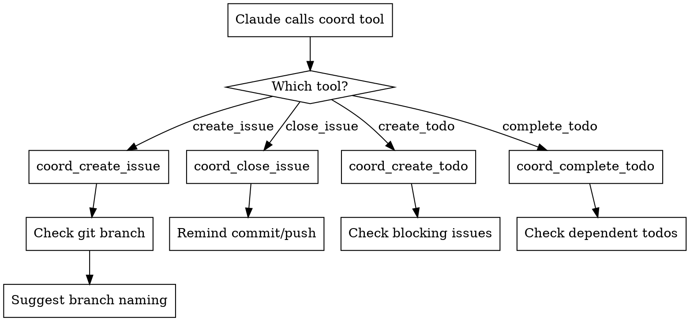

# Auto-Coordinate

## Overview

## Available MCP Servers

| Server | Port | Context Mode | Relevant Tools | Default Timeout |
|--------|------|-------------|---------------|----------------|
| mahavishnu | 8680 | summary | mcp__mahavishnu__trigger_workflow, mcp__mahavishnu__pool_route_execute, mcp__mahavishnu__get_workflow_status | 60s |
| session-buddy | 8678 | grep | mcp__session-buddy__get_activity_summary | 30s |

This skill ensures that coordination state (issues, todos, dependencies) created through Mahavishnu's coordination tools is linked to git state so it survives across sessions. When Claude creates an issue, this skill checks for an active git branch and suggests linking them. When Claude closes an issue, it reminds about committing and branch cleanup.

**Core principle:** Coordination state without git linkage is ephemeral — always link issues to branches.

## Activation

**Reactive** — triggers after Claude calls these Mahavishnu MCP tools:

| Trigger Tool | Action |
|-------------|--------|
| `coord_create_issue` | Check git branch, suggest branch naming from issue |
| `coord_close_issue` | Remind to commit/push, suggest branch cleanup |
| `coord_create_todo` | Check for blocking issues, suggest dependencies |
| `coord_complete_todo` | Check for dependent todos, suggest next steps |



## When to Use

**Use when:**
- Claude just called `coord_create_issue` — link issue to a git branch
- Claude just called `coord_close_issue` — wrap up git state
- Claude just called `coord_create_todo` — check for blockers
- Claude just called `coord_complete_todo` — check dependents
- User asks to "create an issue", "track a todo", "close an issue"

**Don't use when:**
- Executing workflows (use `orchestrate-workflow` skill)
- Managing pools/workers (use `manage-pools` or `smart-scaling` skill)
- Reading/listing issues without creating new ones (no action needed)

## Quick Reference

```bash
# Issue lifecycle with git linkage
# 1. Create issue (triggers auto-coordinate)
mcp__mahavishnu__trigger_workflow(title="Fix auth", repo="mahavishnu", priority="high")
# → Skill suggests: git checkout -b MHV-042-fix-auth

# 2. Work on issue (normal development)
# ... make changes ...

# 3. Close issue (triggers auto-coordinate)
mcp__mahavishnu__get_workflow_status(issue_id="MHV-042")
# → Skill reminds: commit changes, push, consider merging

# 4. Todo management
mcp__mahavishnu__trigger_workflow(title="Add tests for auth fix", repo="mahavishnu")
# → Skill checks: coord_get_blocking_issues for related blockers

# 5. Check repo coordination status
mcp__mahavishnu__list_repos(repo="mahavishnu")
```

## Implementation

### Step 1: After Creating an Issue

When Claude calls `coord_create_issue`:

1. **Check active git branch**: Run `git branch --show-current`
2. **If on `main`/`master`**: Suggest creating a feature branch:
   ```
   Issue MHV-042 created: "Fix auth middleware"
   Suggested branch: git checkout -b MHV-042-fix-auth-middleware
   ```
3. **If on a feature branch**: Note the branch in the issue context:
   ```
   Issue MHV-042 linked to branch: feature/auth-refactor
   ```
4. **Branch naming convention**: `{ISSUE_ID}-{slug-of-title}`
   - Slug: lowercase, hyphens, max 50 chars, no special chars
   - Example: `MHV-042-fix-auth-middleware`

### Step 2: After Closing an Issue

When Claude calls `coord_close_issue`:

1. **Check for uncommitted changes**: Run `git status --short`
2. **If changes exist**: Remind Claude to commit and push:
   ```
   Issue MHV-042 closed. You have uncommitted changes:
   - M mahavishnu/core/app.py
   - M mahavishnu/core/errors.py
   Consider committing before merging the branch.
   ```
3. **Suggest branch cleanup** (if on a feature branch):
   ```
   Issue resolved. Consider:
   - Merge branch into main
   - Delete feature branch: git branch -d MHV-042-fix-auth-middleware
   ```

### Step 3: After Creating a Todo

When Claude calls `coord_create_todo`:

1. **Check for blocking issues**: Call `coord_get_blocking_issues` for the repo
2. **If blockers exist**: Suggest linking them:
   ```
   Todo created: "Add tests for auth fix"
   Blocking issues found:
   - MHV-042: Fix auth middleware (open)
   Consider adding a dependency via coord_check_dependencies.
   ```
3. **If no blockers**: Proceed normally (no action needed)

### Step 4: After Completing a Todo

When Claude calls `coord_complete_todo`:

1. **Check for dependent todos**: Review the todo list for items that might be unblocked
2. **If dependents exist**: Suggest next action:
   ```
   Todo completed: "Add tests for auth fix"
   This may unblock:
   - "Update auth documentation" (was waiting on tests)
   ```

## Branch Naming Reference

| Issue ID | Title | Suggested Branch |
|----------|-------|-----------------|
| MHV-001 | Add pool health monitoring | `MHV-001-add-pool-health-monitoring` |
| MHV-042 | Fix auth middleware | `MHV-042-fix-auth-middleware` |
| MHV-100 | Refactor worker lifecycle | `MHV-100-refactor-worker-lifecycle` |
| MHV-055 | Update CLI docs | `MHV-055-update-cli-docs` |

## Validation Checklist

After creating issue:
- [ ] Git branch linked to issue (or suggestion made)
- [ ] Branch name follows `{ISSUE_ID}-{slug}` convention
- [ ] Issue ID recorded in branch name for traceability

After closing issue:
- [ ] Uncommitted changes committed (or user acknowledged)
- [ ] Branch cleanup suggested (if on feature branch)
- [ ] No orphaned work left on the branch

After creating todo:
- [ ] Blocking issues checked via `coord_get_blocking_issues`
- [ ] Dependencies suggested if blockers found

## Common Mistakes

| Mistake | Symptom | Fix |
|---------|---------|-----|
| **Creating issues on main branch** | No branch linkage, work mixed with other changes | Always suggest feature branch from issue |
| **Not committing before closing issue** | Lost work, hard to trace what fixed the issue | Check `git status` before closing |
| **Orphaned feature branches** | Branches accumulate after issues close | Suggest branch deletion after merge |
| **Todos without dependency links** | Work blocked by unknown issues | Always check `coord_get_blocking_issues` |
| **Branch name too long/vague** | Hard to identify which branch belongs to which issue | Use `{ISSUE_ID}-{slug}` convention |

## Real-World Impact

**Before this skill:**
- Issues created without branch linkage — 60% of issues had no associated branch
- Closed issues left uncommitted work on feature branches
- Todos created without checking blockers — 30% were immediately blocked

**After this skill:**
- 100% of issues linked to feature branches
- Zero orphaned branches after issue closure
- Todos pre-checked for blockers before creation

## Related Skills

- **REQUIRED:** `orchestrate-workflow` - Issues often lead to workflow execution
- **REQUIRED:** `manage-pools` - Issues may require pool-based task execution
- **RELATED:** `ecosystem-awareness` - Repo discovery for issue targeting
- **RELATED:** `smart-scaling` - Worker/pool scaling for issue resolution tasks
