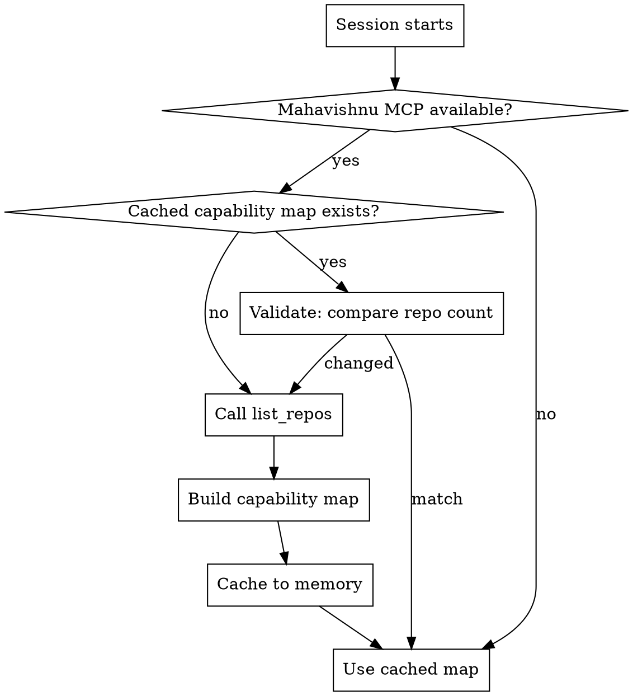

# Ecosystem Awareness

## Overview

## Available MCP Servers

| Server | Port | Context Mode | Relevant Tools | Default Timeout |
|--------|------|-------------|---------------|----------------|
| mahavishnu | 8680 | summary | mcp__mahavishnu__get_health, mcp__mahavishnu__list_repos, mcp__mahavishnu__list_workflows | 60s |
| akosha | 8682 | summary | mcp__akosha__search_all_systems, mcp__akosha__correlate_systems | 60s |

This skill gives Claude persistent knowledge of the Mahavishnu repository ecosystem. On session start (or first Mahavishnu MCP tool call), it discovers all available repositories, builds a capability map, and caches it to Claude Code memory. Subsequent sessions use the cached map — no re-discovery needed.

**Core principle:** Discover once, cache persistently, validate incrementally.

## Activation

**Session lifecycle** — triggers on:

1. Session start when Mahavishnu MCP tools are available
2. First Mahavishnu MCP tool call in a session (`mcp__mahavishnu__*`)
3. User explicitly asks "what repos are available", "show me the ecosystem"



## When to Use

**Use when:**
- Starting a new Claude Code session with Mahavishnu MCP connected
- First Mahavishnu MCP tool call in a session
- User asks about available repositories, roles, or capabilities
- Need to route a task but unsure which repo handles it
- Standalone Mahavishnu users who need to discover their repo catalog

**Don't use when:**
- Deep capability queries (use `find-capability` skill)
- Executing workflows across repos (use `orchestrate-workflow` skill)
- Repo already known and targeted (proceed directly)

## Capability Map Structure

The cached capability map contains three indexes:

```
role_index:       role → [repos]          e.g., "tool" → ["mailgun-mcp", "unifi-mcp", ...]
tag_index:        tag → [repos]           e.g., "python" → ["mahavishnu", "akosha", ...]
repo_index:       repo → {path, role, tags, nickname, mcp}
```

## Quick Reference

```bash
# 1. Discover repos (MCP tool — auto-called by this skill)
mcp__mahavishnu__list_repos()

# 2. Filter by tag
mcp__mahavishnu__list_repos(tag="python")

# 3. Filter by role (via CLI fallback)
mahavishnu list-repos --role tool
mahavishnu list-roles

# 4. Check cache location
# Stored at: /memory/ecosystem_capability_map.md
```

## Implementation

### Step 1: Check for Cached Capability Map

Read from Claude Code memory:

```
File: /memory/ecosystem_capability_map.md
```

If the file exists and is recent (same session or last session), proceed to Step 3 (validate). If not found, proceed to Step 2 (discover).

### Step 2: Discover Ecosystem

Call Mahavishnu MCP tools to build the map:

```python
# Get all repositories
repos = await mcp.call_tool("mcp__mahavishnu__list_repos", {})

# Get repos by role (via CLI or parse from config)
# Note: list_repos returns {path, exists}. Full metadata (role, tags)
# comes from the loaded ecosystem.yaml/repos.yaml config.
```

Build three indexes:

1. **role_index**: Group repos by their assigned role
2. **tag_index**: Group repos by their tags
3. **repo_index**: Map each repo name to full metadata

### Step 3: Validate Cache Freshness

If a cached map exists, compare against a fresh `list_repos` call:

| Check | Stale If | Action |
|-------|----------|--------|
| Repo count differs | New/deleted repos | Rebuild full map |
| Repo names differ | Repo renamed | Rebuild full map |
| Same count and names | Likely current | Use cached map |

This is a lightweight check (one MCP call) that bounds staleness to one session.

### Step 4: Cache Capability Map

Write the capability map to Claude Code memory using the Write tool:

```markdown
# Ecosystem Capability Map

**Discovered**: 2026-04-14
**Source**: ecosystem.yaml
**Repos**: 8

## Roles

| Role | Repos |
|------|-------|
| orchestrator | mahavishnu |
| resolver | oneiric |
| manager | session-buddy |
| inspector | crackerjack |
| ... | ... |

## Tags

| Tag | Repos |
|-----|-------|
| python | mahavishnu, akosha, session-buddy, ... |
| mcp | mailgun-mcp, unifi-mcp, ... |

## Repositories

### mahavishnu (vishnu)
- **Role**: orchestrator
- **Tags**: python, orchestration, mcp
- **Path**: /path/to/mahavishnu
- **MCP**: native
```

### Step 5: Use Cached Map for Routing

Once cached, Claude can use the map to:

- **Route tasks** to the correct repo without querying Mahavishnu
- **Filter repos** by role or tag from memory
- **Suggest repos** when user describes a need
- **Avoid redundant `list_repos` calls** in the same session

## Validation Checklist

After discovery:
- [ ] All repos from `list_repos` appear in the cache
- [ ] Role index covers all 12 defined roles (or roles present in config)
- [ ] Tag index includes all unique tags across repos
- [ ] Each repo entry has path, role, tags, and MCP type
- [ ] Cache file written to `/memory/ecosystem_capability_map.md`
- [ ] Discovery timestamp recorded for staleness tracking

After cache validation:
- [ ] Fresh `list_repos` repo count matches cached count
- [ ] No new repos missing from cache
- [ ] No deleted repos still in cache

## Common Mistakes

| Mistake | Symptom | Fix |
|---------|---------|-----|
| **Not caching the map** | Re-discovering repos every session | Always write to `/memory/` after discovery |
| **Never validating cache** | Stale data after repo changes | Compare repo count/names on each session |
| **Assuming all 12 roles exist** | Missing roles in standalone config | Only index roles present in the loaded config |
| **Calling list_repos on every operation** | Unnecessary MCP overhead | Use cached map after initial discovery |
| **Overwriting cache without checking** | Loses manual annotations | Read existing cache before rebuilding |

## Real-World Impact

**Before this skill:**
- Claude called `list_repos` on every Mahavishnu operation (latency)
- Standalone users couldn't discover their repo catalog
- No cross-session memory of ecosystem layout

**After this skill:**
- One discovery call per session, cached for lifetime
- Standalone users auto-discover repos via `repos.yaml` fallback
- Claude knows the ecosystem without being asked

## Related Skills

- **REQUIRED:** `find-capability` - Deep capability queries beyond basic discovery
- `persistent-state` — Durable storage for service lifecycle events and adapter management (complements repo discovery)
- **RELATED:** `orchestrate-workflow` - After discovering repos, execute workflows
- **RELATED:** `sweep-repositories` - Multi-repo discovery and execution
- **RELATED:** `auto-coordinate` - Links coordination state to discovered repos
