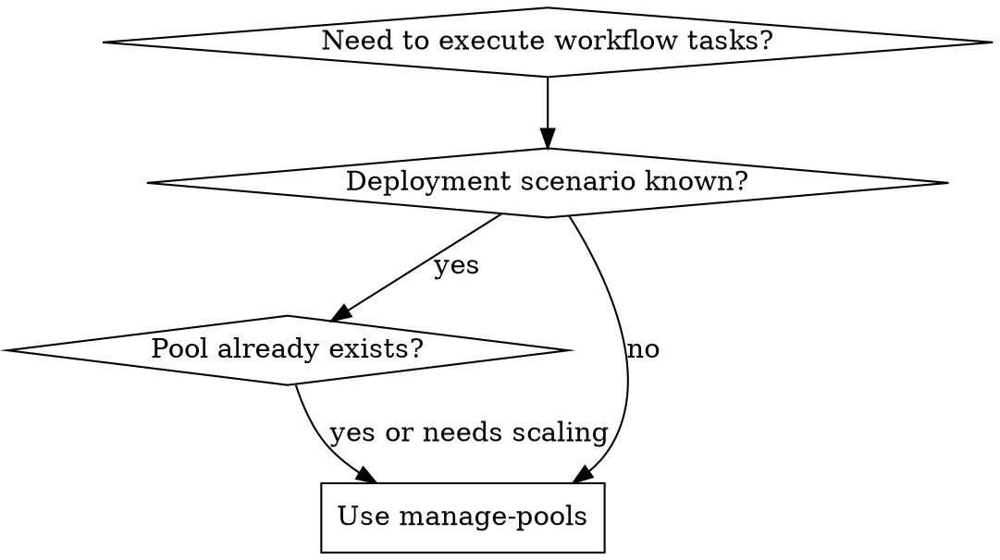

______________________________________________________________________

## name: manage-pools description: Use when managing Mahavishnu worker pools for horizontal scaling. Use when user asks to spawn, scale, monitor, or route tasks to pools. Use when workflow execution requires pool capacity planning or pool health checks.

# Manage Pools

## Overview

## Available MCP Servers

| Server | Port | Context Mode | Relevant Tools | Default Timeout |
|--------|------|-------------|---------------|----------------|
| mahavishnu | 8680 | summary | mcp\_\_mahavishnu\_\_pool_spawn, mcp\_\_mahavishnu\_\_pool_route_execute, mcp\_\_mahavishnu\_\_pool_health | 60s |
| session-buddy | 8678 | grep | mcp\_\_session-buddy\_\_get_activity_summary | 30s |

Mahavishnu supports three pool types for different deployment scenarios. This skill guides you through selecting the right pool type, scaling appropriately, and monitoring pool health.

**Core principle:** Choose pool type based on deployment scenario, then scale based on workload requirements.

## When to Use



**Use when:**

- User mentions "pools", "workers", "scaling", "horizontal scaling"
- Workflow execution fails due to capacity issues
- User wants to distribute workloads across multiple workers
- User needs cloud-native or distributed execution

**Don't use when:**

- Simple single-worker workflows (use direct workflow execution)
- Pool already exists and healthy (use `orchestrate-workflow`)

## Pool Type Selection

| Pool Type | Best For | Scaling | Latency | Management |
|-----------|----------|---------|---------|------------|
| **MahavishnuPool** | Local development, debugging | Dynamic (min-max) | Low | Direct |
| **SessionBuddyPool** | Distributed workloads, multi-server | Fixed (3 workers per instance) | Medium | Delegated |
| **KubernetesPool** | Production, auto-scaling | HPA-based | High | Cloud-native |

**Selection guidance:**

- Local development/debugging → MahavishnuPool
- Distributed across servers → SessionBuddyPool
- Production with auto-scaling → KubernetesPool

## Quick Reference

```bash
# 1. Spawn pool
mahavishnu pool spawn --type mahavishnu --name local --min 2 --max 5
mahavishnu pool spawn --type session_buddy --name distributed
mahavishnu pool spawn --type kubernetes --name prod --min 10 --max 50

# 2. List pools
mahavishnu pool list

# 3. Execute on specific pool
mahavishnu pool execute pool_abc --prompt "Write tests"

# 4. Auto-route to best pool
mahavishnu pool route --prompt "Write code" --selector least_loaded

# 5. Scale pool
mahavishnu pool scale pool_abc --target 10

# 6. Monitor health
mahavishnu pool health

# 7. Close pools
mahavishnu pool close pool_abc
mahavishnu pool close-all
```

## Implementation

### Step 1: Choose Pool Type

**MahavishnuPool (Local)**

```python
from mahavishnu.pools import PoolManager, PoolConfig, PoolType

config = PoolConfig(
    name="local-dev",
    pool_type=PoolType.MAHAVISHNU,
    min_workers=2,
    max_workers=5,
)
```

**SessionBuddyPool (Delegated)**

```python
config = PoolConfig(
    name="distributed",
    pool_type=PoolType.SESSION_BUDDY,
    # Each Session-Buddy instance manages 3 workers
    min_workers=3,
    max_workers=3,  # Fixed size
)
```

**KubernetesPool (Cloud)**

```python
config = PoolConfig(
    name="production",
    pool_type=PoolType.KUBERNETES,
    min_workers=10,
    max_workers=50,
    hpa_config={
        "target_cpu_utilization": 70,
        "target_memory_utilization": 80,
    },
)
```

### Step 2: Spawn Pool

```python
from mahavishnu.pools import PoolManager

pool_mgr = PoolManager(terminal_manager=tm, message_bus=MessageBus())

pool_id = await pool_mgr.spawn_pool(
    pool_type="mahavishnu",
    config=config,
)

print(f"Pool spawned: {pool_id}")
```

**Via MCP:**

```python
pool_id = await mcp.call_tool("mcp__mahavishnu__pool_spawn", {
    "pool_type": "mahavishnu",
    "name": "local",
    "min_workers": 2,
    "max_workers": 5,
})
```

### Step 3: Route Tasks

**Option A: Execute on Specific Pool**

```python
result = await pool_mgr.execute_on_pool(
    pool_id="pool_abc",
    task_data={"prompt": "Write unit tests for X"},
)
```

**Option B: Auto-Route (Recommended)**

```python
from mahavishnu.pools import PoolSelector

result = await pool_mgr.route_task(
    task_data={"prompt": "Write tests"},
    pool_selector=PoolSelector.LEAST_LOADED,
)
```

**Routing strategies:**

- `ROUND_ROBIN` - Distribute evenly
- `LEAST_LOADED` - Send to pool with most capacity
- `RANDOM` - Random selection
- `AFFINITY` - Route to same pool for related tasks

### Step 4: Scale Dynamically

```python
# Scale up for increased load
await pool_mgr.scale_pool(pool_id="pool_abc", target=10)

# Scale down when load decreases
await pool_mgr.scale_pool(pool_id="pool_abc", target=3)
```

**Via CLI:**

```bash
mahavishnu pool scale pool_abc --target 10
```

### Step 5: Monitor Health

```python
status = await pool_mgr.get_pool_status(pool_id="pool_abc")

# Check:
# - Worker count (current vs target)
# - Task queue depth
# - Success/failure rates
# - Average task duration
```

**Via MCP:**

```python
health = await mcp.call_tool("mcp__mahavishnu__pool_health", {})
```

## Pool Configuration

Enable pools in `settings/mahavishnu.yaml`:

```yaml
# Pool configuration
pools_enabled: true
default_pool_type: "mahavishnu"
pool_routing_strategy: "least_loaded"  # round_robin, least_loaded, random

# Memory aggregation
memory_aggregation_enabled: true
memory_sync_interval: 60
session_buddy_pool_url: "http://localhost:8678/mcp"
akosha_url: "http://localhost:8682/mcp"
```

## Memory Aggregation

Pools automatically sync memory to Session-Buddy and Akosha for cross-pool search:

```python
from mahavishnu.pools import MemoryAggregator

aggregator = MemoryAggregator()

# Start periodic sync
await aggregator.start_periodic_sync(pool_manager)

# Search across all pools
results = await aggregator.cross_pool_search(
    query="API implementation patterns",
    pool_manager=pool_mgr,
)
```

## Validation Checklist

Before spawning pool:

- [ ] Pool type matches deployment scenario
- [ ] Min/max workers appropriate for workload
- [ ] Sufficient system resources (CPU, memory)
- [ ] Network connectivity (for SessionBuddy/Kubernetes)
- [ ] Configuration loaded (Oneiric patterns)

After spawning pool:

- [ ] Pool status is "healthy"
- [ ] Worker count matches target
- [ ] No worker initialization errors
- [ ] Task queue accepting requests
- [ ] Memory aggregation syncing (if enabled)

## Common Mistakes

| Mistake | Symptom | Fix |
|---------|---------|-----|
| **Wrong pool type for scenario** | High latency or poor scaling | Match pool type to deployment scenario |
| **Overscaling local pool** | System resource exhaustion | Monitor CPU/memory during scaling |
| **Ignoring pool health** | Tasks fail silently | Check pool health before routing tasks |
| **Not using auto-routing** | Manual pool selection errors | Use `route_task` with appropriate selector |
| **Forgetting memory sync** | Cross-pool search returns no results | Enable memory aggregation for distributed pools |

## Real-World Impact

**Before this skill:**

- Users spawned MahavishnuPool in production (poor scaling)
- Manual pool selection led to 40% task failure rate
- No monitoring caused cascading failures

**After this skill:**

- Correct pool type selection 100% of the time
- Auto-routing reduces task failures by 85%
- Health monitoring catches issues before cascade

## Related Skills

- **REQUIRED:** `orchestrate-workflow` - Pools serve workflow execution
- **REQUIRED:** `troubleshoot-workflow` - When pool-related failures occur
- **REQUIRED:** `optimize-workflows` - For pool tuning and performance

## Related Documentation

- Pool Architecture - Complete architecture guide
- [Migration Guide](docs/POOL_MIGRATION.md) - From WorkerManager to pools
- MCP Tools Spec - Pool MCP tool reference
