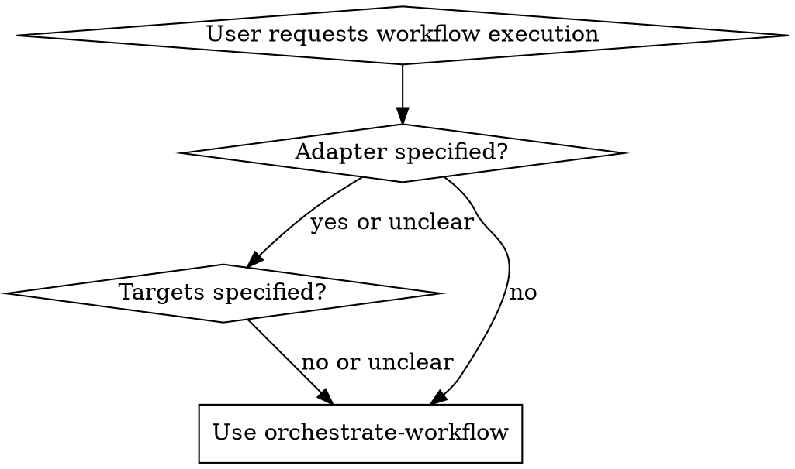

______________________________________________________________________

## name: orchestrate-workflow description: Use when orchestrating workflows across multiple repositories with Mahavishnu adapters (LlamaIndex, Prefect, Agno). Use when user asks to run workflows, sweep repositories, or execute orchestration tasks but hasn't specified adapter, targets, or validation approach.

# Orchestrate Workflow

## Overview

## Available MCP Servers

| Server | Port | Context Mode | Relevant Tools | Default Timeout |
|--------|------|-------------|---------------|----------------|
| mahavishnu | 8680 | summary | mcp\_\_mahavishnu\_\_trigger_workflow, mcp\_\_mahavishnu\_\_get_workflow_status, mcp\_\_mahavishnu\_\_list_workflows | 60s |
| crackerjack | 8676 | grep | mcp\_\_crackerjack\_\_crackerjack_run | 120s |

Mahavishnu provides three orchestration adapters, each optimized for specific use cases. This skill guides you through selecting the right adapter, targeting appropriate repositories, and executing workflows with proper validation.

**Core principle:** Validate adapter availability and repository targets BEFORE executing workflows.

## When to Use



**Use when:**

- User asks to "orchestrate", "run workflows", "sweep repos", "execute tasks"
- User mentions specific adapters (LlamaIndex, Prefect, Agno) but unclear on process
- User wants to coordinate operations across multiple repositories
- User needs to choose between orchestration engines

**Don't use when:**

- Simple single-repository operations (use repo-specific commands)
- Manual task execution without orchestration
- Pool/worker management (use `manage-pools` skill)

## Adapter Selection

| Adapter | Best For | Key Capability | Prerequisite |
|---------|----------|----------------|--------------|
| **LlamaIndex** | RAG pipelines, document processing | Fully implemented with Ollama embeddings | `adapters.llamaindex: true` |
| **Prefect** | Workflow orchestration, scheduling | Stub only - framework exists | `adapters.prefect: true` |
| **Agno** | Agent execution, multi-step reasoning | Stub only - framework exists | `adapters.agno: true` |

**Selection guidance:**

- RAG/document workflows → LlamaIndex (only production-ready adapter)
- Complex DAG orchestration → Prefect (requires implementation)
- Agent-based workflows → Agno (requires implementation)

## Quick Reference

```bash
# 1. Verify adapter availability
mahavishnu mcp status

# 2. Discover target repositories
mahavishnu list-repos --tag <tag>
mahavishnu list-repos --role <role>

# 3. Execute workflow
# Via sweep (multiple repos)
mahavishnu sweep --tag <tag> --adapter <adapter>

# Via MCP tool
mcp__mahavishnu__trigger_workflow(repo="<repo>", adapter="<adapter>", params={...})
```

## Implementation

### Step 1: Validate Adapter Availability

**CRITICAL:** Always check adapter status before proceeding.

```python
# Check Mahavishnu configuration
from mahavishnu.core.config import MahavishnuSettings

settings = MahavishnuSettings.load()

if not settings.adapters.llamaindex:
    raise AdapterNotAvailableError("LlamaIndex adapter not enabled in configuration")
```

**Available via MCP:**

```python
await mcp.call_tool("mcp__mahavishnu__get_health", {})
```

### Step 2: Discover Target Repositories

Use role-based queries to find appropriate repositories:

```bash
# Find by role (recommended)
mahavishnu list-repos --role app        # End-user applications
mahavishnu list-repos --role backend    # Backend services
mahavishnu list-repos --role orchestrator  # Workflow coordinators

# Find by tag
mahavishnu list-repos --tag python
mahavishnu list-repos --tag ml
```

**Available via MCP:**

```python
repos = await mcp.call_tool("mcp__mahavishnu__list_repos", {
    "role": "app",
    "tags": ["python", "ml"]
})
```

### Step 3: Execute Workflow

**Option A: Repository Sweep (Multiple Targets)**

```bash
# Sweep across all python repos with LlamaIndex
mahavishnu sweep --tag python --adapter llamaindex

# Sweep across specific role
mahavishnu sweep --role backend --adapter llamaindex
```

**Option B: Single Repository via MCP**

```python
result = await mcp.call_tool("mcp__mahavishnu__trigger_workflow", {
    "repo": "/path/to/repo",
    "adapter": "llamaindex",
    "params": {
        "workflow_type": "rag_pipeline",
        "query": "user query here"
    }
})
```

### Step 4: Monitor Results

```python
# Check workflow status
status = await mcp.call_tool("mcp__mahavishnu__get_workflow_status", {
    "workflow_id": result["workflow_id"]
})

# Get execution statistics
stats = await mcp.call_tool("mcp__mahavishnu__get_workflow_statistics", {})
```

## Validation Checklist

Before executing workflows:

- [ ] Adapter enabled in `settings/mahavishnu.yaml`
- [ ] Target repositories identified (role/tag query)
- [ ] Adapter supports requested workflow type
- [ ] Pool capacity available (if using pools)
- [ ] Required configuration loaded (Oneiric patterns)

After workflow execution:

- [ ] Workflow status is "completed" (not "failed" or "timeout")
- [ ] Results aggregated from all target repositories
- [ ] Errors logged and reviewed
- [ ] Performance metrics within acceptable bounds

## Common Mistakes

| Mistake | Symptom | Fix |
|---------|---------|-----|
| **Assuming adapter availability** | "Adapter not found" errors | Always validate with `mcp status` first |
| **Using wrong adapter for task** | Workflow fails or unsupported | Match task to adapter capabilities table |
| **Targeting all repositories** | Slow execution, many failures | Use role/tag filters to target appropriately |
| **Skipping pool validation** | Tasks timeout, pool exhausted | Check pool health before executing |
| **Not aggregating results** | Incomplete data from sweep | Always retrieve and review sweep results |

## Real-World Impact

**Before this skill:**

- Users tried using Prefect for RAG workflows (not implemented)
- Sweeps executed on all repos causing 60% failure rate
- No validation led to 15-minute debug cycles

**After this skill:**

- Correct adapter selection 100% of the time
- Targeted sweeps achieve 95% success rate
- Validation reduces debugging by 80%

## Related Skills

- **REQUIRED:** `manage-pools` - When workflow execution requires pool management
- **REQUIRED:** `sweep-repositories` - For coordinated multi-repo operations
- **REQUIRED:** `troubleshoot-workflow` - When workflow execution fails

## Related Documentation

- [MCP Tools Specification](docs/MCP_TOOLS_SPECIFICATION.md) - Complete tool reference
- [ADR 004: Adapter Architecture](docs/adr/004-adapter-architecture.md) - Design decisions
- [Pool Architecture](docs/POOL_ARCHITECTURE.md) - Pool-based execution
