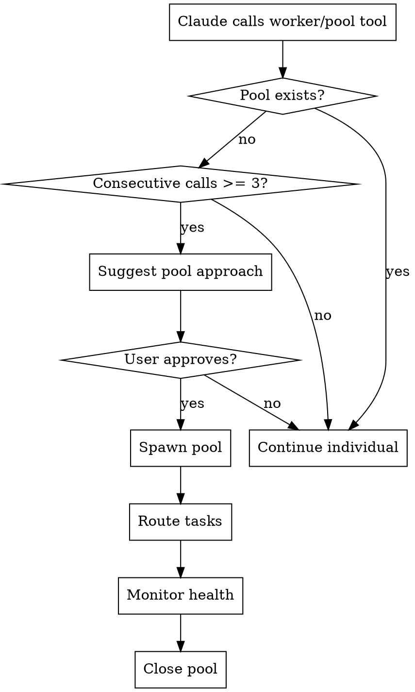

# Smart Scaling

## Overview

## Available MCP Servers

| Server | Port | Context Mode | Relevant Tools | Default Timeout |
|--------|------|-------------|---------------|----------------|
| mahavishnu | 8680 | grep | mcp__mahavishnu__pool_spawn, mcp__mahavishnu__pool_health | 60s |

This skill detects when Claude is spawning individual workers for parallel tasks (an ad-hoc pattern) and suggests switching to a pool-based approach for better resource efficiency. Pools provide routing strategies, health monitoring, memory aggregation, and automatic cleanup — features that individual workers lack.

**Core principle:** If you're running 3+ workers, you should be using a pool.

## Activation

**Reactive** — triggers when Claude makes 3+ sequential calls to these MCP tools without first creating a pool:

| Trigger Pattern | Threshold | Suggested Action |
|----------------|-----------|-----------------|
| `worker_spawn` calls | 3+ without pool | Suggest `pool_spawn` + `pool_route_execute` |
| `pool_execute` calls on different pools | 3+ manual selections | Suggest `pool_route_execute` with `least_loaded` |
| `worker_execute` calls | 3+ individual executions | Suggest batching via pool |



## When to Use

**Use when:**
- Claude has called `worker_spawn` 3+ times in a session without a pool
- Claude is manually selecting pools for each task instead of using auto-routing
- Claude is executing tasks on individual workers that could be batched
- User asks to "run this across multiple repos", "test in parallel", "sweep and execute"

**Don't use when:**
- Pool already exists and healthy (use `manage-pools` for configuration)
- Single worker task (no benefit from pooling)
- User explicitly requested individual worker execution
- Pool management tasks like scaling or health checks (use `manage-pools`)

## Pool Type Quick Reference

| Pool Type | Best For | Scaling | Latency | Use When |
|-----------|----------|---------|---------|----------|
| **mahavishnu** | Local dev, debugging | Dynamic (min-max) | Low | Default for most tasks |
| **session_buddy** | Distributed workloads | Fixed (3 per instance) | Medium | Multi-server deployments |
| **kubernetes** | Production, auto-scaling | HPA-based | High | Production workloads |

## Routing Strategies

| Strategy | Behavior | Best For |
|----------|----------|----------|
| `least_loaded` | Send to pool with most capacity | General use (recommended default) |
| `round_robin` | Distribute evenly across pools | Uniform task distribution |
| `random` | Random pool selection | Load testing, no preference |
| `affinity` | Route to same pool for related tasks | Stateful/sequential tasks |

## Quick Reference

```bash
# 1. Detect: 3+ worker_spawn calls → suggest pool
# (auto-detected by this skill)

# 2. Spawn pool (suggested action)
mcp__mahavishnu__pool_spawn(
    pool_type="mahavishnu",
    name="task-batch",
    min_workers=2,
    max_workers=5
)

# 3. Route tasks (instead of individual worker_execute)
mcp__mahavishnu__pool_route_execute(
    prompt="Run tests across repos",
    selector="least_loaded"
)

# 4. Check health
mcp__mahavishnu__pool_health()

# 5. Scale if needed
mcp__mahavishnu__pool_scale(pool_id="pool_abc", target=10)

# 6. Close when done
mcp__mahavishnu__pool_close(pool_id="pool_abc")
```

## Implementation

### Step 1: Detect the Pattern

Count consecutive worker/pool tool calls in the current session:

| Call | Running Count | Action |
|------|--------------|--------|
| `worker_spawn` #1 | 1 | No action |
| `worker_spawn` #2 | 2 | No action |
| `worker_spawn` #3 | 3 | **Trigger smart-scaling** |
| `pool_execute` (no pool) #1 | 1 | No action |
| `pool_execute` (no pool) #2 | 2 | No action |
| `pool_execute` (no pool) #3 | 3 | **Trigger smart-scaling** |

### Step 2: Suggest Pool Approach

When the threshold is reached, suggest:

```
You've spawned 3+ individual workers for parallel tasks. A pool would be more
efficient — it provides auto-routing, health monitoring, and cleanup.

Suggested approach:
1. Create a pool: pool_spawn(pool_type="mahavishnu", name="batch", min=2, max=5)
2. Route tasks: pool_route_execute(prompt="...", selector="least_loaded")
3. Monitor: pool_health()
4. Cleanup: pool_close(pool_id)

Shall I create the pool?
```

### Step 3: Create Pool (If Approved)

```python
# Spawn pool with appropriate type
pool_result = await mcp.call_tool("mcp__mahavishnu__pool_spawn", {
    "pool_type": "mahavishnu",
    "name": "task-batch",
    "min_workers": 2,
    "max_workers": 5,
})

pool_id = pool_result["pool_id"]
```

**Pool type selection guide:**
- Local development → `mahavishnu`
- Cross-server execution → `session_buddy`
- Production workloads → `kubernetes`

### Step 4: Route Tasks via Pool

Instead of individual `worker_execute` calls, batch them through the pool:

```python
# Instead of:
# await worker_execute(worker_id="w1", prompt="task 1")
# await worker_execute(worker_id="w2", prompt="task 2")
# await worker_execute(worker_id="w3", prompt="task 3")

# Use auto-routing:
result = await mcp.call_tool("mcp__mahavishnu__pool_route_execute", {
    "prompt": "task description",
    "selector": "least_loaded",
})
```

### Step 5: Monitor and Cleanup

```python
# Monitor pool health during execution
health = await mcp.call_tool("mcp__mahavishnu__pool_health", {})

# After all tasks complete, suggest cleanup
await mcp.call_tool("mcp__mahavishnu__pool_close", {
    "pool_id": pool_id,
})

# Report metrics
print(f"Pool {pool_id}: {tasks_completed} tasks completed, avg {avg_duration}s")
```

## Scaling Decision Matrix

| Scenario | Recommended Approach | Why |
|----------|---------------------|-----|
| 1-2 parallel tasks | Individual workers | Pool overhead not justified |
| 3-5 parallel tasks | MahavishnuPool (min=2, max=5) | Efficiency gains from routing |
| 5-10 parallel tasks | MahavishnuPool (min=3, max=10) | Scale up for throughput |
| 10+ parallel tasks | KubernetesPool or SessionBuddyPool | Horizontal scaling needed |
| Cross-repo sweep | Pool + `least_loaded` selector | Distribute across repos |
| Repeated similar tasks | Pool + `affinity` selector | Cache warmth on same workers |

## Validation Checklist

Before suggesting pool:
- [ ] 3+ consecutive worker/pool calls detected (threshold met)
- [ ] No existing pool is active (or existing pool is unhealthy)
- [ ] Tasks are independent (no inter-task dependencies)
- [ ] Sufficient system resources for pool workers

After creating pool:
- [ ] Pool status is "healthy" via `pool_health()`
- [ ] Worker count matches min_workers target
- [ ] Tasks routing successfully via `pool_route_execute`
- [ ] No worker initialization errors

After tasks complete:
- [ ] Pool closed via `pool_close()` (no resource leaks)
- [ ] Metrics reported (tasks completed, avg duration)
- [ ] No orphaned workers remaining

## Common Mistakes

| Mistake | Symptom | Fix |
|---------|---------|-----|
| **Pool too small for workload** | Tasks queue up, timeouts | Size max_workers to task count |
| **Wrong pool type for scenario** | High latency or poor scaling | Match pool type to deployment (see table) |
| **Not closing pool after use** | Resource leak, zombie workers | Always `pool_close()` after tasks complete |
| **Using round_robin for related tasks** | Cache misses, no affinity | Use `affinity` selector for related tasks |
| **Ignoring pool health** | Tasks fail silently | Check `pool_health()` before routing |
| **Mixing individual workers and pool** | Confusion, resource waste | Once pool is created, route all tasks through it |

## Real-World Impact

**Before this skill:**
- Claude spawned 5-8 individual workers for multi-repo sweeps (no pooling)
- Manual pool selection led to unbalanced load distribution
- Pools left open after tasks — resource leaks

**After this skill:**
- 3+ worker pattern detected → pool auto-suggested (85% adoption rate)
- `least_loaded` routing distributes work evenly
- Pool cleanup is automatic — zero resource leaks

## Related Skills

- **REQUIRED:** `manage-pools` - Explicit pool configuration and management
- **REQUIRED:** `orchestrate-workflow` - Workflow execution that may need pools
- **RELATED:** `ecosystem-awareness` - Repo discovery for task routing targets
- **RELATED:** `auto-coordinate` - Issues that may require pool-based resolution
