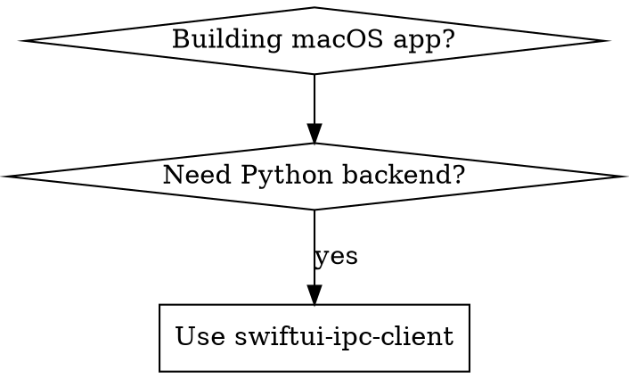

# SwiftUI IPC Client Development Skill

**Purpose**: Guide development of native macOS SwiftUI applications that communicate with Python backends via Unix Domain Socket (JSON-RPC 2.0)

**Based On**: mdinject architecture pattern

---

## Available MCP Servers

| Server | Port | Context Mode | Relevant Tools | Default Timeout |
|--------|------|-------------|---------------|----------------|
| session-buddy | 8678 | grep | mcp__session-buddy__search_conversations, mcp__session-buddy___code_search_symbols_impl | 30s |
| mahavishnu | 8680 | grep | mcp__mahavishnu__get_health | 60s |

---

## When to Use



**Use when:**
- Building native macOS SwiftUI apps that need backend services
- Implementing IPC between Swift frontend and Python backend
- Creating JSON-RPC 2.0 clients over Unix sockets

**Don't use when:**
- Building web apps (use React/Vue instead)
- Cross-platform mobile apps (use Flutter instead)

---

## Architecture Pattern

```
┌─────────────────────────────────────────────────────────────────┐
│                    Native macOS App                             │
├─────────────────────────────────────────────────────────────────┤
│  ┌─────────────────────────────────────────────────────────┐   │
│  │                    SwiftUI Views                         │   │
│  │  • TaskListView, TaskDetailView, TaskFormView            │   │
│  │  • Uses @ObservedObject AppState                         │   │
│  └─────────────────────────┬───────────────────────────────┘   │
│                            │                                    │
│  ┌─────────────────────────▼───────────────────────────────┐   │
│  │                    AppState.swift                        │   │
│  │  • @Published properties for UI state                    │   │
│  │  • Calls IPCService methods                              │   │
│  └─────────────────────────┬───────────────────────────────┘   │
│                            │                                    │
│  ┌─────────────────────────▼───────────────────────────────┐   │
│  │                     IPC/                                 │   │
│  │  • IPCClient.swift - Unix socket connection              │   │
│  │  • JSONRPCClient.swift - Protocol implementation         │   │
│  │  • IPCMethods.swift - Type-safe method definitions       │   │
│  └─────────────────────────┬───────────────────────────────┘   │
└────────────────────────────┼────────────────────────────────────┘
                             │
                   Unix Domain Socket
                   ~/Library/Application Support/AppName/app.sock
                             │
┌────────────────────────────▼────────────────────────────────────┐
│                    Python Helper Process                        │
├─────────────────────────────────────────────────────────────────┤
│  FastAPI/MCP Server listening on Unix socket                    │
│  • JSON-RPC 2.0 protocol                                        │
│  • Method handlers for all IPC calls                            │
└─────────────────────────────────────────────────────────────────┘
```

---

## IPC Protocol Specification

### Transport

```swift
// Socket path convention
let socketPath = "~/Library/Application Support/\(appName)/\(appName.lowercased()).sock"
```

### JSON-RPC 2.0 Format

**Request:**
```json
{
  "jsonrpc": "2.0",
  "id": "uuid-string",
  "method": "tasks.list",
  "params": {"status": "pending"}
}
```

**Response (Success):**
```json
{
  "jsonrpc": "2.0",
  "id": "uuid-string",
  "result": {"items": [...]}
}
```

**Response (Error):**
```json
{
  "jsonrpc": "2.0",
  "id": "uuid-string",
  "error": {"code": -32600, "message": "Invalid Request"}
}
```

---

## Swift Implementation

### IPCClient.swift

```swift
import Foundation

class IPCClient {
    private let socketPath: String
    private var connection: URLSessionWebSocketTask?

    init(appName: String) {
        let home = FileManager.default.homeDirectoryForCurrentUser.path
        self.socketPath = "\(home)/Library/Application Support/\(appName)/\(appName.lowercased()).sock"
    }

    func connect() async throws {
        let url = URL(string: "unix://\(socketPath)")!
        // Unix socket connection implementation
    }

    func call<T: Codable>(
        method: String,
        params: [String: Any]? = nil
    ) async throws -> T {
        let id = UUID().uuidString
        let request: [String: Any] = [
            "jsonrpc": "2.0",
            "id": id,
            "method": method,
            "params": params ?? [:]
        ]

        let responseData = try await sendAndReceive(request)
        let response = try JSONDecoder().decode(JSONRPCResponse<T>.self, from: responseData)

        if let error = response.error {
            throw IPCError.rpcError(error.code, error.message)
        }

        guard let result = response.result else {
            throw IPCError.noResult
        }

        return result
    }
}
```

### IPCMethods.swift (Type-safe Method Definitions)

```swift
enum IPCMethod {
    case systemHealth
    case tasksList(status: String?, limit: Int?)
    case tasksGet(id: String)
    case tasksCreate(title: String, repository: String, priority: String)

    var methodName: String {
        switch self {
        case .systemHealth: return "system.health"
        case .tasksList: return "tasks.list"
        case .tasksGet: return "tasks.get"
        case .tasksCreate: return "tasks.create"
        }
    }

    var params: [String: Any]? {
        switch self {
        case .tasksList(let status, let limit):
            var p: [String: Any] = [:]
            if let s = status { p["status"] = s }
            if let l = limit { p["limit"] = l }
            return p.isEmpty ? nil : p
        case .tasksGet(let id):
            return ["id": id]
        case .tasksCreate(let title, let repo, let priority):
            return ["title": title, "repository": repo, "priority": priority]
        default:
            return nil
        }
    }
}
```

---

## Python Backend Implementation

### IPC Server (FastAPI + Unix Socket)

```python
import asyncio
from pathlib import Path
from typing import Any

class JSONRPCServer:
    """JSON-RPC 2.0 server over Unix domain socket."""

    def __init__(self, socket_path: str):
        self.socket_path = Path(socket_path).expanduser()
        self.methods: dict[str, callable] = {}

    def register_method(self, name: str):
        """Decorator to register JSON-RPC methods."""
        def decorator(func: callable):
            self.methods[name] = func
            return func
        return decorator

    async def handle_request(self, request: dict) -> dict:
        """Process a JSON-RPC request."""
        request_id = request.get("id")
        method = request.get("method")
        params = request.get("params", {})

        if method not in self.methods:
            return {
                "jsonrpc": "2.0",
                "id": request_id,
                "error": {"code": -32601, "message": "Method not found"}
            }

        try:
            result = await self.methods[method](**params)
            return {"jsonrpc": "2.0", "id": request_id, "result": result}
        except Exception as e:
            return {"jsonrpc": "2.0", "id": request_id, "error": {"code": -32603, "message": str(e)}}
```

---

## Directory Structure

```
app/
├── MdInjectApp/
│   ├── MdInjectApp.swift          # App entry point
│   ├── AppState.swift             # @Observable state
│   │
│   ├── IPC/
│   │   ├── IPCClient.swift        # Unix socket client
│   │   ├── JSONRPCClient.swift    # Protocol implementation
│   │   ├── IPCMethods.swift       # Type-safe method enums
│   │   └── IPCError.swift         # Error types
│   │
│   ├── Views/
│   │   ├── ContentView.swift      # Main view
│   │   ├── TaskListView.swift     # Task list
│   │   └── TaskFormView.swift     # Create/edit form
│   │
│   └── Services/
│       ├── NotificationService.swift
│       └── WebSocketService.swift  # Real-time updates
```

---

## Testing Checklist

- [ ] IPC client connects to Unix socket
- [ ] JSON-RPC 2.0 request/response works
- [ ] Error handling for connection failures
- [ ] Task CRUD operations work
- [ ] WebSocket real-time updates work
- [ ] Offline mode with local cache
- [ ] macOS menu bar integration

---

## Reference Implementation

See `~/Projects/mdinject/` for the reference implementation:
- `app/IPC_SPEC.md` - Protocol specification
- `app/MdInjectApp/IPC/` - Swift IPC client code
- `mdinject/ipc/` - Python IPC server code
