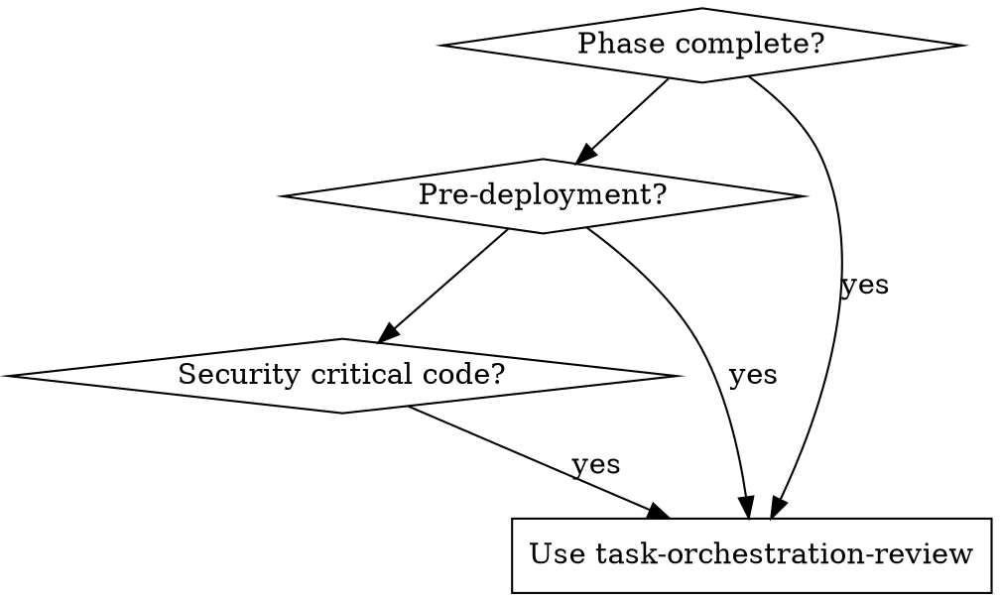

______________________________________________________________________

## name: task-orchestration-review description: Use when reviewing Task Orchestration components at phase boundaries. Coordinates pooled multi-agent reviews for security, database, and API quality. Use at end of each phase or before deployment.

# Task Orchestration Multi-Agent Review Skill

**Purpose**: Coordinate pooled multi-agent reviews for Task Orchestration components, ensuring code quality, security, and architectural consistency.

______________________________________________________________________

## Available MCP Servers

| Server | Port | Context Mode | Relevant Tools | Default Timeout |
|--------|------|-------------|---------------|----------------|
| mahavishnu | 8680 | summary | mcp\_\_mahavishnu\_\_pool_route_execute, mcp\_\_mahavishnu\_\_get_health, mcp\_\_mahavishnu\_\_get_workflow_status | 60s |
| akosha | 8682 | summary | mcp\_\_akosha\_\_search_all_systems, mcp\_\_akosha\_\_query_knowledge_graph, mcp\_\_akosha\_\_run_fitness_analysis | 60s |
| dhara | 8683 | summary | mcp\_\_dhara\_\_state_read, mcp\_\_dhara\_\_state_write, mcp\_\_dhara\_\_state_list | 60s |
| session-buddy | 8678 | summary | mcp\_\_session-buddy\_\_search_conversations, mcp\_\_session-buddy\_\_store_reflection, mcp\_\_session-buddy\_\_quick_search | 60s |
| crackerjack | 8676 | summary | mcp\_\_crackerjack\_\_crackerjack_run, mcp\_\_crackerjack\_\_get_comprehensive_status, mcp\_\_crackerjack\_\_smart_error_analysis | 120s |

## When to Use



**Use when:**

- End of phase completion (before sync points)
- Security-critical code review
- Database schema changes
- API design validation
- Pre-deployment review

______________________________________________________________________

## Review Pool Configuration

### Pool Types by Review Scope

| Review Type | Agents | Pool | Duration |
|-------------|--------|------|----------|
| **Security Review** | Security Auditor + Python Pro | crackerjack | 30 min |
| **Database Review** | Postgres Pro + SRE + Architect | mahavishnu | 45 min |
| **API Design Review** | Backend Dev + UX Researcher | mahavishnu | 30 min |
| **Full Review** | All relevant specialists | multi-pool | 60 min |

______________________________________________________________________

## Pooled Review Pattern

```
┌─────────────────────────────────────────────────────────────────┐
│                    Pooled Review Dispatch                       │
├─────────────────────────────────────────────────────────────────┤
│   Component ──────► Review Orchestrator                         │
│                           │                                     │
│          ┌────────────────┼────────────────┐                   │
│          ▼                ▼                ▼                    │
│   ┌──────────┐    ┌──────────┐    ┌──────────┐                │
│   │ Security │    │  Python  │    │   SRE    │                │
│   │ Auditor  │    │   Pro    │    │ Engineer │                │
│   └────┬─────┘    └────┬─────┘    └────┬─────┘                │
│        └───────────────┴───────────────┘                        │
│                        ▼                                        │
│               ┌────────────────┐                               │
│               │  Consolidated  │                               │
│               │  Review Report │                               │
│               └────────────────┘                               │
└─────────────────────────────────────────────────────────────────┘
```

______________________________________________________________________

## Review Checklist by Type

### Security Review Pool

**Agent A: Security Auditor**

- [ ] Input validation (all user inputs sanitized)
- [ ] SQL injection prevention (parameterized queries)
- [ ] Path traversal prevention (validated paths)
- [ ] Authentication/authorization checks
- [ ] Secrets management (no hardcoded credentials)
- [ ] Audit logging (sensitive operations logged)

**Agent B: Python Pro**

- [ ] Type hints complete and accurate
- [ ] Pydantic v2 validation (field_validator usage)
- [ ] Exception handling (specific exceptions, chaining)
- [ ] Async patterns (proper async/await usage)

### Database Review Pool

**Agent A: Postgres Pro**

- [ ] Normalization (appropriate level)
- [ ] Index strategy (covering indexes, partial indexes)
- [ ] Foreign key constraints (ON DELETE/UPDATE behavior)
- [ ] pgvector setup (HNSW indexes for vectors)

**Agent B: SRE Engineer**

- [ ] Migration rollback plan
- [ ] Connection pooling configuration
- [ ] Backup/restore testing
- [ ] Monitoring queries (slow query log)

______________________________________________________________________

## Mahavishnu Pool Commands

```python
# Dispatch security review pool (2 agents in parallel)
mcp__mahavishnu__pool_spawn(
    pool_type="mahavishnu",
    name="security-review",
    min_workers=2,
    max_workers=2,
)

# Send task to security auditor
mcp__mahavishnu__pool_execute(
    pool_id="security-review",
    prompt="Review [FILE] for security vulnerabilities...",
    timeout=1800,
)

# Send task to python pro
mcp__mahavishnu__pool_execute(
    pool_id="security-review",
    prompt="Review [FILE] for Python code quality...",
    timeout=1800,
)

# Collect results: monitor pool status and search memory for findings
mcp__mahavishnu__pool_monitor(pool_ids=["security-review"])
mcp__mahavishnu__pool_search_memory(query="security review findings")

# After execution, the orchestrator agent collects results via
# mcp__mahavishnu__pool_monitor and mcp__mahavishnu__pool_search_memory,
# then writes a synthesis report.
```

______________________________________________________________________

## Review Schedule by Phase

| Phase End | Review Type | Agents | Blocking |
|-----------|-------------|--------|----------|
| Phase 0 | Security | Security + Python | ✅ Yes |
| Phase 1 | Full | All specialists | ✅ Yes |
| Phase 2 | ML/NLP | NLP + ML + Python | ✅ Yes |
| Phase 3 | API + Security | Backend + Security + UX | ✅ Yes |
| Phase 4 | Quality | QA + SRE | ✅ Yes |
| Phase 5-6 | UI/UX | Frontend + UX + Accessibility | ✅ Yes |
| Phase 7 | Performance | SRE + DBA | ✅ Yes |
| Phase 8 | Deployment | DevOps + Security + SRE | ✅ Yes |

______________________________________________________________________

## Success Metrics

| Metric | Target |
|--------|--------|
| Critical issues caught before merge | > 95% |
| Review completion time | < 60 min |
| False positive rate | < 10% |
| Coverage (files reviewed) | 100% of critical paths |

______________________________________________________________________

## Related Documentation

- Parallel Execution Plan
- Master Plan V3
- [Phase 0 Action Plan](../../../docs/archive/implementation-plans/PHASE_0_ACTION_PLAN.md)
