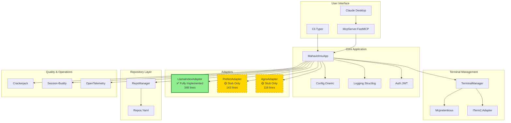

# Mahavishnu Architecture

**Single Source of Truth for Mahavishnu Architecture**

**Last Updated**: 2026-01-24
**Status**: Phase 1 Complete (Foundation + Core Architecture)

---

## Executive Summary

Mahavishnu is a multi-engine orchestration platform that provides unified interfaces for managing workflows across multiple repositories. It currently has **one fully functional adapter** (LlamaIndex) and **two stub adapters** (Prefect, Agno) that require implementation.

### Current State (2026-01-24)

**Complete**:
- Security hardening (JWT auth, Claude Code + Qwen support)
- Async base adapter architecture
- FastMCP-based MCP server with terminal management
- Configuration system using Oneiric patterns
- CLI with authentication framework
- Repository management (9 repos configured)
- Test infrastructure (11 test files)
- **LlamaIndex adapter** (348 lines, fully functional with Ollama)

**Stub Implementations**:
- Prefect adapter (143 lines, framework skeleton only)
- Agno adapter (116 lines, framework skeleton only)

**Missing**:
- Actual orchestration logic in Prefect and Agno adapters
- MCP core orchestration tools (terminal tools are complete)
- Production error recovery patterns
- Full observability implementation

---

## Architecture Overview

### Core Components

```
Mahavishnu
├── Core Application (mahavishnu/core/)
│   ├── app.py                  # MahavishnuApp - main application
│   ├── config.py               # Configuration with Oneiric patterns
│   ├── errors.py               # Custom exception hierarchy
│   ├── adapters/
│   │   └── base.py             # OrchestratorAdapter interface
│   └── observability.py        # OpenTelemetry framework (skeleton)
│
├── Adapters (mahavishnu/engines/)
│   ├── base.py                 # Abstract base adapter
│   ├── llamaindex_adapter.py   # ✅ Fully implemented (348 lines)
│   ├── prefect_adapter.py      # 🟡 Stub only (143 lines)
│   └── agno_adapter.py         # 🟡 Stub only (116 lines)
│
├── MCP Server (mahavishnu/mcp/)
│   ├── server_core.py          # FastMCP server
│   └── tools/
│       ├── terminal_tools.py   # ✅ Implemented (11,453 lines)
│       └── orchestration_tools.py  # ❌ Not implemented
│
├── CLI (mahavishnu/cli.py)     # Typer-based CLI
└── Tests (tests/)
    ├── unit/                   # Unit tests
    ├── integration/            # Integration tests
    └── property/               # Property-based tests
```

---

## Adapter Architecture

### 1. LlamaIndex Adapter (Fully Implemented)

**File**: `mahavishnu/engines/llamaindex_adapter.py`
**Lines**: 348
**Status**: Production Ready

**Capabilities**:
- Real Ollama integration (not simulated)
- Vector embeddings with `nomic-embed-text` model
- Document ingestion from `repos.yaml`
- Semantic search across codebases
- Configuration-based model selection
- Comprehensive error handling

**Key Imports**:
```python
from llama_index.embeddings.ollama import OllamaEmbedding
from llama_index.llms.ollama import Ollama
```

**Usage**:
```python
from mahavishnu.engines import LlamaIndexAdapter

adapter = LlamaIndexAdapter(config={
    "llm_model": "nomic-embed-text",
    "ollama_base_url": "http://localhost:11434"
})

# Fully functional
result = await adapter.ingest_documents(repo_path="/path/to/repo")
results = await adapter.query_documents(query="authentication patterns")
```

### 2. Prefect Adapter (Stub Implementation)

**File**: `mahavishnu/engines/prefect_adapter.py`
**Lines**: 143
**Status**: Framework Skeleton Only

**Current State**:
- Uses Prefect decorators (`@flow`, `@task`)
- Returns simulated/hardcoded results
- No actual flow construction or execution
- No state management or checkpointing

**Missing**:
- LLM integration for dynamic workflows
- Real flow construction logic
- State management and checkpointing
- Progress tracking and streaming
- Error handling and timeouts

**Estimated Completion**: 2 weeks

### 3. Agno Adapter (Stub Implementation)

**File**: `mahavishnu/engines/agno_adapter.py`
**Lines**: 116
**Status**: Framework Skeleton Only

**Current State**:
- Returns simulated results
- No Agno framework imports
- No agent lifecycle management
- No tool integration

**Missing**:
- Agno v2.0 integration
- Agent lifecycle management
- Tool integration
- Multi-LLM routing (Ollama, Claude, Qwen)
- Memory and context management
- Agent coordination

**Estimated Completion**: 2-3 weeks (waiting for Agno v2.0 stable release)

---

## Architectural Evolution

### Phase 1: Original Architecture (Deprecated 2025-01-23)

**Deprecated Adapters**:
- **Airflow**: Data pipeline orchestration
- **CrewAI**: Multi-agent workflows
- **LangGraph**: Stateful AI agents

**Reasons for Deprecation**:
- Airflow → Replaced by Prefect (more Python-native, no scheduler infrastructure)
- CrewAI → Replaced by Agno (better adoption, more active development)
- LangGraph → Replaced by Agno (consolidate to one agent framework)

### Phase 2: Modernization (2025-01-23)

**Decision Records**:
- **ADR 001**: Use Oneiric for configuration and logging
- **ADR 002**: MCP-first design with FastMCP + mcp-common
- **ADR 003**: Error handling with retry, circuit breakers, dead letter queues
- **ADR 004**: Adapter architecture for multi-engine support
- **ADR 005**: Unified memory architecture

**Key Changes**:
- Simplified from 6 engines to 3 adapters
- Focus on Python-native frameworks (Prefect over Airflow)
- Consolidate AI agent frameworks (Agno replaces CrewAI + LangGraph)
- MCP-first design for Claude Desktop integration

### Phase 3: Current Architecture (2026-01-24)

**Active Adapters**:
1. **LlamaIndex**: Fully implemented with Ollama integration
2. **Prefect**: Stub implementation, needs real orchestration logic
3. **Agno**: Stub implementation, needs agent framework integration

**Recommendations**:
- Use LlamaIndex for RAG pipelines and semantic search (production ready)
- Wait to use Prefect adapter until implementation complete (2 weeks)
- Wait to use Agno adapter until v2.0 stable release + implementation (2-3 weeks)

---

## Architecture Diagram



**Legend**:
- ✅ **Green**: Fully implemented and functional
- 🟡 **Yellow**: Stub implementation (framework skeleton only)
- ❌ **Red**: Not implemented (deprecated)

---

## Configuration System

### Oneiric Integration

Mahavishnu uses Oneiric patterns for layered configuration loading:

**Priority Order** (highest to lowest):
1. Environment variables `MAHAVISHNU_{FIELD}`
2. `settings/local.yaml` (gitignored, local dev)
3. `settings/mahavishnu.yaml` (committed to git)
4. Default values in Pydantic models

**Example Configuration**:

```yaml
# settings/mahavishnu.yaml
server_name: "Mahavishnu Orchestrator"
cache_root: .oneiric_cache
health_ttl_seconds: 60.0
log_level: INFO
repos_path: "~/repos.yaml"

# Adapters
adapters:
  prefect: true     # Stub implementation
  llamaindex: true  # Fully implemented
  agno: true        # Stub implementation

# LLM Configuration
llm_model: "nomic-embed-text"  # Ollama embedding model
ollama_base_url: "http://localhost:11434"

# Quality Control
qc:
  enabled: true
  min_score: 80
  checks:
    - linting
    - type_checking
    - security_scan

# Authentication
auth:
  enabled: false  # Set to true in production
  algorithm: "HS256"
  expire_minutes: 60
```

---

## MCP Server Architecture

### Implemented Tools (Terminal Management)

**Status**: Complete (11,453 lines of terminal tools)

**Tools**:
- `terminal_launch`: Launch terminal sessions
- `terminal_type`: Type commands in terminals
- `terminal_read`: Read terminal output
- `terminal_close`: Close terminal sessions
- `terminal_list`: List active terminals

**Features**:
- Launch 10+ concurrent terminal sessions
- Hot-swappable adapters (iTerm2 ↔ mcpretentious)
- Connection pooling for reduced overhead
- iTerm2 profile support
- Command injection and output capture

### Not Yet Implemented (Core Orchestration)

**Tools**:
- `list_repos`: List repositories with tag filtering
- `trigger_workflow`: Trigger workflow execution
- `get_workflow_status`: Check workflow status
- `cancel_workflow`: Cancel running workflow
- `list_adapters`: List available adapters
- `get_adapter_health`: Get health status for specific adapter

**Quality Control Tools**:
- `run_qc`: Run Crackerjack QC checks on repository
- `get_qc_thresholds`: Get QC threshold configuration
- `set_qc_thresholds`: Set QC threshold configuration

**Session Management Tools**:
- `list_checkpoints`: List Session-Buddy checkpoints
- `resume_workflow`: Resume workflow from checkpoint
- `delete_checkpoint`: Delete workflow checkpoint

**Estimated Completion**: 1 week for core orchestration tools

---

## Security Architecture

### Authentication

**JWT Authentication** with multiple providers:
- Claude Code subscription authentication
- Qwen free service authentication
- Custom JWT tokens

**Configuration**:
```yaml
auth:
  enabled: true
  algorithm: "HS256"
  expire_minutes: 60
```

**Environment Variable**:
```bash
export MAHAVISHNU_AUTH_SECRET="your-secret-minimum-32-characters"
```

### Security Measures

- **Path Validation**: Prevents directory traversal attacks
- **Environment-Based Secrets**: No API keys in configuration files
- **Auth Secret Strength Validation**: Minimum 32 characters required
- **Pydantic Validation**: All inputs validated through Pydantic models

---

## Error Handling Architecture

### Custom Exception Hierarchy

**File**: `mahavishnu/core/errors.py`

**Exception Types**:
- `MahavishnuError`: Base exception
- `ConfigurationError`: Configuration-related errors
- `AdapterError`: Adapter execution errors
- `RepositoryError`: Repository management errors
- `AuthenticationError`: Authentication failures

**Features**:
- Structured error context with `message` and `details`
- `to_dict()` method for API responses
- Circuit breaker patterns for resilience
- Dead letter queue for failed operations

### Production Error Recovery (Not Yet Implemented)

**Required**:
- Tenacity retry decorators on adapter methods
- Exponential backoff with jitter
- Circuit breaker state machine integration
- Dead letter queue for failed repos
- Timeout enforcement with `asyncio.timeout`
- Graceful degradation patterns

**Estimated Completion**: 1 week

---

## Observability Architecture

### OpenTelemetry Framework

**File**: `mahavishnu/core/observability.py`
**Lines**: 135 (skeleton only)

**Framework Defined**:
- Span creation interface
- Metric recording interface
- Distributed tracing with correlation IDs
- Structured logging integration
- OTLP endpoint interface

**Not Yet Instrumented**:
- No actual span creation in adapters
- No metric recording during workflows
- No distributed tracing implementation

**Estimated Completion**: 1-2 weeks

---

## Testing Architecture

### Test Structure

```
tests/
├── unit/                   # Unit tests (fast, isolated)
│   ├── test_config.py
│   ├── test_adapters.py
│   └── test_errors.py
├── integration/            # Integration tests (slower, real dependencies)
│   ├── test_mcp_server.py
│   └── test_cli.py
└── property/               # Property-based tests (Hypothesis)
    └── test_config_properties.py
```

**Test Markers**:
- `@pytest.mark.unit`: Unit tests
- `@pytest.mark.integration`: Integration tests
- `@pytest.mark.slow`: Slow tests (E2E)
- `@pytest.mark.property`: Property-based tests

**Current Coverage**: 11 test files (mostly unit tests for foundation)

**Production Testing Requirements** (Not Started):
- Unit tests for adapters (0% coverage currently)
- Integration tests for MCP tools
- E2E tests for critical workflows
- Property-based tests with Hypothesis
- Load testing (100+ repos, 100+ concurrent workflows)
- Security testing (bandit, safety)
- Performance benchmarking

**Target**: 90%+ test coverage

**Estimated Completion**: 2 weeks

---

## Project Status

### Roadmap

- **Phase 0**: Security Hardening (Complete)
- **Phase 1**: Foundation Architecture (Complete)
- **Phase 2**: MCP Server (Partial - terminal tools complete, core tools missing)
- **Phase 3**: Adapter Implementation (Partial - LlamaIndex complete, Prefect/Agno stubs)
- **Phase 4**: Production Features (Not Started - error recovery, observability, QC integration)
- **Phase 5**: Testing & Documentation (Not Started - comprehensive test suite, user docs)
- **Phase 6**: Production Readiness (Not Started - security audit, performance benchmarking)

### Estimated Time to Production

**Critical Path** (Priority 1 tasks):
1. MCP core tools: 1 week
2. Complete Prefect adapter: 2 weeks
3. Complete Agno adapter: 2-3 weeks
4. Production error recovery: 1 week
5. Production testing: 2 weeks

**Total**: 8-11 weeks to production-ready v1.0

---

## Recommended Technology Stack

### For Production Use

**Current (Production Ready)**:
- **LlamaIndex**: Use for RAG pipelines and semantic search
- **Ollama**: Local embeddings with `nomic-embed-text`
- **FastMCP**: MCP server for Claude Desktop integration
- **Oneiric**: Configuration management

**Future (When Implementation Complete)**:
- **Prefect**: General workflow orchestration and ETL pipelines
- **Agno v2.0**: Multi-agent workflows (wait for stable release)

### For Development

**Configuration**:
- Use `settings/local.yaml` for local overrides
- Environment variables for secrets
- Oneiric cache in `.oneiric_cache/`

**Testing**:
- `pytest -m unit` for fast unit tests
- `pytest -m integration` for integration tests
- `pytest --cov=mahavishnu` for coverage reports

**Code Quality**:
- `black mahavishnu/` for formatting
- `ruff check mahavishnu/` for linting
- `mypy mahavishnu/` for type checking
- `bandit -r mahavishnu/` for security scanning

---

## Migration Notes

### From Deprecated Technologies

**Airflow → Prefect**:
- No scheduler infrastructure required
- Pure Python (no YAML DAG definitions)
- 60-70% cost savings
- Better type safety
- Easier testing

**CrewAI → Agno**:
- More active development
- Better adoption
- v2.0 release (September 2025) as "AgentOS runtime"
- Single and multi-agent systems

**LangGraph → Agno**:
- Consolidate to one agent framework
- Reduce complexity
- Unified agent lifecycle management

---

## Key Files Reference

| File | Purpose | Status |
|------|---------|--------|
| `mahavishnu/core/app.py` | Main application class | Complete |
| `mahavishnu/core/config.py` | Configuration with Oneiric | Complete |
| `mahavishnu/core/adapters/base.py` | Abstract adapter interface | Complete |
| `mahavishnu/engines/llamaindex_adapter.py` | LlamaIndex adapter | Complete |
| `mahavishnu/engines/prefect_adapter.py` | Prefect adapter | Stub |
| `mahavishnu/engines/agno_adapter.py` | Agno adapter | Stub |
| `mahavishnu/mcp/server_core.py` | MCP server | Complete |
| `mahavishnu/mcp/tools/terminal_tools.py` | Terminal management | Complete |
| `mahavishnu/cli.py` | CLI application | Complete |
| `mahavishnu/core/errors.py` | Error handling | Complete |
| `mahavishnu/core/observability.py` | Observability framework | Skeleton |

---

## Documentation

- **[README.md](README.md)**: Project overview and quick start
- **[CLAUDE.md](CLAUDE.md)**: Development guidelines for Claude Code
- **[REMAINING_TASKS.md](REMAINING_TASKS.md)**: Detailed task breakdown
- **[UNIFIED_IMPLEMENTATION_STATUS.md](UNIFIED_IMPLEMENTATION_STATUS.md)**: Comprehensive progress tracking
- **[docs/adr/](docs/adr/)**: Architecture Decision Records
- **[docs/MCP_TOOLS_SPECIFICATION.md](docs/MCP_TOOLS_SPECIFICATION.md)**: MCP tool API documentation
- **[docs/IMPLEMENTATION_SUMMARY.md](docs/IMPLEMENTATION_SUMMARY.md)**: Modernization notes

---

## Summary

Mahavishnu provides a unified interface to multiple orchestration engines through a common adapter pattern. The architecture is modular and extensible, with one production-ready adapter (LlamaIndex) and two stub adapters (Prefect, Agno) that require implementation.

**Key Points**:
- LlamaIndex is the only fully functional adapter (real Ollama integration)
- Prefect and Agno are framework skeletons that need implementation
- MCP terminal tools are complete and functional
- MCP core orchestration tools are not yet implemented
- Estimated 8-11 weeks to production-ready v1.0

**For Production Use Today**:
- Use LlamaIndex adapter for RAG pipelines and semantic search
- Use MCP terminal management tools
- Wait for Prefect and Agno adapter implementation before using for orchestration

---

**Document Status**: Single source of truth for Mahavishnu architecture
**Last Reviewed**: 2026-01-24
**Next Review**: After Phase 3 completion (adapter implementations)
