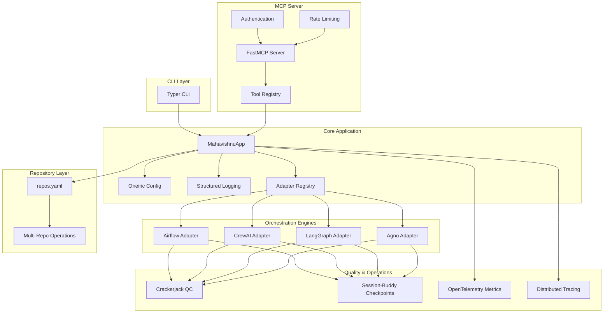

# Mahavishnu Implementation Plan (Enhanced)

## Overview

Mahavishnu is a global orchestrator package designed to help manage development workflows across multiple repositories. It provides a unified interface to various orchestration engines including Airflow, CrewAI, LangGraph, and Agno, while leveraging Oneiric for core configuration and logging.

**Key Design Principles:**

- **Oneiric-Native**: Full integration with Oneiric's configuration, logging, and lifecycle management
- **MCP-First**: Native MCP server using FastMCP + mcp-common patterns
- **Resilient**: Built-in error handling, retries, circuit breakers, and graceful degradation
- **Observable**: Comprehensive metrics, tracing, and structured logging
- **Secure**: Authentication, input validation, secrets management, and audit logging

## Architecture Diagram



## Directory Structure

```
mahavishnu/
├── pyproject.toml              # Dependencies with precise versioning
├── README.md
├── IMPLEMENTATION_PLAN.md      # This file
├── ARCHITECTURE.md             # Detailed architecture documentation
├── SECURITY.md                 # Security guidelines and hardening checklist
├── CONTRIBUTING.md             # Contribution guidelines
├── docs/                       # Additional documentation
│   ├── adr/                    # Architecture Decision Records
│   │   ├── 001-use-oneiric.md
│   │   ├── 002-mcp-first-design.md
│   │   ├── 003-error-handling-strategy.md
│   │   └── 004-adapter-architecture.md
│   └── examples/               # Usage examples
├── settings/                   # Configuration files
│   ├── mahavishnu.yaml         # Base configuration (committed)
│   └── local.yaml              # Local overrides (gitignored)
├── mahavishnu/
│   ├── __init__.py
│   ├── core/                   # Oneiric-powered core
│   │   ├── __init__.py
│   │   ├── app.py              # MahavishnuApp with Oneiric integration
│   │   ├── config.py           # MahavishnuSettings (Pydantic)
│   │   ├── logging.py          # Structured logging setup
│   │   ├── errors.py           # Custom exceptions
│   │   ├── resilience.py       # Retry, circuit breaker, rate limiting
│   │   └── adapters/           # Base adapter interface
│   │       ├── __init__.py
│   │       └── base.py         # OrchestratorAdapter abstract class
│   ├── cli.py                  # Typer CLI application
│   ├── mcp/                    # FastMCP server using mcp-common patterns
│   │   ├── __init__.py
│   │   ├── server.py           # MCP server factory
│   │   ├── server_core.py      # FastMCP server implementation
│   │   ├── tools/              # Tool registration modules
│   │   │   ├── __init__.py
│   │   │   ├── repo_tools.py
│   │   │   ├── workflow_tools.py
│   │   │   └── adapter_tools.py
│   │   ├── auth.py             # Authentication & authorization
│   │   └── context.py          # MCP server context management
│   ├── engines/                # Adapter implementations
│   │   ├── __init__.py
│   │   ├── airflow_adapter.py
│   │   ├── crewai_adapter.py
│   │   ├── langgraph_adapter.py
│   │   └── agno_adapter.py
│   ├── qc/                     # Crackerjack integration
│   │   ├── __init__.py
│   │   ├── runner.py           # QC execution wrapper
│   │   └── thresholds.py       # QC threshold configuration
│   ├── session/                # Session-Buddy integration
│   │   ├── __init__.py
│   │   ├── checkpoint.py       # Checkpoint management
│   │   └── state.py            # Session state schema
│   ├── observability/          # Metrics & tracing
│   │   ├── __init__.py
│   │   ├── metrics.py          # OpenTelemetry metrics
│   │   └── tracing.py          # Distributed tracing setup
│   └── utils/                  # Utility functions
│       ├── __init__.py
│       ├── validation.py       # Input validation
│       └── git_ops.py          # Git operations helpers
├── repos.yaml                  # Repository manifest (user-provided)
└── tests/                      # Comprehensive test suite
    ├── unit/
    ├── integration/
    ├── e2e/
    └── property/
```

## Implementation Phases

### Phase 1: Foundation ✅ (COMPLETED)

- [x] Initialize project structure
- [x] Set up pyproject.toml with dependencies
- [x] Implement core application class
- [x] Create base adapter interface
- [x] Set up basic CLI with Typer
- [x] Configure Oneiric for config/logging
- [x] Create sample configuration files

### Phase 2: Engine Integration (Week 2)

**Objectives:**

- Implement full-featured adapters for CrewAI and LangGraph
- Add Crackerjack integration for post-execution QC
- Add Session-Buddy integration for task persistence
- Create basic workflow examples
- Add comprehensive error handling

**Deliverables:**

- [ ] CrewAIAdapter with crew creation, task execution, error handling
- [ ] LangGraphAdapter with graph building, state management, routing
- [ ] Crackerjack QC runner with configurable thresholds
- [ ] Session-Buddy checkpoint manager with resume capability
- [ ] Example workflows: code sweep, dependency audit, test generation
- [ ] Unit tests for each adapter (>80% coverage)
- [ ] Integration tests for CLI commands

**Success Criteria:**

- Can execute workflows across multiple repos
- QC checks run automatically after workflow completion
- Sessions can be saved and resumed
- All adapters handle errors gracefully

### Phase 3: Advanced Engines (Week 3)

**Objectives:**

- Implement Airflow adapter with dynamic DAG creation
- Implement Agno adapter with agent capabilities
- Test hybrid workflows (e.g., Airflow DAG calling CrewAI)
- Add advanced configuration options
- Add resilience patterns (retries, circuit breakers)

**Deliverables:**

- [ ] AirflowAdapter with dynamic DAG generation
- [ ] AgnoAdapter with multi-agent coordination
- [ ] Hybrid workflow examples
- [ ] Retry logic with exponential backoff
- [ ] Circuit breaker pattern for failing services
- [ ] Timeout handling per operation
- [ ] Dead letter queue for failed workflows

**Success Criteria:**

- Airflow DAGs are created dynamically from workflow definitions
- Hybrid workflows can chain multiple engines
- Failed operations are retried with backoff
- Circuit breaker opens after consecutive failures
- Dead letter workflows can be manually replayed

### Phase 4: MCP and Tools (Week 4)

**Objectives:**

- Build production-ready MCP server using FastMCP + mcp-common
- Implement comprehensive tool set
- Add authentication and rate limiting
- Implement repository management tools
- Add workflow monitoring capabilities

**Deliverables:**

- [ ] MCP server using MCPServerCLIFactory pattern
- [ ] Tool registry with 10+ tools
- [ ] JWT-based authentication
- [ ] Rate limiting middleware (100 req/min per client)
- [ ] Tools: list_repos, trigger_workflow, workflow_status, cancel_workflow, etc.
- [ ] MCP server lifecycle management (start/stop/restart/status/health)
- [ ] HTTP endpoint with SSE support

**Success Criteria:**

- MCP server starts/stops cleanly
- All tools are discoverable and documented
- Authentication prevents unauthorized access
- Rate limiting prevents abuse
- Health probe returns accurate status

### Phase 5: Observability & Monitoring (Week 5)

**Objectives:**

- Implement OpenTelemetry metrics collection
- Add distributed tracing for cross-repo operations
- Create Grafana dashboards
- Set up alerting rules
- Add performance profiling

**Deliverables:**

- [ ] OpenTelemetry metrics (execution times, success rates, repo-level stats)
- [ ] Distributed tracing with Jaeger/Tempo
- [ ] Structured JSON logging with correlation IDs
- [ ] Grafana dashboards (4+ dashboards)
- [ ] Alerting rules (PagerDuty/Slack integration)
- [ ] Performance profiling with cProfile/py-spy

**Success Criteria:**

- Metrics are exported to Prometheus
- Traces show full workflow execution across repos
- Logs are queryable in Elasticsearch/Loki
- Dashboards show real-time system health
- Alerts fire for critical failures

### Phase 6: Polish and Deployment (Week 6-7)

**Objectives:**

- Add comprehensive tests (unit, integration, E2E, property-based)
- Set up CI/CD pipeline
- Prepare for PyPI release
- Create detailed usage examples
- Security audit and hardening
- Performance testing and optimization

**Deliverables:**

- [ ] Test suite: >80% unit coverage, 50+ integration tests, 10+ E2E tests
- [ ] Property-based tests with Hypothesis
- [ ] CI/CD pipeline (GitHub Actions)
- [ ] PyPI package with proper versioning
- [ ] 10+ usage examples in docs/examples/
- [ ] Security audit report
- [ ] Performance benchmarks (1000 repos, 100 concurrent workflows)
- [ ] Load testing with Locust
- [ ] Documentation site (MkDocs)

**Success Criteria:**

- All tests pass in CI
- Package can be installed via pip
- Examples are runnable and well-documented
- Security audit finds no critical vulnerabilities
- System meets performance targets
- Documentation is comprehensive and accurate

### Phase 7: Production Readiness (Week 8)

**Objectives:**

- Load testing and performance benchmarking
- Security audit and penetration testing
- Incident response runbooks
- On-call procedures
- SLA/SLO definitions
- Compliance checks (if applicable)

**Deliverables:**

- [ ] Load test report (target: 1000 repos, 100 concurrent workflows)
- [ ] Security audit by third party
- [ ] Penetration testing report
- [ ] Incident response runbooks (5+ scenarios)
- [ ] On-call runbook with escalation paths
- [ ] SLA/SLO definitions (99.9% uptime target)
- [ ] Disaster recovery plan
- [ ] Multi-region deployment guide

**Success Criteria:**

- System handles target load without degradation
- Security audit finds no critical issues
- Runbooks are tested and validated
- On-call team is trained
- SLA/SLOs are measurable and achievable
- DR plan is tested twice per year

## Technical Specifications

### Oneiric Integration

Mahavishnu uses Oneiric for configuration and logging, following these patterns:

**Configuration (mahavishnu/core/config.py):**

```python
from pydantic import Field
from mcp_common.cli import MCPServerSettings

class MahavishnuSettings(MCPServerSettings):
    """Mahavishnu configuration extending Oneiric MCPServerSettings.

    Configuration loading order (later overrides earlier):
    1. Default values (below)
    2. settings/mahavishnu.yaml (committed)
    3. settings/local.yaml (gitignored, for development)
    4. Environment variables: MAHAVISHNU_{FIELD}

    Example YAML (settings/mahavishnu.yaml):
        server_name: "Mahavishnu Orchestrator"
        cache_root: .oneiric_cache
        health_ttl_seconds: 60.0
        log_level: INFO
        repos_path: ~/repos.yaml
        adapters:
            airflow: true
            crewai: true
            langgraph: true
            agno: true
        qc:
            enabled: true
            min_score: 80
            checks:
                - linting
                - type_checking
                - security_scan
    """

    # Repository configuration
    repos_path: str = Field(default="repos.yaml", description="Path to repos.yaml")

    # Adapter configuration
    airflow_enabled: bool = Field(default=True, description="Enable Airflow adapter")
    crewai_enabled: bool = Field(default=True, description="Enable CrewAI adapter")
    langgraph_enabled: bool = Field(default=True, description="Enable LangGraph adapter")
    agno_enabled: bool = Field(default=True, description="Enable Agno adapter")

    # Quality control
    qc_enabled: bool = Field(default=True, description="Enable Crackerjack QC")
    qc_min_score: int = Field(default=80, description="Minimum QC score threshold")

    # Session management
    session_enabled: bool = Field(default=True, description="Enable Session-Buddy checkpoints")
    checkpoint_interval: int = Field(default=60, description="Checkpoint interval (seconds)")

    # Resilience
    retry_max_attempts: int = Field(default=3, description="Max retry attempts")
    retry_base_delay: float = Field(default=1.0, description="Base retry delay (seconds)")
    circuit_breaker_threshold: int = Field(default=5, description="Failures before circuit opens")
    timeout_per_repo: int = Field(default=300, description="Timeout per repo (seconds)")

    # Observability
    metrics_enabled: bool = Field(default=True, description="Enable OpenTelemetry metrics")
    tracing_enabled: bool = Field(default=True, description="Enable distributed tracing")
    otlp_endpoint: str = Field(default="http://localhost:4317", description="OTLP endpoint")
```

**Logging (mahavishnu/core/logging.py):**

```python
import structlog
from pathlib import Path
from typing import Any

def setup_logging(settings: MahavishnuSettings) -> None:
    """Setup structured logging with configurable sinks.

    Supports multiple sinks:
    - stdout: Human-readable in development
    - stderr: JSON in production
    - file: Rotating file logs
    - http: Send to log aggregation service

    Args:
        settings: Mahavishnu configuration
    """
    processors = [
        structlog.stdlib.filter_by_level,
        structlog.stdlib.add_logger_name,
        structlog.stdlib.add_log_level,
        structlog.stdlib.PositionalArgumentsFormatter(),
        structlog.processors.TimeStamper(fmt="iso"),
        structlog.processors.StackInfoRenderer(),
        structlog.processors.format_exc_info,
    ]

    # Add correlation ID if tracing is enabled
    if settings.tracing_enabled:
        from opentelemetry import trace
        processors.append(_add_correlation_id)

    # Choose renderer based on environment
    if settings.log_level == "DEBUG":
        processors.append(structlog.dev.ConsoleRenderer(colors=True))
    else:
        processors.append(structlog.processors.JSONRenderer())

    structlog.configure(
        processors=processors,
        wrapper_class=structlog.make_filtering_bound_logger(settings.log_level),
        logger_factory=structlog.PrintLoggerFactory(),
        cache_logger_on_first_use=True,
    )

def _add_correlation_id(
    logger: Any,
    method_name: str,
    event_dict: dict[str, Any],
) -> dict[str, Any]:
    """Add OpenTelemetry trace correlation ID to log entries."""
    from opentelemetry import trace
    current_span = trace.get_current_span()
    if current_span and current_span.is_recording():
        event_dict["trace_id"] = format(current_span.context.trace_id, "032x")
        event_dict["span_id"] = format(current_span.context.span_id, "016x")
    return event_dict
```

### Adapter Architecture

All adapters implement a common interface with enhanced error handling and observability:

**Base Adapter (mahavishnu/core/adapters/base.py):**

```python
from abc import ABC, abstractmethod
from typing import Any
from dataclasses import dataclass

@dataclass
class AdapterResult:
    """Standard result type for adapter execution."""
    status: str  # "success", "failure", "partial"
    repos_processed: int
    repos_failed: int
    execution_time_seconds: float
    metadata: dict[str, Any]
    errors: list[str] | None = None

class OrchestratorAdapter(ABC):
    """Base class for orchestrator adapters with resilience patterns."""

    def __init__(self, config: MahavishnuSettings):
        self.config = config
        self.stats = {
            "executions": 0,
            "successes": 0,
            "failures": 0,
            "retries": 0,
        }

    @abstractmethod
    async def execute(
        self,
        task: dict[str, Any],
        repos: list[str],
    ) -> AdapterResult:
        """Execute a task using the orchestrator engine.

        Must implement:
        - Input validation
        - Error handling
        - Retry logic (via self._retry)
        - Timeout handling
        - Metrics collection
        - Distributed tracing

        Args:
            task: Task specification with 'id', 'type', 'params' keys
            repos: List of repository paths to operate on

        Returns:
            AdapterResult with execution details
        """
        pass

    async def _retry(
        self,
        func,
        *args,
        max_attempts: int | None = None,
        base_delay: float | None = None,
        **kwargs,
    ):
        """Retry function with exponential backoff."""
        import asyncio
        import random

        max_attempts = max_attempts or self.config.retry_max_attempts
        base_delay = base_delay or self.config.retry_base_delay

        for attempt in range(max_attempts):
            try:
                return await func(*args, **kwargs)
            except Exception as e:
                if attempt == max_attempts - 1:
                    self.stats["retries"] += attempt
                    raise

                delay = base_delay * (2 ** attempt) + random.uniform(0, 1)
                await asyncio.sleep(delay)

        self.stats["retries"] += max_attempts - 1
```

### MCP Server Design

The MCP server follows mcp-common patterns with FastMCP:

**Server Factory (mahavishnu/mcp/server_core.py):**

```python
from fastmcp import FastMCP
from mcp_common.cli import MCPServerCLIFactory
from mcp_common.ui import ServerPanels
from ..core.config import MahavishnuSettings

class MahavishnuMCPServer:
    """Mahavishnu MCP server using FastMCP + mcp-common patterns."""

    def __init__(self, settings: MahavishnuSettings):
        self.settings = settings
        self.mcp_app = FastMCP(
            "mahavishnu-mcp-server",
            streamable_http_path="/mcp",
        )
        self._setup_middleware()
        self._register_tools()

    def _setup_middleware(self):
        """Setup authentication, rate limiting, and other middleware."""
        # Rate limiting
        from fastmcp.server.middleware.rate_limiting import RateLimitingMiddleware

        rate_limiter = RateLimitingMiddleware(
            max_requests_per_second=100.0 / 60.0,  # 100 req/min
            burst_capacity=20,
            global_limit=True,
        )
        self.mcp_app.add_middleware(rate_limiter)

        # Authentication (if configured)
        if self.settings.auth_enabled:
            from .auth import JWTAuthMiddleware

            auth_middleware = JWTAuthMiddleware(
                secret=self.settings.auth_secret,
                algorithm="HS256",
            )
            self.mcp_app.add_middleware(auth_middleware)

    def _register_tools(self):
        """Register all MCP tools."""
        from .tools.repo_tools import register_repo_tools
        from .tools.workflow_tools import register_workflow_tools
        from .tools.adapter_tools import register_adapter_tools

        register_repo_tools(self.mcp_app, self.settings)
        register_workflow_tools(self.mcp_app, self.settings)
        register_adapter_tools(self.mcp_app, self.settings)

    def run(self):
        """Run the MCP server."""
        import uvicorn

        uvicorn.run(
            self.mcp_app.http_app,
            host=self.settings.http_host,
            port=self.settings.http_port,
        )
```

**Tool Registration (mahavishnu/mcp/tools/repo_tools.py):**

```python
from typing import Any
from fastmcp import FastMCP
from mcp_common.ui import ServerPanels
from ...core.config import MahavishnuSettings
from ...core.app import MahavishnuApp

def register_repo_tools(mcp_app: FastMCP, settings: MahavishnuSettings) -> None:
    """Register repository management tools."""

    @mcp_app.tool()
    async def list_repos(
        tag: str | None = None,
    ) -> list[dict[str, Any]]:
        """List repositories with optional tag filtering.

        Args:
            tag: Optional tag to filter repositories

        Returns:
            List of repository dictionaries with path, tags, description
        """
        try:
            app = MahavishnuApp(config=settings)
            repos = app.get_repos_by_tag(tag) if tag else app.get_all_repos()

            return [
                {
                    "path": repo.path,
                    "tags": repo.tags,
                    "description": repo.description,
                }
                for repo in repos
            ]

        except Exception as e:
            ServerPanels.error(
                title="Repository List Error",
                message=f"Failed to list repositories",
                suggestion="Check repos.yaml configuration",
                error_type=type(e).__name__,
            )
            raise

    @mcp_app.tool()
    async def get_repo_health(
        repo_path: str,
    ) -> dict[str, Any]:
        """Get health status for a specific repository.

        Checks:
        - Git status (clean/dirty)
        - Branch status (ahead/behind)
        - Open PRs
        - Open issues
        - Recent activity

        Args:
            repo_path: Path to repository

        Returns:
            Repository health dictionary
        """
        # Implementation with git operations
        pass
```

### CLI Commands

**CLI Groups (mahavishnu/cli.py):**

```python
import typer
from pathlib import Path
from .core.config import MahavishnuSettings
from .mcp.server import MahavishnuMCPServer

app = typer.Typer()

# Sub-groups
workflow_app = typer.Typer()
adapter_app = typer.Typer()
repo_app = typer.Typer()
app.add_typer(workflow_app, name="workflow")
app.add_typer(adapter_app, name="adapter")
app.add_typer(repo_app, name="repo")

@workflow_app.command()
def sweep(
    tag: str = typer.Option(..., "--tag", "-t", help="Tag to filter repositories"),
    adapter: str = typer.Option("langgraph", "--adapter", "-a", help="Orchestrator adapter"),
    task_file: Path = typer.Option(None, "--task-file", help="Task definition file"),
):
    """Perform AI sweep across tagged repositories."""
    settings = MahavishnuSettings.load("mahavishnu")
    app = MahavishnuApp(config=settings)

    # Load task definition
    task = _load_task(task_file) if task_file else {"type": "ai-sweep"}

    # Execute workflow
    result = app.execute_workflow(
        task=task,
        adapter_name=adapter,
        tag=tag,
    )

    typer.echo(f"Workflow completed: {result}")

@repo_app.command()
def list(
    tag: str | None = typer.Option(None, "--tag", "-t", help="Filter by tag"),
):
    """List repositories from repos.yaml."""
    settings = MahavishnuSettings.load("mahavishnu")
    app = MahavishnuApp(config=settings)

    repos = app.get_repos_by_tag(tag) if tag else app.get_all_repos()

    for repo in repos:
        typer.echo(f"  {repo.path} - {', '.join(repo.tags)}")

# MCP server lifecycle commands
mcp_app = typer.Typer()
app.add_typer(mcp_app, name="mcp")

@mcp_app.command()
def start():
    """Start the MCP server."""
    from mcp_common.cli import MCPServerCLIFactory

    settings = MahavishnuSettings.load("mahavishnu")

    factory = MCPServerCLIFactory(
        server_name="mahavishnu",
        settings_class=MahavishnuSettings,
        start_handler=_start_mcp_server,
        stop_handler=_stop_mcp_server,
        health_probe_handler=_health_probe,
    )

    factory.start()

@mcp_app.command()
def status():
    """Get MCP server status."""
    from mcp_common.cli import MCPServerCLIFactory

    factory = MCPServerCLIFactory(
        server_name="mahavishnu",
        settings_class=MahavishnuSettings,
    )

    factory.status()
```

### Integration Points

**Crackerjack QC (mahavishnu/qc/runner.py):**

```python
from dataclasses import dataclass
from typing import Any
from crackerjack import run_crackerjack

@dataclass
class QCResult:
    """Quality control result."""
    repo_path: str
    score: int
    passed: bool
    checks: dict[str, Any]
    errors: list[str] | None = None

class QCRunner:
    """Crackerjack QC execution wrapper."""

    def __init__(self, config: MahavishnuSettings):
        self.config = config
        self.min_score = config.qc_min_score

    async def run_qc(
        self,
        repo_path: str,
        checks: list[str] | None = None,
    ) -> QCResult:
        """Run QC checks on a repository.

        Args:
            repo_path: Path to repository
            checks: List of checks to run (default: from config)

        Returns:
            QCResult with score and pass/fail status
        """
        if not self.config.qc_enabled:
            return QCResult(
                repo_path=repo_path,
                score=100,
                passed=True,
                checks={},
            )

        # Default checks
        if checks is None:
            checks = ["linting", "type_checking", "security_scan"]

        # Run Crackerjack
        try:
            result = await run_crackerjack(
                project_path=repo_path,
                checks=checks,
                autofix=False,
            )

            score = result.get("score", 0)
            passed = score >= self.min_score

            return QCResult(
                repo_path=repo_path,
                score=score,
                passed=passed,
                checks=result.get("checks", {}),
                errors=result.get("errors"),
            )

        except Exception as e:
            return QCResult(
                repo_path=repo_path,
                score=0,
                passed=False,
                checks={},
                errors=[str(e)],
            )
```

**Session-Buddy Checkpoints (mahavishnu/session/checkpoint.py):**

```python
from dataclasses import dataclass, asdict
from datetime import datetime
from typing import Any
import json

@dataclass
class CheckpointState:
    """Session checkpoint state."""
    workflow_id: str
    task: dict[str, Any]
    repos: list[str]
    completed_repos: list[str]
    failed_repos: list[str]
    current_step: str
    metadata: dict[str, Any]
    timestamp: str

class CheckpointManager:
    """Session-Buddy checkpoint management."""

    def __init__(self, config: MahavishnuSettings):
        self.config = config
        self.checkpoint_dir = Path(".mahavishnu") / "checkpoints"
        self.checkpoint_dir.mkdir(parents=True, exist_ok=True)

    async def save_checkpoint(
        self,
        workflow_id: str,
        state: CheckpointState,
    ) -> Path:
        """Save workflow checkpoint.

        Args:
            workflow_id: Unique workflow identifier
            state: Current workflow state

        Returns:
            Path to checkpoint file
        """
        checkpoint_path = self.checkpoint_dir / f"{workflow_id}.json"

        with open(checkpoint_path, "w") as f:
            json.dump(asdict(state), f, indent=2, default=str)

        return checkpoint_path

    async def load_checkpoint(
        self,
        workflow_id: str,
    ) -> CheckpointState | None:
        """Load workflow checkpoint.

        Args:
            workflow_id: Unique workflow identifier

        Returns:
            CheckpointState if found, None otherwise
        """
        checkpoint_path = self.checkpoint_dir / f"{workflow_id}.json"

        if not checkpoint_path.exists():
            return None

        with open(checkpoint_path, "r") as f:
            data = json.load(f)

        return CheckpointState(**data)

    async def resume_workflow(
        self,
        workflow_id: str,
    ) -> dict[str, Any]:
        """Resume workflow from checkpoint.

        Args:
            workflow_id: Unique workflow identifier

        Returns:
            Resume result with remaining repos
        """
        state = await self.load_checkpoint(workflow_id)

        if not state:
            raise ValueError(f"Checkpoint not found: {workflow_id}")

        # Calculate remaining repos
        remaining_repos = [
            repo for repo in state.repos
            if repo not in state.completed_repos
        ]

        return {
            "workflow_id": workflow_id,
            "remaining_repos": remaining_repos,
            "failed_repos": state.failed_repos,
            "current_step": state.current_step,
        }
```

## Security & Hardening

### Authentication & Authorization

**JWT-Based Authentication:**

- All MCP tools require valid JWT token
- Tokens are signed with HS256 algorithm
- Token expiration: 1 hour (configurable)
- Refresh token support

**Role-Based Access Control:**

- Admin: Full access to all tools
- Operator: Can trigger workflows, view status
- Viewer: Read-only access

### Input Validation

**Pydantic Models:**

- All tool inputs use Pydantic models
- Schema validation on all parameters
- SQL injection prevention for repo paths
- Path traversal protection

### Secrets Management

**Provider-Based:**

- Environment variables (default)
- HashiCorp Vault (optional)
- AWS Secrets Manager (optional)
- Automatic rotation support

### Audit Logging

**All Operations Logged:**

- Workflow triggers
- QC check results
- Configuration changes
- Authentication events
- Authorization failures

**Log Format:**

```json
{
  "timestamp": "2025-01-22T12:34:56Z",
  "trace_id": "abc123...",
  "span_id": "def456...",
  "event": "workflow_triggered",
  "workflow_id": "wf-123",
  "user": "user@example.com",
  "adapter": "langgraph",
  "repos": ["repo1", "repo2"],
  "tags": ["backend", "python"]
}
```

### Network Security

**TLS/mTLS:**

- TLS 1.3 for HTTP endpoint
- mTLS for server-to-server communication
- Certificate rotation support

### Rate Limiting

**Per-Client Limits:**

- 100 requests per minute
- Burst capacity: 20 requests
- Configurable per client tier

## Error Handling & Resilience

### Retry Logic

**Exponential Backoff with Jitter:**

- Max attempts: 3 (configurable)
- Base delay: 1 second
- Max delay: 60 seconds
- Jitter: ±1 second

**Retryable Errors:**

- Network timeouts
- 5xx server errors
- Rate limit errors (429)
- Transient failures

### Circuit Breaker

**Circuit States:**

- Closed: Normal operation
- Open: Failures exceed threshold, requests fail fast
- Half-Open: Testing if service has recovered

**Configuration:**

- Failure threshold: 5 consecutive failures
- Timeout: 60 seconds before half-open
- Success threshold: 2 consecutive successes to close

### Dead Letter Queue

**Failed Workflows:**

- Saved to `.mahavishnu/dead_letter/`
- Include error context and metadata
- Can be replayed manually
- Automatic replay on schedule (optional)

### Graceful Degradation

**Partial Failures:**

- If 3/10 repos fail, continue with remaining 7
- Return partial results with error details
- Don't fail entire workflow for single repo failure

**Adapter Unavailability:**

- If adapter crashes, mark as unhealthy
- Circuit breaker opens for that adapter
- Other adapters continue functioning

## Observability

### Metrics (OpenTelemetry)

**Collected Metrics:**

- `mahavishnu_workflow_duration_seconds`: Workflow execution time
- `mahavishnu_workflow_status_total`: Workflow success/failure count
- `mahavishnu_repo_processing_duration_seconds`: Per-repo processing time
- `mahavishnu_qc_score`: QC check scores
- `mahavishnu_adapter_health`: Adapter health status
- `mahavishnu_active_workflows`: Current active workflow count

**Labels:**

- adapter: {airflow,crewai,langgraph,agno}
- workflow_type: {sweep,audit,generate}
- repo: repository path
- status: {success,failure,partial}

### Distributed Tracing

**Trace Workflow Execution:**

- Span for workflow initiation
- Child spans for each repo
- Grandchild spans for QC checks
- Span attributes: repo path, adapter, task type

### Logging

**Structured JSON Logs:**

```json
{
  "timestamp": "2025-01-22T12:34:56Z",
  "level": "INFO",
  "logger": "mahavishnu.core.app",
  "trace_id": "abc123...",
  "span_id": "def456...",
  "event": "repo_processing_complete",
  "workflow_id": "wf-123",
  "repo": "/path/to/repo",
  "duration_seconds": 45.2,
  "status": "success"
}
```

**Multiple Sinks:**

- stdout: Human-readable in development
- file: Rotating file logs (.mahavishnu/logs/)
- http: Send to log aggregation (optional)

### Dashboards (Grafana)

**Dashboard 1: Workflow Overview**

- Workflow execution rate
- Success/failure ratio
- Average duration
- Active workflow count

**Dashboard 2: Repository Stats**

- Repos processed
- Per-repo duration
- QC scores by repo
- Failed repos

**Dashboard 3: Adapter Health**

- Adapter status (healthy/degraded/down)
- Request rate per adapter
- Error rate per adapter
- Circuit breaker state

**Dashboard 4: System Resources**

- CPU usage
- Memory usage
- Disk I/O
- Network I/O

### Alerting

**Alert Rules:**

- Workflow failure rate > 10% (5 minutes)
- QC score < 80 (5 minutes)
- Adapter circuit breaker open (immediate)
- System memory > 90% (5 minutes)
- Active workflows > 100 (immediate)

**Alert Channels:**

- Slack: #mahavishnu-alerts
- PagerDuty: On-call rotation
- Email: team@example.com

## Configuration Management

### Schema Validation

**Pydantic Models:**

- All configuration uses Pydantic models
- Schema validation at startup
- Type safety and coercion
- Default values

### Environment-Specific Configs

**Configuration Hierarchy:**

1. `settings/mahavishnu.yaml` (base, committed)
1. `settings/local.yaml` (development, gitignored)
1. `settings/production.yaml` (production, committed if non-sensitive)
1. Environment variables: `MAHAVISHNU_{FIELD}`

### Hot Reload

**SIGHUP Handler:**

- Reload configuration without restart
- Validate new configuration before applying
- Rollback on validation failure
- Notify clients of configuration change

## Deployment

### Upgrade Strategy

**Database Migrations:**

- Alembic for schema migrations
- Forward and backward migrations
- Migration testing in CI

**Configuration Migrations:**

- Automatic config migration on startup
- Backup old configuration
- Rollback on failure

### Backup & Restore

**Backups:**

- Checkpoints: Daily to S3
- Configuration: Git versioned
- State database: Hourly snapshots

**Restore:**

- One-command restore from backup
- Restore specific checkpoint
- Restore configuration version

### Disaster Recovery

**Multi-Region Deployment:**

- Primary region: us-east-1
- DR region: us-west-2
- Data replication: Async
- RTO: 4 hours
- RPO: 1 hour

### Multi-Tenancy

**User/Org Isolation:**

- Separate checkpoints per user
- Separate workflow history
- Rate limiting per user
- Audit logs per user

## Developer Experience

### Local Development

**Quickstart:**

```bash
# Clone and install
git clone https://github.com/example/mahavishnu.git
cd mahavishnu
uv venv
source .venv/bin/activate
uv pip install -e ".[dev]"

# Configure
cp settings/mahavishnu.example.yaml settings/local.yaml
# Edit settings/local.yaml with your configuration

# Run workflow
mahavishnu workflow sweep --tag=backend --adapter=langgraph

# Start MCP server
mahavishnu mcp start
```

### Debugging

**Enable Debug Logging:**

```bash
export MAHAVISHNU_LOG_LEVEL=DEBUG
mahavishnu workflow sweep --tag=backend
```

**Enable Tracing:**

```bash
export MAHAVISHNU_TRACING_ENABLED=true
export MAHAVISHNU_OTLP_ENDPOINT=http://localhost:4317
mahavishnu workflow sweep --tag=backend
```

### Contributing

**Contribution Workflow:**

1. Fork repository
1. Create feature branch
1. Make changes with tests
1. Run `crackerjack run`
1. Run `pytest tests/`
1. Submit pull request

**Code Style:**

- Black: Code formatting
- isort: Import sorting
- flake8: Linting
- mypy: Type checking

## Dependencies

### Core Dependencies

```toml
[project]
name = "mahavishnu"
version = "0.1.0"
requires-python = ">=3.11"

dependencies = [
    # CLI
    "typer~=0.9.0",

    # Oneiric ecosystem
    "oneiric~=0.1.0",
    "mcp-common~=0.3.0",

    # MCP server
    "fastmcp>=0.1.0",
    "uvicorn~=0.23.0",

    # Configuration
    "pydantic~=2.0.0",
    "pyyaml~=6.0",
    "tomli~=2.0.0",

    # Observability
    "opentelemetry-api~=1.20.0",
    "opentelemetry-sdk~=1.20.0",
    "opentelemetry-instrumentation~=0.41b0",
    "structlog~=23.1.0",

    # Resilience
    "tenacity~=8.2.0",

    # Quality control
    "crackerjack>=0.1.0",

    # Session management
    "session-buddy>=0.1.0",

    # Git operations
    "gitpython~=3.1.0",
]

[project.optional-dependencies]
dev = [
    "pytest~=7.4.0",
    "pytest-asyncio~=0.21.0",
    "pytest-cov~=4.1.0",
    "hypothesis~=6.82.0",
    "black~=23.7.0",
    "isort~=5.12.0",
    "flake8~=6.1.0",
    "mypy~=1.5.0",
    # Note: We use Crackerjack for QC, not pre-commit
]

airflow = [
    "apache-airflow~=2.7.0",
]

crewai = [
    "crewai~=0.28.0",
]

langgraph = [
    "langgraph~=0.0.40",
]

agno = [
    "agno~=0.1.0",
]

all = [
    "mahavishnu[airflow,crewai,langgraph,agno,dev]",
]
```

## Configuration Files

### repos.yaml

**Schema:**

```yaml
repos:
  - path: "/path/to/repo1"
    tags:
      - backend
      - python
    description: "Backend services repository"
    metadata:
      owner: "team-backend"
      language: "python"
      ci_system: "github-actions"

  - path: "/path/to/repo2"
    tags:
      - frontend
      - typescript
    description: "Frontend application"
    metadata:
      owner: "team-frontend"
      language: "typescript"
      ci_system: "gitlab-ci"
```

**Validation:**

- Path must exist and be a git repository
- Tags must be alphanumeric with hyphens
- Description is required
- Metadata is optional

### settings/mahavishnu.yaml

**Example:**

```yaml
# Mahavishnu Configuration

server_name: "Mahavishnu Orchestrator"
cache_root: .oneiric_cache
health_ttl_seconds: 60.0
log_level: INFO

# Repository configuration
repos_path: ~/repos.yaml

# Adapter configuration
adapters:
  airflow:
    enabled: true
    dag_dir: ~/.mahavishnu/dags
    concurrency: 10

  crewai:
    enabled: true
    max_agents: 50
    llm_provider: openai

  langgraph:
    enabled: true
    checkpoint_dir: .mahavishnu/checkpoints
    max_concurrent: 20

  agno:
    enabled: true
    agent_dir: .mahavishnu/agents

# Quality control
qc:
  enabled: true
  min_score: 80
  checks:
    - name: linting
      enabled: true
      weight: 30
    - name: type_checking
      enabled: true
      weight: 30
    - name: security_scan
      enabled: true
      weight: 40

# Session management
session:
  enabled: true
  checkpoint_interval: 60
  checkpoint_dir: .mahavishnu/checkpoints

# Resilience
resilience:
  retry_max_attempts: 3
  retry_base_delay: 1.0
  circuit_breaker_threshold: 5
  timeout_per_repo: 300

# Observability
observability:
  metrics_enabled: true
  tracing_enabled: true
  otlp_endpoint: http://localhost:4317

# Authentication (optional)
auth:
  enabled: false
  secret: ${MAHAVISHNU_AUTH_SECRET}
  algorithm: HS256
  expire_minutes: 60

# MCP server
mcp:
  http_host: 127.0.0.1
  http_port: 8677
  http_enabled: true
  rate_limit_per_minute: 100
```

## Testing Strategy

### Unit Tests

**Framework:** pytest with pytest-asyncio

**Coverage Target:** >80%

**Test Structure:**

```
tests/unit/
├── core/
│   ├── test_app.py
│   ├── test_config.py
│   ├── test_logging.py
│   └── test_resilience.py
├── adapters/
│   ├── test_airflow_adapter.py
│   ├── test_crewai_adapter.py
│   ├── test_langgraph_adapter.py
│   └── test_agno_adapter.py
├── qc/
│   └── test_qc_runner.py
└── session/
    └── test_checkpoint.py
```

### Integration Tests

**Framework:** pytest with Docker containers for dependencies

**Test Structure:**

```
tests/integration/
├── test_workflow_execution.py
├── test_qc_integration.py
├── test_checkpoint_integration.py
└── test_mcp_server.py
```

### E2E Tests

**Framework:** pytest with real repositories

**Test Structure:**

```
tests/e2e/
├── test_sweep_workflow.py
├── test_audit_workflow.py
├── test_hybrid_workflow.py
└── test_resume_workflow.py
```

### Property-Based Tests

**Framework:** Hypothesis

**Test Properties:**

- Repo list filtering is idempotent
- Workflow execution is commutative
- Checkpoint save/load is round-trip
- QC scoring is monotonic

**Example:**

```python
from hypothesis import given, strategies as st

@given(st.lists(st.text(min_size=1), min_size=1, max_size=100))
def test_repo_filtering_is_idempotent(tags):
    """Filtering repos by tags should be idempotent."""
    app = MahavishnaApp()
    repos1 = app.get_repos_by_tags(tags)
    repos2 = app.get_repos_by_tags(tags)
    assert repos1 == repos2
```

## Performance Targets

### Throughput

- 100 concurrent workflows
- 1000 repositories per workflow
- 1000 repos processed per minute

### Latency

- Workflow initiation: \<100ms
- Per-repo processing: \<5s (average)
- QC check execution: \<30s per repo
- Total workflow time: \<10 minutes (100 repos)

### Resource Usage

- Memory: \<4GB (100 concurrent workflows)
- CPU: \<80% (8 cores)
- Disk I/O: \<100MB/s
- Network: \<1Gbps

## Production Readiness Checklist

### Security

- [ ] Authentication implemented and tested
- [ ] Input validation on all inputs
- [ ] Secrets management configured
- [ ] TLS enabled for HTTP endpoint
- [ ] Rate limiting configured
- [ ] Audit logging enabled
- [ ] Security audit completed
- [ ] Penetration testing completed

### Observability

- [ ] Metrics collection enabled
- [ ] Distributed tracing enabled
- [ ] Structured logging configured
- [ ] Dashboards created
- [ ] Alerting rules configured
- [ ] On-call rotation established

### Reliability

- [ ] Circuit breakers implemented
- [ ] Retry logic configured
- [ ] Dead letter queue configured
- [ ] Health checks implemented
- [ ] Graceful degradation tested
- [ ] Disaster recovery tested

### Performance

- [ ] Load testing completed
- [ ] Performance benchmarks met
- [ ] Resource usage optimized
- [ ] Bottlenecks identified and resolved

### Operations

- [ ] CI/CD pipeline operational
- [ ] Deployment automation working
- [ ] Backup/restore tested
- [ ] Runbooks documented
- [ ] On-call team trained
- [ ] SLA/SLOs defined and measurable
