# Sentence-Transformers Alternatives for Intel Macs

**Problem**: `sentence-transformers>=2.2.2` requires `torch`, which doesn't have wheels for Intel Macs (x86_64) on Python 3.13.

**Current Solution**: Exclude sentence-transformers on incompatible platforms (temporary fix)

**Better Solutions**: Use embedding alternatives that work everywhere

---

## Quick Comparison

### Solution Comparison at a Glance

```mermaid
graph TB
    subgraph "Problem"
        ISSUE[❌ sentence-transformers<br/>Requires PyTorch<br/>No Intel Mac wheels<br/>Python 3.13 incompatible]
    end

    subgraph "Solutions"
        FAST[✅ FastEmbed<br/>🏭 Production<br/>⚡ Fast<br/>💰 Free<br/>🔒 Local]
        OLLAMA[✅ Ollama<br/>🔧 Development<br/>⚡⚡ Medium<br/>💰 Free<br/>🏠 Local]
        OPENAI[✅ OpenAI API<br/>☁️ Cloud<br/>⚡⚡⚡ Fast<br/>💵 Pay-per-use<br/>🌐 Remote]
    end

    ISSUE --> FAST
    ISSUE --> OLLAMA
    ISSUE --> OPENAI

    style ISSUE fill:#FFB6C1
    style FAST fill:#90EE90,stroke:#333,stroke-width:3px
    style OLLAMA fill:#87CEEB,stroke:#333,stroke-width:3px
    style OPENAI fill:#FFD700,stroke:#333,stroke-width:3px
```



### Platform Compatibility Matrix

| Solution | Intel Mac | Apple Silicon | Linux | Windows | Python 3.13 | Setup |
|----------|-----------|---------------|-------|---------|-------------|-------|
| **sentence-transformers** | ❌ | ✅ | ✅ | ✅ | ❌ | Easy |
| **FastEmbed** | ✅ | ✅ | ✅ | ✅ | ✅ | Easy |
| **Ollama** | ✅ | ✅ | ✅ | ✅ | ✅ | Medium |
| **OpenAI API** | ✅ | ✅ | ✅ | ✅ | ✅ | Easy |
| **ONNX Runtime** | ✅ | ✅ | ✅ | ✅ | ✅ | Hard |

---

## Recommended Alternatives

### 1. Hugging Face Transformers (ONNX Runtime) ⭐ RECOMMENDED

**Why**: ONNX Runtime has native wheels for all platforms (including Intel Macs)

```python
# Install
pip install transformers[onnx] onnxruntime

# Usage
from transformers import AutoTokenizer, AutoModel
import torch

# Load model and export to ONNX
model = AutoModel.from_pretrained("sentence-transformers/all-MiniLM-L6-v2")
tokenizer = AutoTokenizer.from_pretrained("sentence-transformers/all-MiniLM-L6-v2")

# Export to ONNX for faster inference
dummy_input = tokenizer("Hello world", return_tensors="pt")
torch.onnx.export(
    model,
    (dummy_input['input_ids'], dummy_input['attention_mask']),
    "sentence_transformer.onnx",
    input_names=['input_ids', 'attention_mask'],
    output_names=['embedding'],
)

# Run inference with ONNX Runtime
import onnxruntime as ort
session = ort.InferenceSession("sentence_transformer.onnx")
embeddings = session.run(None, {
    'input_ids': dummy_input['input_ids'].numpy(),
    'attention_mask': dummy_input['attention_mask'].numpy()
})
```

**Pros**:
- ✅ Works on Intel Macs
- ✅ Faster inference than PyTorch
- ✅ Compatible with Python 3.13

**Cons**:
- Requires one-time model export
- Slightly more complex setup

---

### 2. OpenAI Embeddings API ⭐ SIMPLEST

**Why**: Cloud-based, no local dependencies, works everywhere

```python
# Install
pip install openai

# Usage
from openai import OpenAI

client = OpenAI(api_key="your-api-key")

response = client.embeddings.create(
    input="Hello world",
    model="text-embedding-3-small"  # Cheapest, fastest
)

embedding = response.data[0].embedding
```

**Pros**:
- ✅ Zero dependencies
- ✅ Works on all platforms
- ✅ No local model management
- ✅ State-of-the-art quality

**Cons**:
- Requires API key
- Network latency
- Usage costs apply

---

### 3. Ollama with Local Embeddings ⭐ BEST FOR PRIVACY

**Why**: Runs locally, supports Intel Macs, no PyTorch dependency

```python
# Install Ollama
brew install ollama

# Pull embedding model
ollama pull nomic-embed-text

# Usage in Python
import requests

def get_embedding(text: str) -> list[float]:
    response = requests.post(
        "http://localhost:11434/api/embed",
        json={"model": "nomic-embed-text", "input": text}
    )
    return response.json()["embedding"]

# Usage
embedding = get_embedding("Hello world")
```

**Pros**:
- ✅ Works on Intel Macs (no PyTorch needed)
- ✅ Fully local (privacy-preserving)
- ✅ Easy to use
- ✅ Supports multiple embedding models

**Cons**:
- Requires Ollama service running
- Model quality varies

---

### 4. FastEmbed ⭐ FASTEST

**Why**: Pure Python, ONNX-based, no heavy dependencies

```python
# Install
pip install fastembed

# Usage
from fastembed import SentenceTransformer

# Downloads model automatically on first use
embedding_model = SentenceTransformer("BAAI/bge-small-en-v1.5")
embeddings = embedding_model.encode("Hello world")

# Batch encoding
embeddings = embedding_model.encode([
    "Hello world",
    "Fast sentence embeddings"
])
```

**Pros**:
- ✅ Works on all platforms (ONNX-based)
- ✅ No PyTorch dependency
- ✅ Fast inference
- ✅ Multiple models available

**Cons**:
- Limited model selection
- First download can be slow

---

### 5. Sentence-Transformers with CPU-Only PyTorch

**Why**: Use older PyTorch version with Intel Mac support

```python
# Install specific PyTorch version (has Intel Mac wheels)
pip install torch==2.0.1 --index-url https://download.pytorch.org/whl/cpu

# Install sentence-transformers
pip install sentence-transformers

# Usage (unchanged)
from sentence_transformers import SentenceTransformer
model = SentenceTransformer('all-MiniLM-L6-v2')
embeddings = model.encode("Hello world")
```

**Pros**:
- ✅ Familiar API
- ✅ Works on Intel Macs

**Cons**:
- Uses older PyTorch version (may have security issues)
- Slower inference
- Not recommended for production

---

## Migration Guide

### Migration Decision Tree

```mermaid
flowchart TD
    START([Migrate from<br/>sentence-transformers]) --> PRIORITY{Primary<br/>Concern?}

    PRIORITY -->|Performance| PERF{Platform?}
    PRIORITY -->|Privacy| PRIVACY{Need<br/>Local?}
    PRIORITY -->|Simplicity| SIMPLE{Setup<br/>Complexity?}

    PERF -->|Intel Mac| FAST1[🏭 FastEmbed<br/>✅ Cross-platform<br/>⚡ Fastest]
    PERF -->|Any| SIMPLE

    PRIVACY -->|Yes| OLLAMA[🔧 Ollama<br/>🏠 Local<br/>🔒 Private]
    PRIVACY -->|No| SIMPLE

    SIMPLE -->|Easy Setup| OPENAI[☁️ OpenAI<br/>🚀 Zero setup<br/>💵 Pay-per-use]
    SIMPLE -->|Free| FAST1

    FAST1 --> IMPLEMENT1[Implementation:<br/>pip install fastembed]
    OLLAMA --> IMPLEMENT2[Implementation:<br/>brew install ollama]
    OPENAI --> IMPLEMENT3[Implementation:<br/>pip install openai]

    IMPLEMENT1 --> CODE[Update Code:<br/>See examples below]
    IMPLEMENT2 --> CODE
    IMPLEMENT3 --> CODE

    CODE --> DONE([✅ Migration Complete])

    style FAST1 fill:#90EE90,stroke:#333,stroke-width:3px
    style OLLAMA fill:#87CEEB,stroke:#333,stroke-width:3px
    style OPENAI fill:#FFD700,stroke:#333,stroke-width:3px
```



### Replace sentence-transformers in Code

**Current code** (incompatible):
```python
from sentence_transformers import SentenceTransformer

model = SentenceTransformer('all-MiniLM-L6-v2')
embeddings = model.encode(["text1", "text2"])
```

### Option 1: Use FastEmbed (RECOMMENDED)
```python
from fastembed import SentenceTransformer

model = SentenceTransformer('BAAI/bge-small-en-v1.5')
embeddings = model.encode(["text1", "text2"])
```

### Option 2: Use Ollama
```python
import requests
import json

def get_embeddings(texts: list[str]) -> list[list[float]]:
    response = requests.post(
        "http://localhost:11434/api/embed",
        json={"model": "nomic-embed-text", "input": texts}
    )
    return [item["embedding"] for item in response.json()]

embeddings = get_embeddings(["text1", "text2"])
```

### Option 3: Use OpenAI API
```python
from openai import OpenAI

client = OpenAI()

def get_embeddings(texts: list[str]) -> list[list[float]]:
    response = client.embeddings.create(
        input=texts,
        model="text-embedding-3-small"
    )
    return [item.embedding for item in response.data]

embeddings = get_embeddings(["text1", "text2"])
```

---

## Recommended Approach for Mahavishnu

### For Production (Privacy-First): Use FastEmbed

**Implementation**:
```bash
# Update dependencies
# In pyproject.toml, replace:
# "sentence-transformers>=2.2.2; ..."
# With:
"fastembed>=0.2.0",  # Fast embeddings, works on all platforms
```

**Code changes** (in modules using embeddings):
```python
# mahavishnu/core/embeddings.py
from fastembed import SentenceTransformer

class EmbeddingService:
    def __init__(self, model: str = "BAAI/bge-small-en-v1.5"):
        self.model = SentenceTransformer(model)

    async def embed(self, texts: list[str]) -> list[list[float]]:
        """Generate embeddings for texts."""
        return self.model.encode(texts)
```

### For Development/Testing: Use Ollama

**Setup**:
```bash
# Install Ollama
brew install ollama

# Start service
ollama serve

# Pull model
ollama pull nomic-embed-text
```

**Usage**:
```python
import requests

OLLAMA_EMBEDDING_MODEL = "nomic-embed-text"

def get_embedding(text: str) -> list[float]:
    """Get embedding from Ollama."""
    response = requests.post(
        "http://localhost:11434/api/embed",
        json={"model": OLLAMA_EMBEDDING_MODEL, "input": text},
        timeout=30
    )
    response.raise_for_status()
    return response.json()["embedding"]
```

---

## Performance Comparison

| Solution | Inference Speed | Setup Complexity | Platform Support | Privacy |
|-----------|-----------------|------------------|-----------------|----------|
| **sentence-transformers** | 50-100 ms | Low | Limited | ✅ Local |
| **FastEmbed** | 20-50 ms | Low | ✅ All | ✅ Local |
| **Ollama** | 100-200 ms | Medium | ✅ All | ✅ Local |
| **OpenAI API** | 200-500 ms | Low | ✅ All | ❌ Cloud |
| **ONNX Runtime** | 30-80 ms | High | ✅ All | ✅ Local |

---

## Summary Recommendation

**For Mahavishnu**, I recommend:

1. **Primary**: Use **FastEmbed** for production
   - Fast, cross-platform, no dependencies
   - Easy migration (similar API)

2. **Alternative**: Use **Ollama** for development
   - Privacy-preserving
   - Supports multiple models
   - Easy to install

3. **Fallback**: Use **OpenAI API** for cloud scenarios
   - Zero setup
   - Best quality embeddings
   - Pay-per-use pricing

---

## Next Steps

Would you like me to:
1. Replace sentence-transformers with FastEmbed in Mahavishnu?
2. Set up Ollama integration for development?
3. Create an embedding service abstraction that supports multiple providers?

Let me know your preference!
