# Mahavishnu Workflow Diagrams

**Common Workflows and Operational Procedures**

**Last Updated**: 2026-02-03

---

## Table of Contents

1. [Quick Start Workflow](#1-quick-start-workflow)
2. [Pool Spawn and Execute](#2-pool-spawn-and-execute)
3. [Repository Sweep](#3-repository-sweep)
4. [Memory Search](#4-memory-search)
5. [Quality Control Pipeline](#5-quality-control-pipeline)
6. [Error Recovery](#6-error-recovery)
7. [MCP Tool Execution](#7-mcp-tool-execution)

---

## 1. Quick Start Workflow

### First-Time Setup

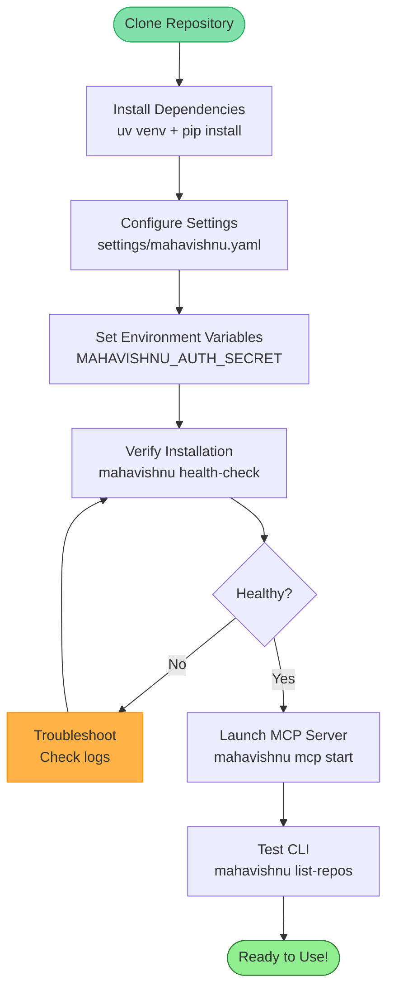

### Configuration Priority

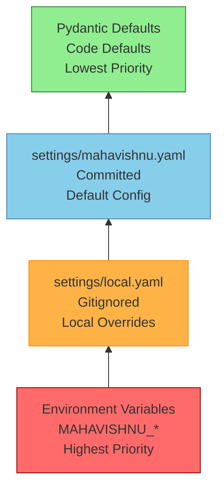

---

## 2. Pool Spawn and Execute

### Pool Lifecycle

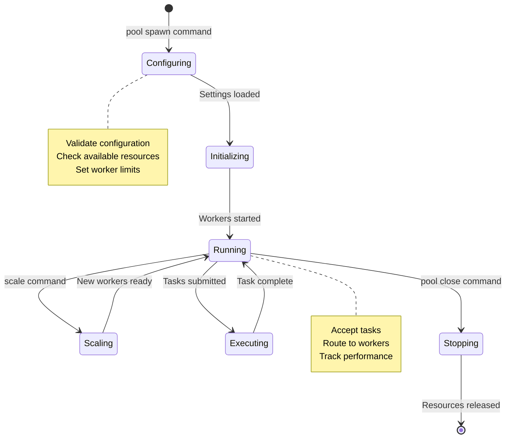

### Spawn and Execute Flow

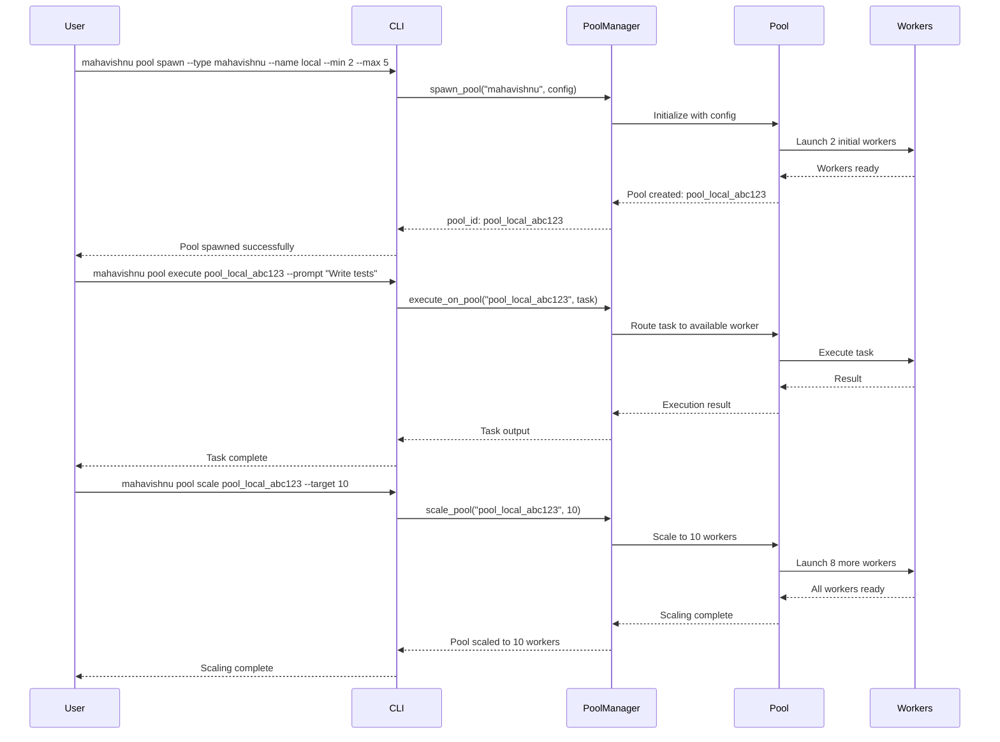

### Auto-Routing Decision Tree

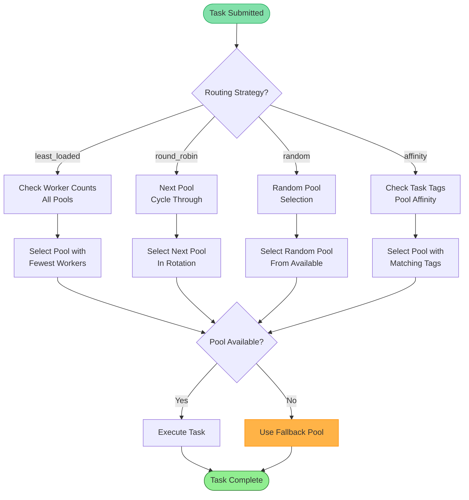

---

## 3. Repository Sweep

### Cross-Repository Workflow Execution

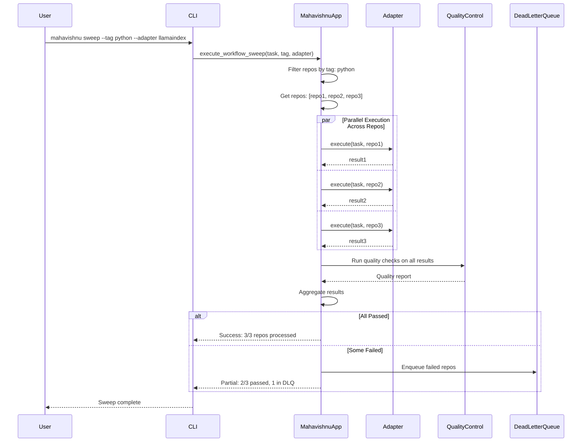

### Tag-Based Filtering

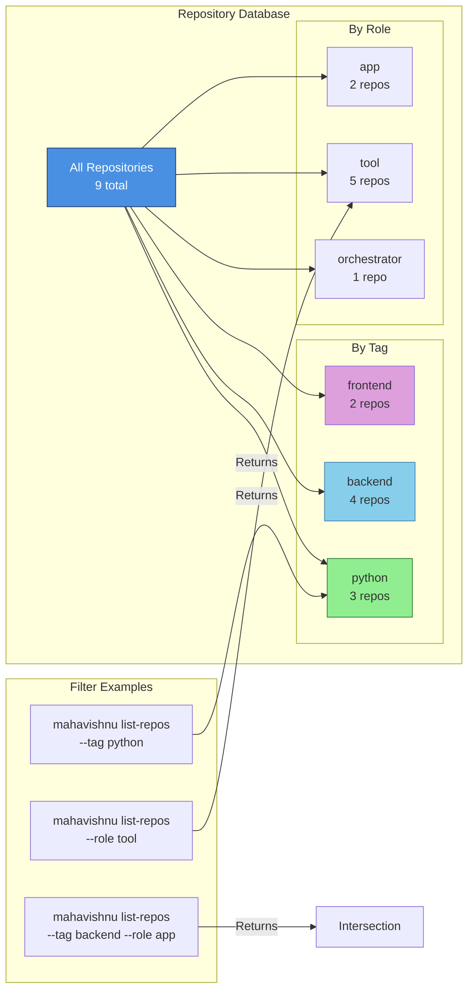

---

## 4. Memory Search

### Cross-Pool Search Flow

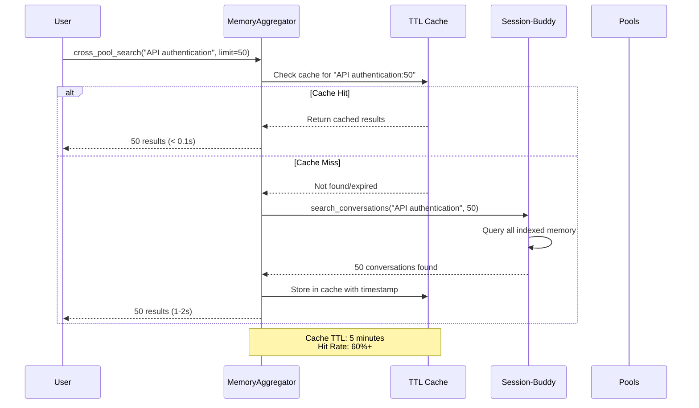

### Cache Performance

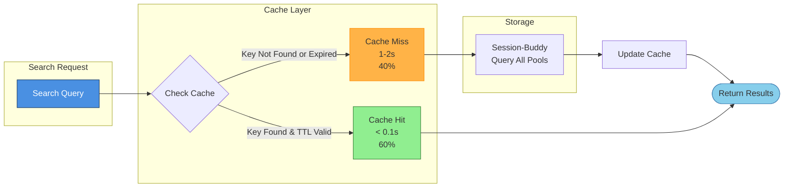

---

## 5. Quality Control Pipeline

### QC Flow

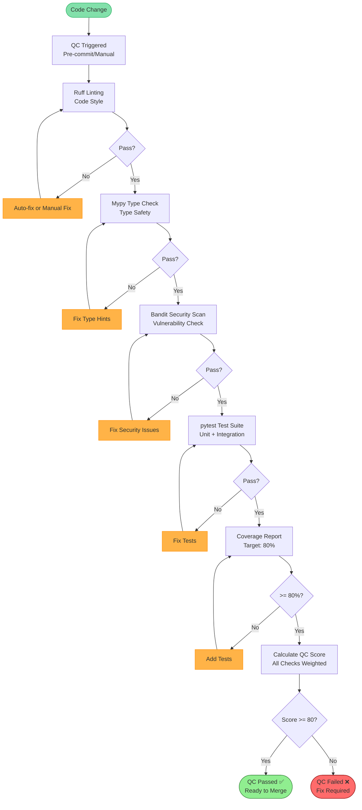

### QC Score Calculation

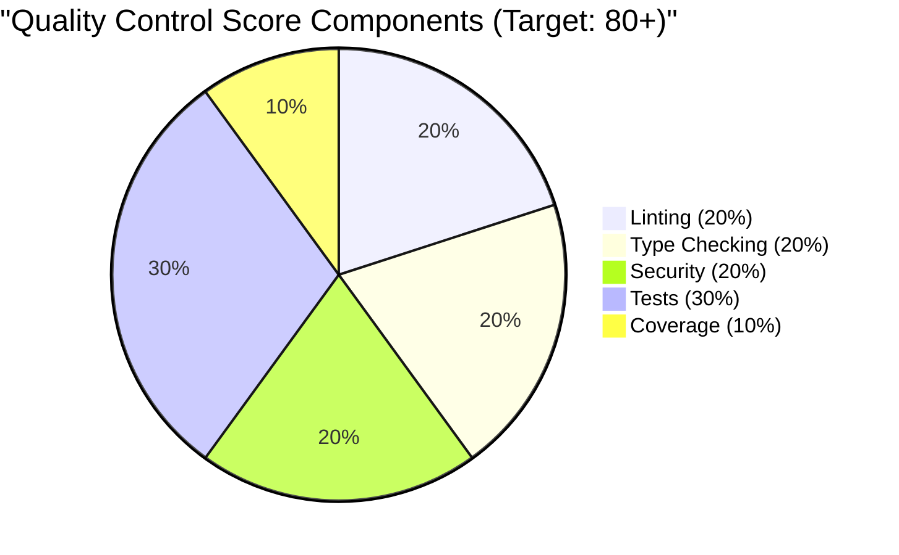

---

## 6. Error Recovery

### Circuit Breaker Pattern

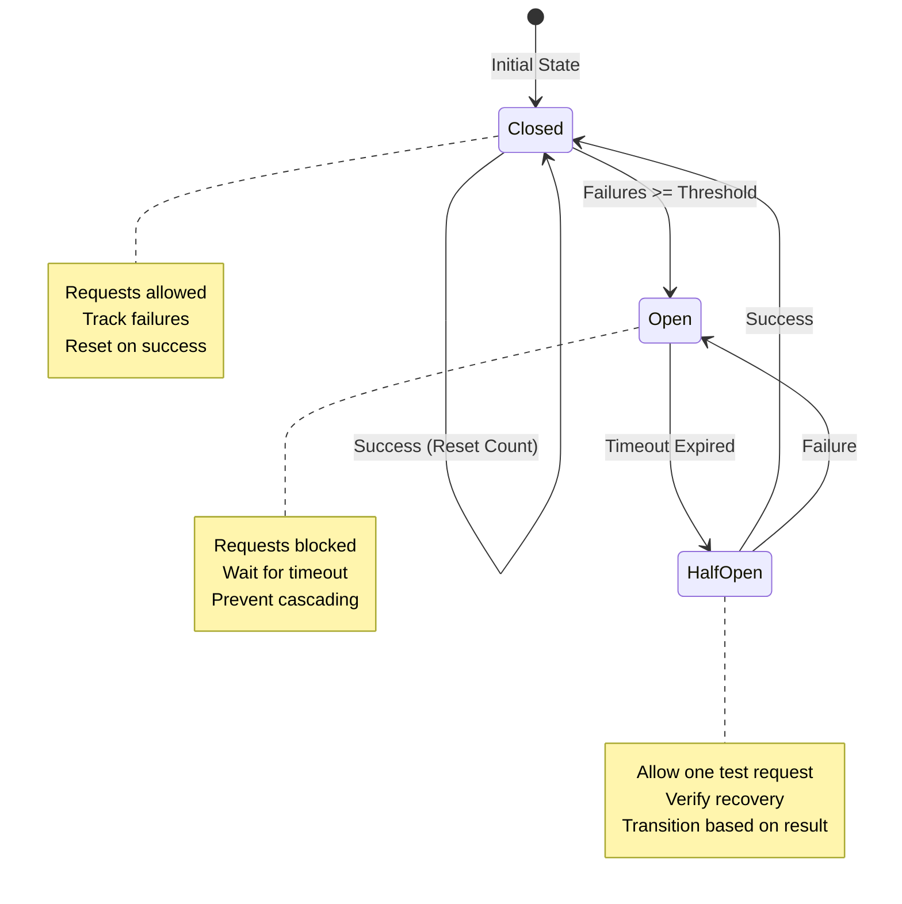

### Error Handling Flow

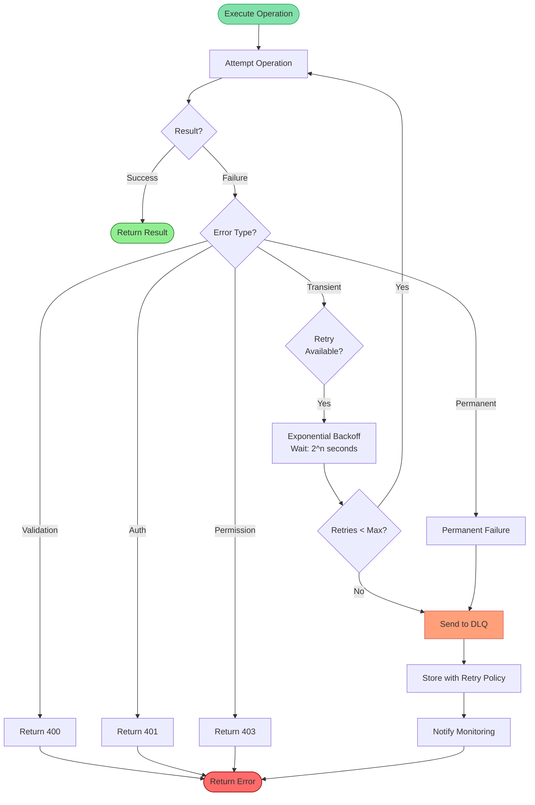

---

## 7. MCP Tool Execution

### MCP Tool Call Flow

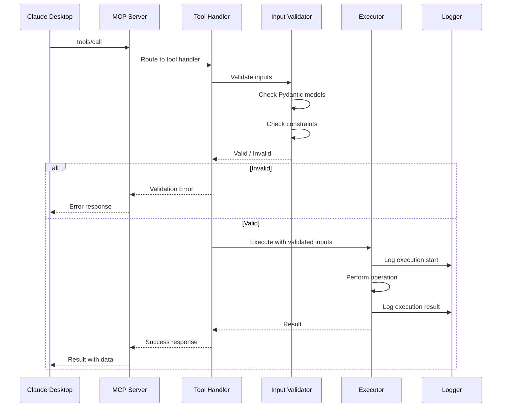

### Available MCP Tools

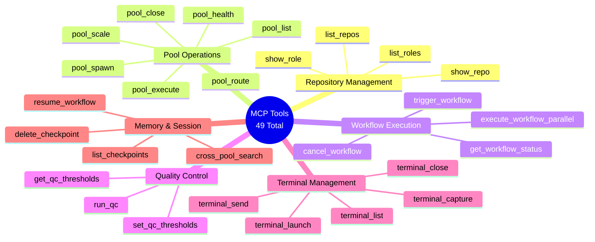

---

## Quick Reference

### Common Command Patterns

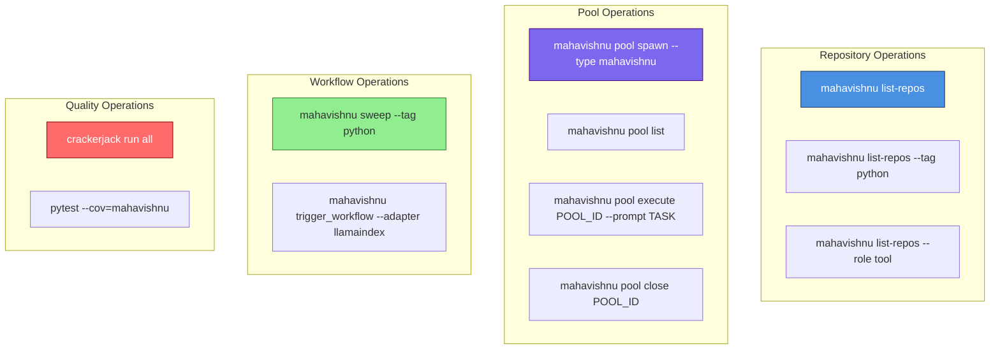

---

## Summary

These workflow diagrams cover the most common operational procedures in Mahavishnu:

- **Quick Start**: Setup and configuration
- **Pool Management**: Spawn, execute, scale, and close pools
- **Repository Sweep**: Multi-repo workflow execution
- **Memory Search**: Cross-pool search with caching
- **Quality Control**: Automated quality pipeline
- **Error Recovery**: Circuit breaker and DLQ patterns
- **MCP Tools**: Tool execution flow

For more detailed architecture diagrams, see [VISUAL_GUIDE.md](VISUAL_GUIDE.md).

---

**Document Version**: 1.0
**Last Updated**: 2026-02-03
**Related Documentation**:
- [VISUAL_GUIDE.md](VISUAL_GUIDE.md) - Comprehensive architecture diagrams
- [GETTING_STARTED.md](GETTING_STARTED.md) - Setup and configuration
- [MCP_TOOLS_REFERENCE.md](MCP_TOOLS_REFERENCE.md) - Complete MCP tool documentation
