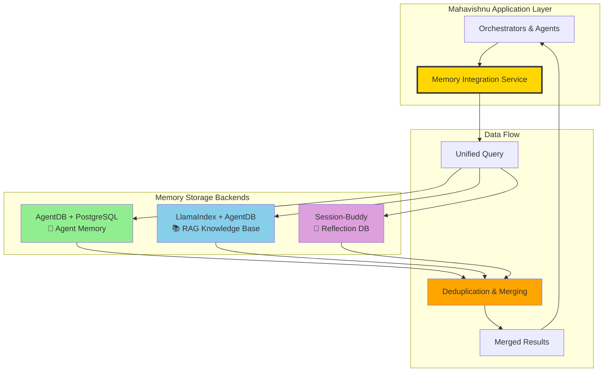
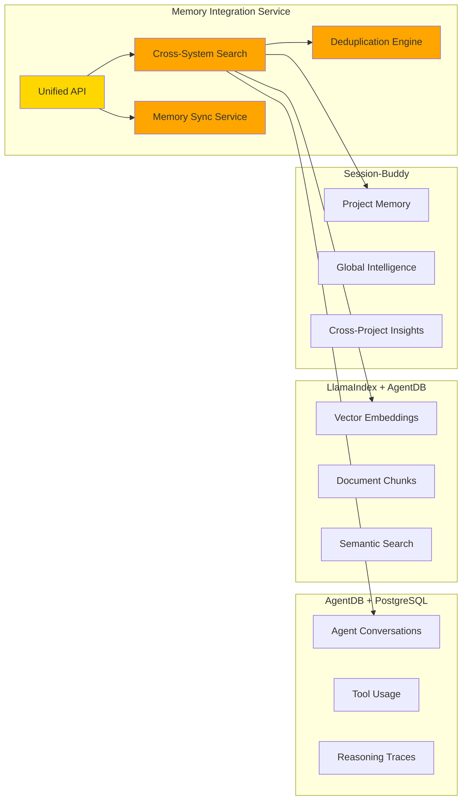
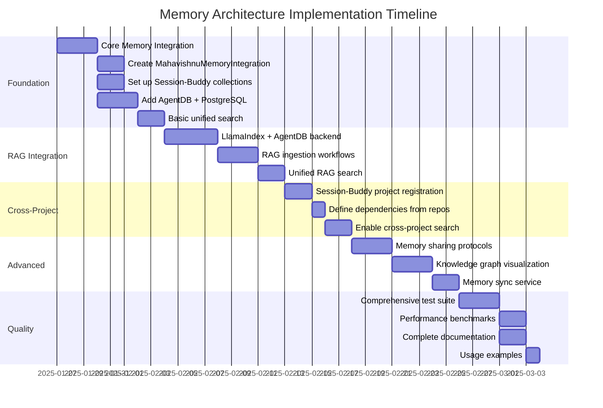

# ADR 005: Unified Memory Architecture

**Status:** Accepted
**Date:** 2025-01-24
**Deciders:** @les
**Technical Story:** [Link to issue/discussion]

## Context

Mahavishnu is a global orchestrator package that manages workflows across multiple repositories. As the system evolved, we identified several memory-related needs:

1. **Agent Memory**: High-volume agent conversations, tool usage, reasoning traces
1. **RAG Knowledge Base**: Vector embeddings for semantic search across codebases
1. **Workflow History**: Execution logs and orchestration patterns
1. **Cross-Project Learning**: Share insights across related projects
1. **Session Context**: Maintain context across development sessions

The existing implementation had basic session checkpoint integration but lacked:

- Unified search across memory systems
- Persistent agent memory storage
- Cross-project knowledge sharing
- Scalable vector operations for RAG

## Decision

We will implement a **unified memory architecture** that integrates three specialized storage backends:

### 1. Session-Buddy Integration (Project Memory + Global Intelligence)

**What:**

- Use Session-Buddy's Reflection Database (DuckDB-based)
- Create dedicated collections for Mahavishnu
- Leverage Session-Buddy's cross-project intelligence features

**Why:**

- **Already integrated**: Session-Buddy MCP server is available and configured
- **Proven architecture**: Reflection Database with ONNX embeddings works well
- **Cross-project features**: Automatic dependency-aware search and knowledge sharing
- **Automatic insights capture**: Extracts learnings from `★ Insight ─────` patterns
- **Privacy-first**: 100% local processing, no external APIs

**Collections:**

```python
collection_name="mahavishnu_project"
  - Workflow executions
  - Orchestration patterns
  - Adapter health metrics

collection_name="mahavishnu_global"
  - Cross-project orchestration insights
  - Best practices
  - Solutions discoverable by related projects
```

### 2. AgentDB + PostgreSQL (Agent Memory)

**What:**

- Use AgentDB with PostgreSQL backend for agent-specific memory
- Store high-volume agent data (conversations, tool usage, reasoning traces)
- Provide PostgreSQL-backed persistent storage with replication support

**Why:**

- **Scalability**: AgentDB optimized for agent workloads, handles high-frequency operations
- **Persistence**: PostgreSQL provides durable, scalable storage with replication
- **Vector operations**: Built-in similarity search for agent memory
- **Separation of concerns**: Agent-specific data separated from project memory
- **Performance**: PostgreSQL connection pooling for concurrent access

**Use Cases:**

- Agent conversation tracking (Agno adapter)
- Tool usage history and results
- Reasoning traces and decision processes
- Agent context window management

### 3. LlamaIndex + AgentDB (RAG Knowledge Base)

**What:**

- Use LlamaIndex for RAG pipelines with AgentDB as vector store backend
- Ingest repositories and documents with Ollama embeddings
- Provide large-scale semantic search capabilities

**Why:**

- **Purpose-built**: LlamaIndex optimized for RAG and vector operations
- **Ollama integration**: Local embeddings (nomic-embed-text), no external APIs
- **AgentDB backend**: Persistent vector storage in PostgreSQL
- **Advanced retrieval**: Hybrid search, re-ranking, filters
- **Large-scale**: Handles millions of documents efficiently

**Use Cases:**

- Repository/document ingestion
- Code chunking and embeddings
- Semantic search for knowledge retrieval
- Agent knowledge base integration

### Unified Memory Service

**What:**

- Create `MahavishnuMemoryIntegration` class as single interface
- Provide unified search across all memory systems
- Implement bidirectional memory sharing protocols
- Automatic deduplication and result merging

**Why:**

- **Developer experience**: Single API for all memory operations
- **Transparency**: Developers don't need to know where data is stored
- **Optimization**: Intelligent result merging and ranking
- **Flexibility**: Easy to add new memory backends

## Architecture Diagram

### System Overview



### Component Details



**Legacy ASCII Diagram** (for reference):

```
┌───────────────────────────────────────────────────────────────────┐
│          Mahavishnu Memory Interface Service                      │
├───────────────────────────────────────────────────────────────────┤
│  • Unified search across all memory systems                      │
│  • Bidirectional memory sharing with Session-Buddy               │
│  • Memory deduplication and intelligent merging                  │
│  • Cross-system memory sharing protocols                         │
└───────────────────────────────────────────────────────────────────┘
            │                    │                    │
            ↓                    ↓                    ↓
┌──────────────────────┐  ┌──────────────────────┐  ┌──────────────────┐
│  AgentDB + PostgreSQL│  │  LlamaIndex RAG     │  │  Session-Buddy   │
│  (Agent Memory)      │  │  (Knowledge Base)    │  │  Reflection DB   │
├──────────────────────┤  ├──────────────────────┤  ├──────────────────┤
│ • Agent conversations│  │ • Vector embeddings │  │ • Project memory │
│ • Tool usage         │  │ • Document chunks   │  │ • Global memory  │
│ • Reasoning traces   │  │ • Semantic search    │  │ • Insights       │
│ • Persistent storage │  │ • AgentDB backend    │  │ • Cross-project  │
└──────────────────────┘  └──────────────────────┘  └──────────────────┘
```

## Consequences

### Positive

- **✅ Leverages existing infrastructure**: Session-Buddy already available and proven
- **✅ Scales for production**: AgentDB + PostgreSQL handles high-volume operations
- **✅ Optimized workloads**: Each system does what it's best at
- **✅ Unified developer experience**: Single API for all memory operations
- **✅ Cross-project intelligence**: Session-Buddy's unique features fully utilized
- **✅ Privacy-first**: All processing local, no external API dependencies
- **✅ Future-proof**: Modular design allows adding/swapping backends

### Negative

- **❌ Complexity**: More complex than single-system memory (justified by benefits)
- **❌ Multiple dependencies**: Requires PostgreSQL, AgentDB, Session-Buddy, LlamaIndex
- **❌ Migration effort**: Need to set up all backends and configure integration
- **❌ Operational overhead**: More systems to monitor and maintain

### Mitigations

- **Clear architecture**: Well-documented separation of concerns
- **Phased rollout**: Implement incrementally to validate each component
- **Comprehensive testing**: Unit, integration, and performance tests
- **Monitoring**: Unified health checks and metrics across all systems
- **Documentation**: Extensive documentation for setup and troubleshooting

## Alternatives Considered

### Alternative 1: Session-Buddy Only

**Approach:** Use Session-Buddy's Reflection Database for all memory storage

**Pros:**

- Simpler architecture (single system)
- Already integrated and proven
- Cross-project features built-in

**Cons:**

- Not optimized for high-volume agent operations
- LlamaIndex would need custom vector store adapter
- No AgentDB agent-specific features

**Decision:** Rejected because Session-Buddy's DuckDB may not scale for high-frequency agent operations and large-scale RAG workloads.

### Alternative 2: AgentDB Only

**Approach:** Use AgentDB for all memory storage

**Pros:**

- Single system to manage
- PostgreSQL backend provides persistence and scalability
- AgentDB optimized for agent workloads

**Cons:**

- Loses Session-Buddy's cross-project intelligence features
- Loses automatic insights capture
- Would need to reimplement Session-Buddy features

**Decision:** Rejected because losing Session-Buddy's unique cross-project capabilities would be a significant regression.

### Alternative 3: Custom Memory System

**Approach:** Build custom memory system from scratch

**Pros:**

- Complete control over architecture
- Can optimize for Mahavishnu-specific needs

**Cons:**

- Reinventing the wheel (Session-Buddy and AgentDB already exist)
- High development and maintenance cost
- Risk of building inferior solution

**Decision:** Rejected because existing solutions (Session-Buddy, AgentDB) are well-designed and proven.

## Implementation Plan

### Implementation Timeline



### Phase 1: Core Memory Integration (Foundation)

- Create `MahavishnuMemoryIntegration` class
- Set up Session-Buddy collections
- Add AgentDB + PostgreSQL
- Implement basic unified search

### Phase 2: LlamaIndex + AgentDB Backend

- Update `llamaindex_adapter.py` with AgentDB backend
- Create RAG ingestion workflows
- Implement unified search including RAG results

### Phase 3: Cross-Project Integration

- Register Mahavishnu with Session-Buddy project groups
- Define dependencies from repos.yaml
- Enable cross-project search

### Phase 4: Advanced Features

- Implement memory sharing protocols
- Create knowledge graph visualization
- Add memory synchronization service

### Phase 5: Testing & Documentation

- Comprehensive test suite (>80% coverage)
- Performance benchmarks
- Complete documentation
- Usage examples

**Estimated Timeline:** 10-14 days total

## Configuration

### Memory Service Settings

```yaml
# settings/mahavishnu.yaml
memory_service:
  enabled: true
  enable_rag_search: true
  enable_agent_memory: true
  enable_reflection_search: true
  enable_cross_system_sharing: true
  sync_interval_minutes: 5

agentdb:
  enabled: true
  postgres_url: "postgresql://localhost:5432/agentdb"
  embedding_dimension: 1536
  connection_pool_size: 10

llamaindex:
  enabled: true
  ollama_base_url: "http://localhost:11434"
  llm_model: "nomic-embed-text"
  chunk_size: 1024
  chunk_overlap: 20
  vector_store_backend: "agentdb"
```

## Success Metrics

### Performance Targets

- **Unified Search Latency**: \<500ms for 20 results
- **Memory Store Latency**: \<100ms per operation
- **Concurrent Operations**: Support 100+ concurrent stores
- **Cross-Project Search**: \<1s for dependency-aware results

### Quality Targets

- **Test Coverage**: >80% across all memory modules
- **Deduplication Accuracy**: >99% duplicate detection
- **Search Relevance**: >0.8 average relevance score
- **Uptime**: >99.9% for all memory systems

## References

- [Session-Buddy Documentation](https://github.com/lesleslie/session-buddy) - Project memory and cross-project intelligence
- [LlamaIndex Documentation](https://docs.llamaindex.ai) - RAG pipelines and vector operations
- [AgentDB Documentation](https://github.com/agentdb/agentdb) - Agent memory storage (verify availability)
- [ADR 004: Adapter Architecture](./004-adapter-architecture.md) - Previous architecture decisions

## Related Decisions

- [ADR 001: Use Oneiric](./001-use-oneiric.md) - Configuration and logging framework
- [ADR 002: MCP-First Design](./002-mcp-first-design.md) - MCP server architecture
- [ADR 003: Error Handling Strategy](./003-error-handling-strategy.md) - Error handling patterns
- [ADR 004: Adapter Architecture](./004-adapter-architecture.md) - Multi-adapter support

______________________________________________________________________

**Document Version:** 1.0
**Last Updated:** 2025-01-24
**Status:** Accepted - Ready for Implementation
