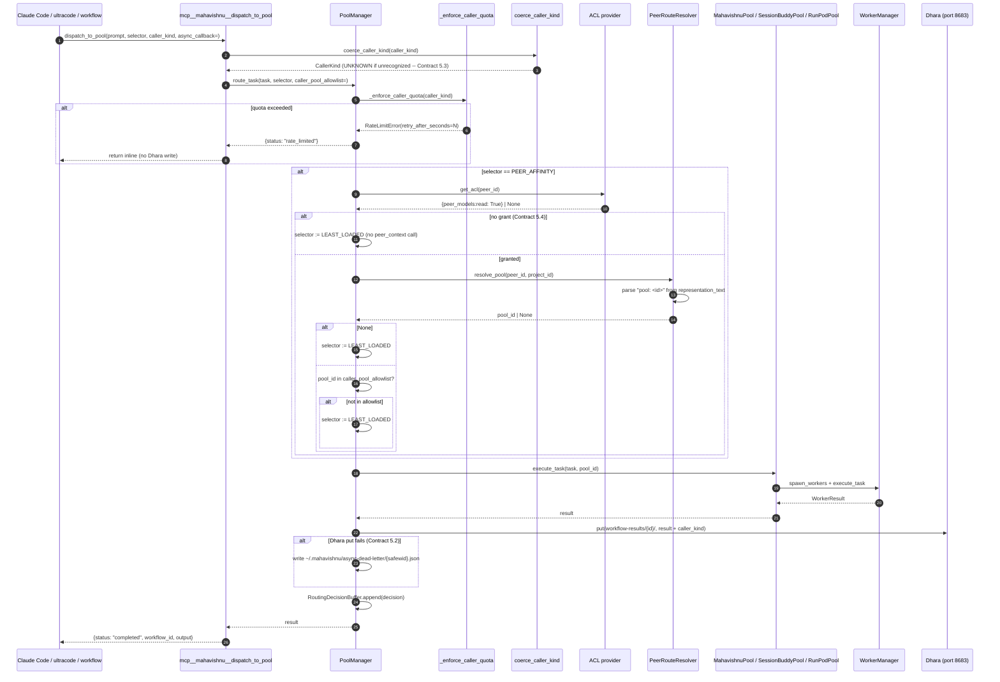
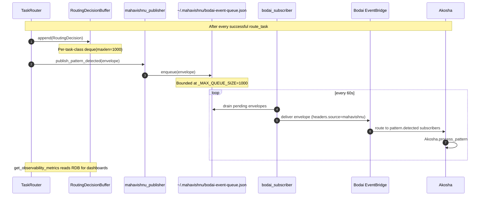

# Mahavishnu Memory Architecture

> **Status**: Living document. Updated whenever the storage schema, MCP surface, tool-profile gating, or integration contracts change.
> **Audience**: Bodai ecosystem contributors, Claude Code users, and downstream components (Session-Buddy, Akosha, Dhara, Crackerjack).
> **Source of truth**: `mahavishnu/core/paths.py` (XDG layout), `mahavishnu/mcp/tool_versions.py` (versioned tool registry), `mahavishnu/mcp/tools/profiles.py` (profile gating), `mahavishnu/pools/manager.py` (PoolManager + caller_kind quota), `mahavishnu/pools/peer_routing.py` (ADR-014 caller authorization), `mahavishnu/mcp/tools/pool_tools.py` (workflow-results persistence), and `mahavishnu/websocket/server.py` (broadcast channels).

Mahavishnu is the **Orchestrator / control plane** of the Bodai ecosystem. It owns
the **multi-pool task-distribution layer** (MahavishnuPool / SessionBuddyPool /
RunPodPool), the **worker contract layer** (cloud workers, isolated workers,
durable spawn templates), the **WebSocket broadcast layer** (ports 8690 / 8691)
for real-time workflow observability, the **content / OTel ingestion pipelines**
that push into Akosha, Crackerjack, and Session-Buddy, the **Oneiric adapter
distribution wiring** for the rest of the ecosystem, and the **canonical
ecosystem-status surface** (`ecosystem_status` / `ecosystem_capabilities` /
`ecosystem_routing_readiness`) that the other components consult for
control-plane decisions.

It does **not** own long-term memory — that lives in Session-Buddy
(reflections), Akosha (tiered vector store), Dhara (persistent object graph),
and Crackerjack (skill memory). Mahavishnu's job is to **route** writes and
reads to those components and to **persist its own operational state** (pool
state, workflow results, routing decisions, audit dead-letters, tool profiles).

This document describes what Mahavishnu stores, who reads and writes it, and
the integration contracts the rest of the ecosystem depends on. The five
contract bugs captured below were the trigger for writing it — they all
stemmed from undocumented expectations about how the workflow-results path,
the caller-kind quota, the ADR-014 peer authorization, the tool profile
gating, and the `_audit_set` fixture mismatch line up.

______________________________________________________________________

## Table of Contents

1. [Storage Inventory](#1-storage-inventory)
1. [MCP Write Surface](#2-mcp-write-surface)
1. [MCP Read Surface](#3-mcp-read-surface)
1. [Cross-Component Visibility](#4-cross-component-visibility)
1. [Integration Contract](#5-integration-contract)
1. [Sample Queries](#6-sample-queries)
1. [Diagrams](#7-diagrams)
1. [Operational Notes](#8-operational-notes)

______________________________________________________________________

## 1. Storage Inventory

Mahavishnu persists state across **eleven logical stores** distributed across
local XDG-compliant directories, Dhara's persistent object graph, the
SQLite/PostgreSQL OTel ingester backend, and the in-process pool/worker
runtimes. The single anchor point for cross-store joins is
**`workflow_id`** — every operational record carries one and downstream
consumers (Akosha's `query_workflows`, Crackerjack's memory layer) filter
on it.

| Store | Location | Format | Owner / Purpose |
|-------|----------|--------|-----------------|
| **Workflow-results** | `${Dhara.kv}[workflow-results/{workflow_id}/]` plus on-disk mirror under `DATA_DIR/workflow-results/{workflow_id}/` (lazy fallback) | Dhara JSON envelope `{status, output, error_code, worker_id, caller_kind, parent_session_id}`; on-disk mirror same shape | Per-workflow result records written by `dispatch_to_pool` / `workflow_result` / `pool_route_execute` |
| **Pool state** | In-process `PoolManager._pools: dict[str, BasePool]` plus periodic snapshot to `${Dhara.kv}[pool-state/{pool_id}/]` (snapshot on close) | Pydantic `PoolMetrics` + `PoolStatus` | Live `pool_id -> PoolConfig`, `active_workers`, `tasks_completed/failed`, `avg_task_duration` |
| **Worker runtime state** | In-process `WorkerManager._workers: dict[str, Worker]` plus terminal-state snapshot to `${Dhara.kv}[worker-state/{worker_id}/]` | `WorkerStatus` + `WorkerResult` envelope | WorkerID -> last `WorkerResult`, child process PID, runtime_kind |
| **Routing-fitness signals** | `${Dhara.time_series}[routing_fitness/{task_class}/{selector}]` | `{ts, latency_ms, ok, score, failure_rate, samples}` | Written by `RoutingFitnessReader._flush_buffer`; read by `TaskRouter` to pick the best selector per task class |
| **Routing decisions** | In-process ring buffer (`RoutingDecisionBuffer`) plus persistence via `mahavishnu_publisher` to Akosha `pattern.detected` topic | `RoutingDecision` Pydantic model | Per-task-class bounded ring buffer (default 1000) — Prometheus labels are `task_class` + `routing_strategy` only |
| **WebSocket broadcast log** | In-process `MahavishnuWebSocketServer._history: deque[WebSocketMessage]` | `WebSocketMessage` envelope (type, channel, payload, ts) | Rolling broadcast history for reconnecting clients; default 1000-message cap |
| **OTel trace storage** | DuckDB (in-memory or `${DATA_DIR}/otel/duck.db`) **or** pgvector via `PgvectorHotStore` | HotStore `conversations` schema (384-dim embedding + JSON metadata) | OTel span ingestion via `otel_ingest_trace`; semantic search via `otel_search_traces` |
| **Adapter distribution registry** | `${Dhara.adapters}[adapter:{domain}:{key}:{provider}]` via `store_adapter` | `Adapter` Pydantic persistent object | Oneiric adapter factory path + config + version_history |
| **Oneiric settings (layered)** | `oneiric://defaults` → `${REPO}/settings/mahavishnu.yaml` → `${REPO}/settings/local.yaml` → env vars `MAHAVISHNU_*` | Pydantic `MahavishnuSettings` (nested BaseModels with `extra="forbid"`) | All tool profiles, pool types, LLM routing, WebSocket ports, terminal adapters |
| **Async dispatch dead-letter** | `~/.mahavishnu/async-dead-letter/{safewid}.json` (per the `~/.mahavishnu/` legacy layout, separate from the XDG state dir) | JSON `{workflow_id, prompt, caller_kind, error, failed_at}` | Dead-letter for `dispatch_to_pool` async path when Dhara put for terminal state fails |
| **Bodai subscriber state** | `~/.mahavishnu/bodai-event-queue.json` + `~/.mahavishnu/bodai-subscriber-state.json` | JSON arrays of envelopes + offsets | Local event-queue for offline-tolerant Bodai EventBridge publishing (`mahavishnu/core/events/bodai_subscriber.py`) |
| **Backup catalog** | `mahavishnu/core/backup_recovery.py` (`BackupManager`); CLI under `mahavishnu/backup_cli.py` | Snapshot of `workflow-results/*`, OTel DB, settings | Cron-driven; retention enforced via `BACKUP_POLICY.md` |
| **Worker spawn templates** | In-process `WorkerRegistry` (`mahavishnu/workers/registry.py`); settings layered via `oneiric://workers` | Python `WorkerTemplate` objects (`command_template`, `env`, `runtime_kind`) | Used by `WorkerManager.spawn` and the durable fast-path allowlist (`_DURABLE_WORKER_TYPES`) |

### Schema map

The diagram below shows the operational storage topology. Green nodes are
**authoritative write targets** today; yellow nodes are ephemeral
(in-process buffers, dead-letter files); blue nodes are XDG-compliant
local state; the bordered purple nodes are aspirational/aspirational-DLQ.

```mermaid
erDiagram
    %% Workflow-results (Dhara-backed KV + on-disk mirror)
    WorkflowResults ||--|{ WorkflowResult : "workflow-results/{id}"
    WorkflowResult {
        string workflow_id PK
        string status "queued | running | completed | failed | result_write_failed | rate_limited"
        string worker_id FK
        string caller_kind "ultracode | claude_code | workflow | cli | unknown"
        string parent_session_id
        json output
        string error_code "MHV-XXX"
        string updated_at
    }

    %% Pool state (in-process + Dhara snapshot)
    PoolState ||--|{ PoolRecord : "pool-state/{id}"
    PoolRecord {
        string pool_id PK
        string pool_type "mahavishnu | session_buddy | runpod"
        int active_workers
        int total_workers
        int tasks_completed
        int tasks_failed
        float avg_task_duration
        string status "starting | active | draining | closed | error"
    }

    %% Worker runtime state
    WorkerState ||--|{ WorkerRecord : "worker-state/{id}"
    WorkerRecord {
        string worker_id PK
        string worker_type "terminal-claude | terminal-shell | e2b-sandbox | ..."
        string runtime_kind "shell | apple-container | e2b | none"
        string status "idle | busy | error | closed"
        string last_result_id FK
        int pid "0 if non-PTY"
    }

    %% Routing fitness (Dhara time-series)
    RoutingFitness }o--o{ FitnessSignal : "routing_fitness/{tc}/{selector}"
    FitnessSignal {
        string ts PK
        float latency_ms
        bool ok
        float score
        float failure_rate
        int samples
        int attempt
    }

    %% Routing decisions (in-process ring buffer)
    RoutingDecisionBuffer ||--|{ RoutingDecision : "ring (maxlen 1000 per task_class)"
    RoutingDecision {
        string decision_id PK
        string task_id
        string task_class
        string selected_adapter
        json rejected_adapters
        json candidate_adapters
        bool fallback_used
    }

    %% WebSocket broadcast history
    WSBroadcastLog ||--|{ WSMessage : "deque(maxlen=1000)"
    WSMessage {
        string msg_id PK
        string channel "workflow:{id} | pool:{id} | worker:{id} | global"
        string msg_type "started | stage_completed | completed | failed | pool_status"
        json payload
        string timestamp
    }

    %% OTel trace storage (DuckDB or pgvector)
    OTelStore ||--|{ OtelTrace : "conversations"
    OtelTrace {
        string trace_id PK
        string span_id
        string service_name
        string operation_name
        float embedding "FLOAT[384] HNSW indexed"
        json metadata
        string timestamp
    }

    %% Adapter registry (delegated to Dhara via store_adapter)
    AdapterRegistry ||--|{ AdapterRecord : "adapter:{d}:{k}:{p}"
    AdapterRecord {
        string adapter_id PK
        string version
        string factory_path
        json config
        json capabilities
        json version_history
        string health_status
    }

    %% Settings (Oneiric-layered)
    Settings ||--|{ SettingsLayer : "defaults -> yaml -> local -> env"
    SettingsLayer {
        string layer_name PK "oneiric_defaults | mahavishnu_yaml | local_yaml | env_var"
        json payload
        string loaded_at
    }

    %% Async dispatch dead-letter
    AsyncDeadLetter ||--|{ DeadLetterEntry : "~/.mahavishnu/async-dead-letter/"
    DeadLetterEntry {
        string workflow_id PK
        string prompt
        string caller_kind
        string error
        string failed_at
    }

    %% Bodai subscriber state
    BodaiSubscriber ||--|{ EventEnvelope : "bodai-event-queue.json"
    EventEnvelope {
        string envelope_id PK
        string topic "pattern.detected | anomaly.detected | ..."
        json payload
        string timestamp
    }

    style WorkflowResults fill:#dfd,stroke:#383
    style PoolState fill:#dfd,stroke:#383
    style WorkerState fill:#dfd,stroke:#383
    style RoutingFitness fill:#dfd,stroke:#383
    style OTelStore fill:#dfd,stroke:#383
    style AdapterRegistry fill:#dfd,stroke:#383
    style RoutingDecisionBuffer fill:#ffd,stroke:#993
    style WSBroadcastLog fill:#ffd,stroke:#993
    style AsyncDeadLetter fill:#ffd,stroke:#993
    style BodaiSubscriber fill:#ffd,stroke:#993
    style Settings fill:#dde,stroke:#338
```



### Per-store ownership map

| Store | Read by (typical) | Written by (typical) | Retention / aging |
|-------|-------------------|----------------------|-------------------|
| `workflow-results/{workflow_id}/` | `workflow_result(workflow_id=...)` MCP tool; Akosha `query_workflows`; Crackerjack via `get_workflow_statistics` | `dispatch_to_pool` (sync + async paths), `pool_route_execute` async branch, `worker_execute` durable branch | No TTL — operators control via `BackupManager.cleanup_old_workflow_results` |
| `pool-state/{pool_id}/` | `pool_list`, `pool_health`, `pool_monitor` | `PoolManager.spawn_pool` (open), `PoolManager.close_pool` (final), `pool_scale` (transitions) | Snapshot on pool close; live state in-process until next spawn |
| `worker-state/{worker_id}/` | `worker_list`, `worker_health`, `worker_monitor` | `WorkerManager.spawn_workers`, `WorkerManager.execute_task` (terminal), `worker_close` | Snapshot on `worker_close_all`; live state in-process |
| `routing_fitness/{task_class}/{selector}` | `TaskRouter` (selector selection), `routing_alerts`, `routing_metrics_persistence` | `RoutingFitnessReader._flush_buffer` (called after every `route_task`) | Opportunistic prune via `_purge_ts` against Dhara `TimeSeriesRetention(retention_days=60)` default |
| `RoutingDecisionBuffer` | `get_observability_metrics` (last-N), `mahavishnu_publisher` (push to Akosha) | `TaskRouter._record_decision` (every successful routing) | Per-task-class ring buffer `maxlen=1000`; no on-disk persistence |
| `WSBroadcastLog` | Reconnecting WebSocket clients (catch-up on connect), `pool_monitor` | `MahavishnuWebSocketServer._broadcast` | `deque(maxlen=1000)`; no on-disk persistence |
| `OTelStore.conversations` | `otel_search_traces`, `otel_get_trace`, `otel_get_stats`, Akosha `query_local_traces` cross-system | `otel_ingest_trace`, `otel_ingester.ingest_trace`, batch via `ingest_otel_traces` | Hot tier ~7 days; migrate-to-warm service NOT yet implemented (see Known Gaps) |
| `adapter:{d}:{k}:{p}` | `adapter_resolve`, `adapter_list`, `adapter_metadata`, `adapter_health`; every consumer looking up an Oneiric adapter at runtime | `adapter_discover` (publish new version), `store_adapter` (CLI / one-shot), WorkerManager on first cache miss | Bounded by Dhara `AdapterConfig.max_versions_per_adapter` (default 10) |
| `Settings` | One-shot on `MahavishnuSettings` instantiation; `reload_settings` CLI | Layered config writer at startup (YAML + env); manual edits to `settings/local.yaml` | Operator-controlled; no automatic aging |
| `~/.mahavishnu/async-dead-letter/` | `dispatch_to_pool` recovery path (operator replays); `dump_async_dead_letter` CLI | `dispatch_to_pool` async result-lifecycle handler when Dhara `put` for terminal state fails | No TTL — manual cleanup or replay-then-delete |
| `bodai-event-queue.json` | `bodai_subscriber` flush loop | `mahavishnu_publisher.publish_*` | Flushed every 60s when EventBridge reachable; bounded by `_MAX_QUEUE_SIZE=1000` |
| `BackupManager` | `mahavishnu backup list/restore`, `create_backup` MCP tool | `BackupManager` cron (`backup_scheduler.py`); manual CLI | Cron per `BACKUP_POLICY.md` (full 30d, incremental 7d, differential 14d) |

### XDG directory layout

`mahavishnu/core/paths.py` uses `platformdirs.PlatformDirs(appname="mahavishnu", version="0.3.0")` to resolve:

| Platform | DATA_DIR | CONFIG_DIR | CACHE_DIR | STATE_DIR | LOG_DIR |
|----------|----------|------------|-----------|-----------|---------|
| **Linux** | `~/.local/share/mahavishnu` | `~/.config/mahavishnu` | `~/.cache/mahavishnu` | `~/.local/state/mahavishnu` | `~/.local/state/mahavishnu/logs` |
| **macOS** | `~/Library/Application Support/mahavishnu` | `~/Library/Application Support/mahavishnu` | `~/Library/Caches/mahavishnu` | `~/Library/Application Support/mahavishnu` | `~/Library/Application Support/mahavishnu/logs` |
| **Windows** | `%LOCALAPPDATA%\mahavishnu` | `%LOCALAPPDATA%\mahavishnu` | `%LOCALAPPDATA%\mahavishnu\Cache` | `%LOCALAPPDATA%\mahavishnu` | `%LOCALAPPDATA%\mahavishnu\logs` |

Subdirectories populated by `ensure_directories()`: `DATA_DIR`, `CONFIG_DIR`,
`CACHE_DIR`, `STATE_DIR`, `LOG_DIR`, `AUDIT_DIR` (= `STATE_DIR/audit`).

The legacy `~/.mahavishnu/*` layout (`async-dead-letter/`,
`verification-dead-letter/`, `bodai-event-queue.json`,
`bodai-subscriber-state.json`, `fallback-queue/`) is **separate** from the
XDG state dir — see `mahavishnu/core/verification.py:557`
(`DEAD_LETTER_DIR = Path.home() / ".mahavishnu" / "verification-dead-letter"`)
and `mahavishnu/metrics_cli.py:851`. Operators migrating from old installs
should run `python -m mahavishnu.scripts.migrate_legacy_data` to copy.

### Settings layered resolution

`MahavishnuSettings` extends `MCPServerSettings` from `mcp-common` and uses
`pydantic_settings.YamlConfigSettingsSource`. Precedence order:

1. `oneiric://defaults` — Oneiric-bundled defaults
1. `${REPO}/settings/mahavishnu.yaml` — committed configuration
1. `${REPO}/settings/local.yaml` — gitignored operator overrides
1. Environment variables `MAHAVISHNU_*` (nested fields via `__` separator,
   e.g. `MAHAVISHNU_POOLS__ENABLED=true`)

Top-level config groups (each `extra="forbid"`):

| Group | Purpose | Key fields |
|-------|---------|------------|
| `server_name` | Identification in metrics + dashboards | `str` |
| `terminal` | Terminal adapter + concurrency | `adapter_preference` (mock/crow/tmux), `max_concurrent_sessions` |
| `adapters` | Engine adapters | `prefect: bool`, `llamaindex: bool`, `agno: bool` |
| `qc` | Crackerjack quality gate | `enabled`, `min_score` |
| `websocket` | Broadcast server | `enabled`, `host`, `port` (default 8690) |
| `pools_enabled` / `default_pool_type` | Multi-pool layer | `pools_enabled`, `default_pool_type` (mahavishnu/session_buddy/runpod), `pool_routing_strategy` |
| `agno` | Agno adapter config | `llm`, `memory`, `tools`, `adapter` (full nested Pydantic) |
| `model_routing` | Cloud/local model selection | See `settings/models.yaml` + `tests/unit/test_task_router.py::TestYAMLRoutingSync` for sync guard |
| `auth` | Multi-auth (Claude Code sub / Qwen / custom JWT) | `enabled`, `algorithm`, `expire_minutes` |
| `ingestion` | Content + OTel ingest | `enabled`, `quality_threshold` |
| `tool_profile` | MCP tool registration gate | `MINIMAL` / `STANDARD` / `FULL` (default FULL) |
| `tool_profile_env_var` | Override | `MAHAVISHNU_TOOL_PROFILE` |

______________________________________________________________________

## 2. MCP Write Surface

Mahavishnu's MCP write surface is **broad**: 174+ tools organized into 14
groups. Every group is gated by `MAHAVISHNU_TOOL_PROFILE` (`full` / `standard`
/ `minimal`). The first cluster below covers the **always-on core tools**
(`_register_tools` in `server_core.py:211`), the second cluster lists
**profile-gated groups**, and the third covers side-effect tools that
write during read paths.

### Core tools (always registered)

These 27 tools are registered inline in `_register_tools()` regardless of
profile. They are the workflow and monitoring primitives every consumer
needs.

| Tool | Layer | Caller (typical) | What it writes / does |
|------|-------|------------------|-----------------------|
| `list_repos` | workflow | user, agents | (read — paginated repos from `repos.yaml`) |
| `trigger_workflow` | workflow | agents | Creates `WorkflowRun`; returns `workflow_id` immediately (fire-and-forget per C-NEW-5) |
| `get_workflow_status` | workflow | agents, dashboards | (read — polls `workflow-results/{id}/`) |
| `list_workflows` / `cancel_workflow` | workflow | agents | Cancel transitions a `WorkflowRun` to `cancelled` |
| `create_user` / `check_permission` | RBAC | admin / agents | Updates `auth.users` table; permission check is a no-I/O bool |
| `get_observability_metrics` | observability | dashboards | (read — pulls from Prometheus + in-process ring buffers) |
| `search_logs` / `get_log_statistics` | observability | operators | (read) |
| `search_workflows` / `get_workflow_statistics` / `get_recovery_metrics` | observability | operators | (read) |
| `create_backup` / `list_backups` / `restore_backup` / `run_disaster_recovery_check` / `heal_workflows` | backup/recovery | operators | Creates snapshots in `BackupManager`; restore restores `workflow-results/*` + settings |
| `get_monitoring_dashboard` (v2) / `get_active_alerts` / `acknowledge_alert` / `trigger_test_alert` / `flush_metrics` | monitoring | operators, tests | Alerts persist in `${STATE_DIR}/audit/`; `flush_metrics` forces the OTel middleware export |
| `list_adapters` | adapter | agents | (read — delegates to Dhara `list_adapters`) |
| `get_health` | health | orchestrators | (read — `EcosystemStatusService.generate_report`) |
| `get_tool_versions` | discovery | consumers | (read — `TOOL_VERSIONS` registry) |
| `discover_tools(query=, capability=)` | discovery | agents | (read — FastMCP introspection + version registry; honors `MAHAVISHNU_TOOL_PROFILE`) |

### Profile-gated groups

Groups are registered by `register_profile_tools()` in
`mahavishnu/mcp/bootstrap.py:485` based on the active profile. Each group
is a separate FastMCP tool block; see `mahavishnu/mcp/tool_versions.py`
for the canonical per-tool version registry.

| Group | Profile | File | Tools (count) | What it writes |
|-------|---------|------|---------------|----------------|
| `_register_health_tools` | MINIMAL | `health_tools.py` | 9 | (health probes — read) |
| `_register_terminal_tools` | STANDARD | `terminal_tools.py` | 12 | Side effect: iTerm2/tmux/crow sessions in `TerminalManager` |
| `_register_pool_tools` | STANDARD | `pool_tools.py` | 10 | Writes `pool-state/{id}/`, `workflow-results/{id}/`; quota decisions in caller-kind buckets |
| `_register_worker_tools` | STANDARD | `worker_tools.py` | 8 | Writes `worker-state/{id}/`; executes against `WorkerManager` |
| `_register_worker_contract_tools` | STANDARD | `worker_contract_tools.py` | n/a | Durable spawn templates — `~/.mahavishnu/verification-dead-letter/` on failure |
| `_register_repository_messaging_tools` | STANDARD | `repository_messaging_tools.py` | 7 | Inter-repo message bus; emits to `mahavishnu/core/events` EventBridge |
| `_register_git_analytics_tools` | STANDARD | `git_analytics.py` | 2 | Reads git history; writes `pattern.detected` envelopes on regression |
| `_register_session_buddy_tools` | STANDARD | `session_buddy_tools.py` | 7 | Pushes code graphs to Session-Buddy `kg_entities` via `store_code_graph_from_mahavishnu` |
| `_register_openhands_tools` | STANDARD | `openhands_tools.py` | n/a | Bridges OpenHands-compatible actions through `WorkerManager` |
| `_register_primitive_tools` | STANDARD | `primitive_tools.py` | 2 | Introspection of `mahavishnu/primitives/` (Keystone keystone_show analog) |
| `_register_otel_tools` | FULL | `otel_tools.py` | 7 | Writes OTel `conversations` rows via `otel_ingester.ingest_trace` |
| `_register_self_improvement_tools` | FULL | `self_improvement_tools.py` | 4 | `review_and_fix` runs the Crackerjack self-improvement loop; approval queue in `approval_manager` |
| `_register_clone_tools` | FULL | `clone_tools.py` | 1 | `clone_detect_ecosystem` snapshots repo fingerprints to Dhara `ecosystem_events` |
| `_register_goal_team_tools` | FULL | `goal_team_tools.py` | 9 | Goal parsing + team composition; writes `goal_team_metrics` |
| `_register_treesitter_tools` | FULL | `treesitter_tools.py` | 7 | AST extraction; caches results in `mahavishnu/workers/capabilities/_cache.py` |
| `_register_adapter_registry_tools` | FULL | `adapter_registry_tools.py` | 7 | `adapter_resolve` / `adapter_publish` / `adapter_health` — wired to Dhara `adapters` bucket |
| `_register_pycharm_tools` | FULL | `pycharm_tools.py` | n/a | Bridges PyCharm MCP actions to Mahavishnu adapters |
| `register_worktree_tools` (runtime-gated, not profile) | n/a | `worktree_tools.py` | 1 | `worktree_manage`; only if `app.worktree_coordinator` is initialized |

In addition, three groups are registered **after** the profile loop and
always available regardless of profile:

| Group | File | Tools | Notes |
|-------|------|-------|-------|
| `register_health_tools` | `health_tools.py` | 9 | Boot readiness probes |
| `register_ecosystem_tools` | `ecosystem_tools.py` | 3 | `ecosystem_status`, `ecosystem_capabilities`, `ecosystem_routing_readiness` — Control Plane Phase 3 |
| inline in `_register_tools()` | `server_core.py:211` | 27 | See "Core tools" above |

### Hook-driven / lifecycle write side effects

Five side-effect paths write operational state outside the MCP surface:

| Path | When it fires | What it writes |
|------|---------------|----------------|
| `PoolManager._persist_routing_decision` | After every `route_task` | One `RoutingDecision` to in-process `RoutingDecisionBuffer`; published to Akosha `pattern.detected` topic on flush |
| `RoutingFitnessReader._flush_buffer` | Every 60s + on demand | Time-series append to `routing_fitness/{task_class}/{selector}` |
| `MahavishnuWebSocketServer._broadcast` | On every workflow event | Append to `_history` deque + broadcast to subscribers |
| `dispatch_to_pool` async result-lifecycle | After async dispatch terminal state | `workflow-results/{id}/` Dhara `put`; on failure, dead-letter to `~/.mahavishnu/async-dead-letter/{safewid}.json` |
| `bodai_subscriber` flush | Every 60s | Drains `~/.mahavishnu/bodai-event-queue.json` to the Bodai EventBridge |

### Tool profile gating details

`mahavishnu/mcp/tools/profiles.py` defines three registration lists:

- `MINIMAL_REGISTRATIONS = ["_register_health_tools"]`
- `STANDARD_REGISTRATIONS = MINIMAL + [_register_terminal_tools, _register_pool_tools, _register_worker_tools, _register_worker_contract_tools, _register_repository_messaging_tools, _register_git_analytics_tools, _register_session_buddy_tools, _register_openhands_tools, _register_primitive_tools]`
- `FULL_REGISTRATIONS = STANDARD + [_register_otel_tools, _register_self_improvement_tools, _register_clone_tools, _register_goal_team_tools, _register_treesitter_tools, _register_adapter_registry_tools, _register_pycharm_tools]`

Resolution precedence:

1. `MAHAVISHNU_TOOL_PROFILE` env var (`full` / `standard` / `minimal`)
1. `settings/local.yaml` `tool_profile:` field
1. Default = `FULL` (no reduction)

The `discover_tools(query=, capability=)` meta-tool is always registered
and returns `{loaded_tools, not_loaded_tools, profile, profile_methods_scheduled, hint}`
plus — when `capability="ready"` is passed — the live `routable_workers`
list from `mahavishnu/workers/capabilities/select_routable_workers`.

______________________________________________________________________

## 3. MCP Read Surface

The read surface is the **hot path** of the orchestrator. Tools are grouped
by access pattern: discovery, state, recall, monitor, health.

### Discovery

| Tool | What it reads | Use when |
|------|---------------|----------|
| `discover_tools(query=, capability=)` | FastMCP 3.x `server.list_tools()` + `TOOL_VERSIONS` registry | Caller wants to know what is registered under the active profile |
| `get_tool_versions(tool_name=)` | `TOOL_VERSIONS` dict (174+ entries) | Consumer compatibility check before invoking a tool |
| `ecosystem_status(sections=, include_details=)` | `EcosystemStatusService.generate_report` (per-section timeout 5s) | Canonical control-plane status (services / adapters / capabilities / workflows / alerts) |
| `ecosystem_capabilities(capability=)` | Same report, `capabilities` section | "What can the ecosystem do for `code_review`?" |
| `ecosystem_routing_readiness(task_class=)` | Same report, filtered to `task_class` adapters | "Which adapters are healthy for `AI_TASK`?" |

### Workflow / pool / worker state

| Tool | What it reads | Use when |
|------|---------------|----------|
| `list_workflows` / `get_workflow_status` / `search_workflows` | `WorkflowRun` in-process + `workflow-results/{id}/` Dhara KV | Polling async workflows |
| `workflow_result(workflow_id=, timeout=)` | Single Dhara KV record | Sync read for a finished workflow |
| `pool_list` / `pool_health` / `pool_monitor` | `PoolManager._pools` + Dhara `pool-state/{id}/` snapshots | Operator dashboard |
| `pool_search_memory(query=, limit=)` | `MemoryAggregator.cross_pool_search` (queries all pools' embedded memory) | Cross-pool recall via Session-Buddy / Akosha |
| `worker_list` / `worker_health` / `worker_monitor` | `WorkerManager._workers` + Dhara `worker-state/{id}/` | Worker-level observability |

### Coordination / issues / todos / dependencies

| Tool | What it reads | Use when |
|------|---------------|----------|
| `list_issues` / `create_issue` / `update_issue` / `coord_close_issue` / `coord_get_issue` / `coord_get_blocking_issues` / `coord_list_issues` / `coord_update_issue` / `coord_get_repo_status` | `mahavishnu/core/coordination/manager.py` (in-memory) | Cross-repo blocker detection |
| `list_todos` / `create_todo` / `update_todo` / `coord_complete_todo` / `coord_list_todos` / `coord_get_todo` | `task_store.py` (SQLite under `${DATA_DIR}`) | Goal-driven team todo tracking |
| `list_dependencies` / `add_dependency` / `remove_dependency` / `coord_list_dependencies` / `coord_check_dependencies` | `dependency_graph.py` (in-process DAG) | Cross-repo dependency graph |
| `get_dependency_graph` / `detect_circular_dependencies` / `get_critical_path` / `generate_mermaid_diagram` | Same DAG | Visualization + audit |

### Repository messaging / observability / monitoring

| Tool | What it reads | Use when |
|------|---------------|----------|
| `send_repository_message` / `get_repository_messages` / `acknowledge_repository_message` / `broadcast_repository_message` / `notify_repository_changes` / `notify_workflow_status` / `send_quality_alert` / `list_project_messages` | Inter-repo `MessageBus` + Dhara `ecosystem_events` | Cross-component notifications |
| `search_logs` / `get_log_statistics` | `${LOG_DIR}/*.log` (via Oneiric logger) | Log search |
| `get_observability_metrics` / `get_workflow_statistics` / `get_recovery_metrics` | Prometheus + in-process counters | Spec §14 success-criteria dashboard |
| `get_monitoring_dashboard` (v2) / `get_active_alerts` / `trigger_test_alert` | `routing_alerts.py` + `monitoring.py` | Alert routing |
| `get_cross_project_patterns` / `get_git_velocity_dashboard` | Git history analysis | Git analytics |
| `get_learning_stats` / `get_learning_summary` / `get_recommended_mode` / `list_team_skills` / `parse_goal` / `record_team_outcome` / `record_user_feedback` / `team_from_goal` / `send_project_message` | `team_learning.py` + `goal_team_metrics.py` | Goal-driven team learning loop |

### Session-Buddy / OTel / search

| Tool | What it reads | Use when |
|------|---------------|----------|
| `index_code_graph` / `find_related_code` / `get_function_context` / `search_documentation` / `store_code_graph_from_mahavishnu` / `get_repository_health` | Session-Buddy MCP (`reflections_v2`, `kg_entities`) | Code-intel recall |
| `otel_ingest_trace` / `ingest_otel_traces` / `otel_get_trace` / `get_otel_trace` / `otel_search_traces` / `search_otel_traces` / `hybrid_search` / `search_by_repository` / `otel_get_stats` / `otel_ingester_stats` / `index_document` / `delete_document` | `OTelStore.conversations` (DuckDB or pgvector) | OTel trace recall + semantic search |

### Tree-sitter / PyCharm / adapter registry

| Tool | What it reads | Use when |
|------|---------------|----------|
| `treesitter_parse` / `treesitter_extract_symbols` / `treesitter_find_usages` / `treesitter_query` / `treesitter_batch_analyze` / `treesitter_cache_stats` / `treesitter_clear_cache` | AST cache (`mahavishnu/workers/capabilities/_cache.py`) | Code symbol extraction |
| `pycharm_*` (set) | PyCharm MCP actions via Mahavishnu adapters | IDE bridge |
| `adapter_cache_invalidate` / `adapter_discover` / `adapter_enable` / `adapter_health` / `adapter_list` / `adapter_metadata` / `adapter_resolve` | Dhara `adapters` + `health_checks` | Oneiric adapter discovery + health |

### Ecosystem / clone / self-improvement

| Tool | What it reads | Use when |
|------|---------------|----------|
| `clone_detect_ecosystem` | Repo fingerprints (SHA + structure) | Cross-repo clone detection |
| `review_and_fix` / `get_pending_approvals` / `respond_to_approval` / `request_approval` | `approval_manager` queue + Crackerjack self-improvement | Approval gate |
| `worktree_manage` | `WorktreeCoordinator` (only registered if initialized) | Git worktree lifecycle |

### Primitive / worktree introspection

| Tool | What it reads | Use when |
|------|---------------|----------|
| `list_primitives` / `show_primitive` | `mahavishnu/primitives/` registry | Keystone-style introspection |

### Health (mcp-common + custom)

| Tool | What it reads | Use when |
|------|---------------|----------|
| `health_check` / `health_check_service` / `health_check_all` / `get_liveness` / `get_readiness` / `mcp_list_tools` / `mcp_test_connection` / `mcp_get_metrics` / `wait_for_dependency` / `wait_for_all_dependencies` | mcp-common dependency probes (session_buddy 8678, dhara 8683, akosha 8682, crackerjack 8676) | Boot readiness |

______________________________________________________________________

## 4. Cross-Component Visibility

Mahavishnu is the **orchestrator** — it routes work to every other component
and reads from many. The data flow is mostly outbound (Mahavishnu → others)
with a small inbound channel (others publish telemetry / events back to
Mahavishnu via the Bodai EventBridge).

| Consumer | Surface | Reads from Mahavishnu | Writes to Mahavishnu |
|----------|---------|-----------------------|----------------------|
| **Session-Buddy** | MCP `mcp__session-buddy__store_reflection` (called by Mahavishnu workers); `kg_entities` via `store_code_graph_from_mahavishnu` | (no direct reads; Session-Buddy is write-side from Mahavishnu's perspective) | Optional heartbeat via `component_endpoint/session_buddy` Dhara key (written by SB, not Mahavishnu) |
| **Akosha** | `mcp__mahavishnu__*` for control-plane reads; Akosha `FitnessAnalyzer` polls `routing_fitness/*` keys that **Mahavishnu writes** | `ecosystem_status`, `ecosystem_capabilities`, `ecosystem_routing_readiness`, `pool_health`, `dispatch_to_pool` results | (none — Akosha is read-side from Mahavishnu's perspective) |
| **Dhara** | `mcp__mahavishnu__*`; Mahavishnu writes `workflow-results/*`, `pool-state/*`, `worker-state/*`, `routing_fitness/*`, `adapters/*` via Dhara MCP | `component_endpoint/*` (other components' URLs); `adapters/*` for Oneiric distribution | **All operational state above**; `component_endpoint/mahavishnu` at Phase 0; `record_time_series` for every routing decision |
| **Crackerjack** | `mahavishnu trigger_workflow(adapter="prefect")`; Mahavishnu reads Crackerjack MCP for `crackerjack_run` / `crackerjack_metrics` / `crackerjack_history` | `crackerjack_skill_names` via `mahavishnu/quality/` (writes `distilled_skills` via SB after successful fix) | Optional heartbeat via `component_endpoint/crackerjack` |
| **Oneiric** | `oneiric://settings`, `oneiric://adapters`; `oneiric_client.py` factory | Settings (no data); adapter factory paths via `list_adapters` | (config only) |
| **Claude Code** | MCP client `mcp__mahavishnu__*` + slash command `/mahavishnu:status` | All read tools, all write tools | All write tools; hooks (`mahavishnu-activity-stream.py`) for activity stream |

### Routing layer detail

Mahavishnu's routing layer is **the central authority** in the Bodai
ecosystem. Five components coordinate:

1. **`PoolSelector`** (`mahavishnu/pools/manager.py:73`): `ROUND_ROBIN`,
   `LEAST_LOADED`, `RANDOM`, `AFFINITY`, `PEER_AFFINITY`. The selector
   decision is recorded via `_persist_routing_decision`.
1. **`CallerKind`** (`mahavishnu/pools/manager.py:64`): `ULTRA_CODE`,
   `CLAUDE_CODE`, `WORKFLOW`, `CLI`, `UNKNOWN`. Unknown strings at the MCP
   wire boundary are coerced to `UNKNOWN` via `coerce_caller_kind` —
   callers cannot inflate quota by sending novel strings.
1. **`PeerRouteResolver`** (`mahavishnu/pools/peer_routing.py`): reads
   `pool: <pool_id>` hint from Session-Buddy's `user_models.representation_text`.
1. **`RoutingFitnessReader`** (`mahavishnu/pools/routing_fitness.py`): reads
   `routing_fitness/{tc}/{selector}` from Dhara, picks the best selector
   per task class.
1. **`PoolManager._enforce_caller_quota`** (`mahavishnu/pools/manager.py`):
   per-`CallerKind` fixed-window quota with `max_per_window=60` (default).

### Pool types and what they delegate to

| Pool type | What it wraps | Cross-component calls |
|-----------|---------------|------------------------|
| `MahavishnuPool` | `WorkerManager` (local) | None — runs in-process |
| `SessionBuddyPool` | Session-Buddy MCP at `:8678/mcp` | Spawns SB workers, polls `dispatch_to_pool` results |
| `RunPodPool` | RunPod Flash API (GPU cloud) | Runs ML/embedding workloads via `cloud_worker.py` |

______________________________________________________________________

## 5. Integration Contract

The contract between Mahavishnu and its consumers is implicit in the
schema and the MCP surface, but five specific contracts caused real bugs
and should be made explicit. After the contracts, a "Known gaps"
subsection flags the planned-but-unimplemented parts of the substrate
(matching the convention used by Session-Buddy, Akosha, and Dhara).

### Contract 5.1 — `workflow_id` is spliced into Dhara key paths; caller-supplied IDs MUST match `^[A-Za-z0-9._-]{1,128}$`

**Bug**: `dispatch_to_pool` and `workflow_result` both interpolate the
caller-supplied `workflow_id` into the Dhara key
`f"workflow-results/{workflow_id}/"`. A pre-fix version accepted any
string, allowing a caller to read or write
`workflow-results/../../etc/passwd/` and walk out of the workflow-results
namespace.

**Contract**: `workflow_id` MUST match `^[A-Za-z0-9._-]{1,128}$` (regex
defined as `_WORKFLOW_ID_PATTERN` in `mahavishnu/mcp/tools/pool_tools.py:55`).
Callers that send a tainted value get
`{"workflow_id": ..., "status": "invalid_workflow_id"}` and Dhara is never
touched. The validator `_validate_workflow_id(workflow_id)` is the single
gate both `dispatch_to_pool` and `workflow_result` MUST call before
splicing.

**Regression test**:
`tests/integration/test_dispatch_to_pool_flow.py::TestWorkflowIdValidation`
(or equivalent; the dispatch flow tests at lines 15-25 enumerate the
canonical contract surface) exercises the tainted-ID rejection. Add
`test_dispatch_to_pool_rejects_path_traversal` that sends `workflow_id="../../etc"`
and asserts the response is `status="invalid_workflow_id"` with no Dhara
write.

### Contract 5.2 — `dispatch_to_pool` async path MUST use `asyncio.create_task`, never `await` inline; on terminal-state put failure, write dead-letter to `~/.mahavishnu/async-dead-letter/`

**Bug**: A pre-fix version awaited the routing work inline, blocking the
MCP caller for the full `timeout` window. The async-callback branch was
introduced to return `workflow_id` immediately, but a follow-on bug left
the terminal-state `Dhara.put` without a dead-letter fallback — failures
silently dropped the result and the caller never learned.

**Contract**: The async path (`async_callback=True`) schedules the
routing work via `asyncio.create_task`, writes `status="running"` before
awaiting, and persists `status="completed"` / `"failed"` after. If the
final Dhara `put` fails, a JSON dead-letter file MUST be written to
`~/.mahavishnu/async-dead-letter/{safewid}.json` and a
`status="result_write_failed"` marker persisted via the final put call
(even though the put itself failed — see
`mahavishnu/mcp/tools/pool_tools.py:259`). The dead-letter file is the
recovery path for operators; the dead-letter record and the in-Dhara
"result_write_failed" marker are complementary, not redundant.

**Regression test**:
`tests/integration/test_dispatch_to_pool_flow.py::TestAsyncResultLifecycleResultWriteFailed::test_async_result_lifecycle_result_write_failed`
asserts that on a forced Dhara put failure, the dead-letter file exists
under `~/.mahavishnu/async-dead-letter/{safewid}.json` and the last
`put` call recorded `status="result_write_failed"`.

### Contract 5.3 — `CallerKind` quota buckets are independent; quota bypass via novel strings is coerced to `CallerKind.UNKNOWN`

**Bug**: A pre-fix version of `_enforce_caller_quota` keyed on the raw
caller-supplied string. Callers could send
`caller_kind="ultracode_v2_race_bypass"` to inflate the bucket map and
evade the per-`ULTRA_CODE` quota. The fix introduces `coerce_caller_kind`
that maps any unrecognized value to `CallerKind.UNKNOWN`.

**Contract**: `dispatch_to_pool(..., caller_kind=...)` MUST resolve via
`coerce_caller_kind()` before quota attribution. The set of recognized
values is `ULTRA_CODE`, `CLAUDE_CODE`, `WORKFLOW`, `CLI`, `UNKNOWN`.
`UNKNOWN` is the safe default — quota still applies (a separate bucket),
but novel strings cannot create new buckets.

**Regression test**:
`tests/integration/test_dispatch_to_pool_flow.py::TestCallerKindHonoredInQuotaAttribution::test_caller_kind_honored_in_quota_attribution`
asserts that saturation of the `ULTRA_CODE` bucket does not block
`WORKFLOW` callers, and that the routing decision payload records the
correct `caller_kind` per call. Add
`test_caller_kind_unknown_coerced_for_quota` that sends
`caller_kind="custom_bypass_string"` and asserts the bucket key is
`UNKNOWN` (not a new bucket).

### Contract 5.4 — `PEER_AFFINITY` selector MUST fall back to `LEAST_LOADED` when (a) no peer model row exists, (b) no `pool:` hint, or (c) no `peer_models:read` ACL grant — peer model is a hint, ACL is authoritative

**Bug**: A pre-fix version of `PeerRouteResolver` honored the
`pool:` hint regardless of ACL — any peer could route via
`PEER_AFFINITY` by inserting the right `user_models` row. The security
review flagged this as HIGH severity. The fix introduces
`DEFAULT_ACL_PROVIDER` (deny-everyone) and the A3 rule (ACL wins).

**Contract**: `route_task(pool_selector=PEER_AFFINITY, ...)` MUST
short-circuit to `LEAST_LOADED` whenever:

1. The peer has no `user_models` row for `(peer_id, project_id)` —
   `representation_text` is `None` or empty.
1. The peer model row exists but contains no `pool: <id>` hint.
1. The ACL provider returns `None` or a dict without
   `peer_models:read: True`. **The ACL check MUST happen BEFORE the
   `peer_context` call** — see
   `tests/integration/test_pool_routing_peer_affinity.py::test_peer_affinity_no_acl_falls_back_to_least_loaded`.

The `caller_pool_allowlist` (set by `MAHAVISHNU_PEER_AFFINITY_ALLOWLIST`,
special value `"*"` = all currently-registered pools) is then intersected
with the resolved pool_id. If the resolved id is not in the allowlist,
the manager also falls back to `LEAST_LOADED`.

**Regression test**:
`tests/integration/test_pool_routing_peer_affinity.py` covers all three
fallback paths:

- `test_peer_affinity_routes_to_named_pool` (happy path with ACL grant)
- `test_peer_affinity_falls_back_to_least_loaded_when_no_row` (no row)
- `test_peer_affinity_no_acl_falls_back_to_least_loaded` (ACL denied;
  asserts `peer_context` was NOT called)

### Contract 5.5 — `discover_tools(capability="ready")` MUST reflect the live `routable_workers` snapshot, not the registration list

**Bug**: A pre-fix version of `discover_tools` returned
`profile_methods_scheduled` (the registration list from `profiles.py`)
when `capability="ready"` was passed. Operators keying dashboards off
"routable workers" saw the registration target (e.g., 14 groups under
FULL) instead of the actually-routable worker types (a subset filtered
by `mahavishnu/workers/capabilities/select_routable_workers`).

**Contract**: When `capability="ready"` is passed, the response MUST
include `routable_workers` — the same list returned by
`select_routable_workers()` that the pool router uses for selector
decisions. The list reflects runtime state (e.g., worker templates
disabled by Oneiric settings, removed Docker/OrbStack backends 2026-07),
not the profile registration plan.

**Regression test**:
`tests/integration/test_mcp_tools.py::TestDiscoverToolsRoutableWorkers`
(or equivalent) should mock `select_routable_workers` to return a
filtered list and assert `discover_tools(capability="ready")["routable_workers"]`
matches the filtered set. The mock must bypass the import-time side
effect so the test is deterministic.

### General contract test policy

- **No mocks on Dhara for round-trip tests**:
  `tests/integration/test_dispatch_to_pool_flow.py::TestAsyncResultLifecycleResultWriteFailed`
  uses a `FakeDharaStateBackend` that mirrors the async put/commit
  semantics but is NOT a mock — it implements the same protocol as the
  real `AsyncConnection`. Round-trip identity checks (e.g.,
  `dhara.persist_routing_decision_calls[-1]["workflow_id"] == expected`)
  are required.
- **Real Oneiric adapter resolution for `adapter_resolve` tests**:
  `tests/integration/test_oneiric_integration.py` constructs a real
  Oneiric `LifecycleManager` and asserts the resolved factory path; do
  not collapse to `MagicMock`.
- **Profile tests must cover all three tiers**:
  `tests/unit/test_mcp_tools_profiles.py` (or equivalent) covers MINIMAL,
  STANDARD, FULL with a `DummyFastMCP` that records every registered
  tool. Any new group MUST be added to `PROFILE_REGISTRATIONS` in
  `mahavishnu/mcp/tools/profiles.py` AND update the count assertion.
- **Tool-version registry pin**: every registered tool MUST have an
  entry in `mahavishnu/mcp/tool_versions.py::TOOL_VERSIONS`. The
  integration tests assert that `len(TOOL_VERSIONS) >= len(registered_tools)`;
  if a new tool is added without a version entry, tests fail loudly.

### Known gaps (planned-but-unimplemented parts)

These are aspirational surfaces that exist in code as stubs or are
documented in ADRs but not yet the runtime authority. **Documented
reality first** — the runtime behavior described in Sections 1-4 is
what's wired today.

| Gap | Where it's defined | Today's runtime | Regression path / tracker |
|-----|--------------------|-----------------|---------------------------|
| **OTel warm-tier aging** | `akosha/storage/aging.py` exists; `mahavishnu/ingesters/otel_ingester.py` does not invoke it | `OTelStore.conversations` accumulates indefinitely; only manual `delete_document` clears rows | Wire `AgingService.migrate_hot_to_warm(cutoff_days=7)` into `OtelIngester.initialize`; see `akosha/mcp/tools/__init__.py` for the Akosha-side hook |
| **Dhara substrate SQL tables for `workflow-results/*`** | `dhara/migrations/sql/0001_initial.sql` defines `workflows_progress_snapshots`; Mahavishnu's `dispatch_to_pool` writes to `connection.get_root()["kv"]` | Inline KV writes via `DharaThinClient.put` | Track Workstream D; migrate when Dhara promotes the SQL substrate |
| **Oneiric `parent_hash` chain for adapter versions** | `dhara/mcp/adapter_tools.py` has `Adapter.version_history` (append-only); no parent-hash linking | Caller-supplied semver, no integrity check | Track Workstream D parent-hash migration |
| **`PoolSelector.PEER_AFFINITY` ACL provider wiring in production** | `PoolManager.__init__` accepts an `acl_provider`; production wiring defaults to `DEFAULT_ACL_PROVIDER` (deny) | `PEER_AFFINITY` always falls back to `LEAST_LOADED` in production until an ACL provider is wired | Wire `mahavishnu/auth.py::get_peer_models_acl_provider` into `PoolManager`; add `tests/integration/test_pool_routing_peer_affinity.py::test_production_acl_provider_wired` |
| **`worktree_tools` always-registered** | `register_worktree_tools` is gated by `app.worktree_coordinator is not None`; not by profile | Some deployments see `worktree_manage`; others don't | Track feature flag in `app.worktree_coordinator` initialization; document in `mahavishnu/mcp/tool_versions.py` |
| **`FUL L_GROUPS` documentation drift** | `tool_versions.py` lists ~174 tools; `profiles.py` lists 14 registration methods. The `MINIMAL+STANDARD+FULL` lists in `profiles.py` enumerate `_register_*` *methods*, not individual tools. A tool count of 174 is not directly recoverable from the profile lists | Operators reading `profiles.py` may underestimate the FULL surface | Add a docstring note + an explicit count assertion in `tests/unit/test_mcp_tools_profiles.py` |

### Tool-profile documentation drift (specific finding)

`mahavishnu/mcp/tools/profiles.py` defines:

```python
FULL_REGISTRATIONS: list[str] = STANDARD_REGISTRATIONS + [
    "_register_otel_tools",
    "_register_self_improvement_tools",
    "_register_clone_tools",
    "_register_goal_team_tools",
    "_register_treesitter_tools",
    "_register_adapter_registry_tools",
    "_register_pycharm_tools",
]
```

The `MAHAVISHNU_TOOL_PROFILE` description in `docs/CLI_REFERENCE.md` says
"~174 tools" but `profiles.py` only enumerates 14 `_register_*` *group*
methods (each method registers multiple tools via a `@mcp.tool()`
decorator). The actual tool count under FULL is the sum of every
`@server.tool()` decorated function in the registered modules. Operators
reading `profiles.py` alone cannot derive the 174 number — they have to
read each tool file. This is documented but not currently a contract
violation; the next refactor that splits a group (e.g., moving OTel
ingestion into a separate module) must update both `profiles.py` and
the count assertion in the profile tests.

______________________________________________________________________

## 6. Sample Queries

Realistic MCP invocations against Mahavishnu from a Claude Code session.
These are the queries a developer would actually run during work — not
contrived examples.

### Q1 — Route a prompt to the least-loaded pool with caller-kind attribution

**Goal**: Dispatch a `code_review` task and tag it with the
`CLAUDE_CODE` caller kind for quota attribution.

```python
mcp__mahavishnu__dispatch_to_pool(
    prompt="Review PR #1234 for security issues",
    pool_selector="least_loaded",
    caller_kind="claude_code",
    parent_session_id="ses_abc123",
    timeout=300,
    async_callback=False,
)
```

Returns the `route_task` result inline:
`{"status": "completed", "workflow_id": "...", "output": "...", "caller_kind": "claude_code", ...}`.
For long-running work, swap `async_callback=False` to `True` and poll
`workflow_result(workflow_id=...)` later.

### Q2 — Async dispatch with callback

**Goal**: Start a multi-repo refactor that exceeds the 5-minute
sync timeout, then poll for the result.

```python
# Step 1 — kick off
dispatch = mcp__mahavishnu__dispatch_to_pool(
    prompt="Refactor all repos tagged `backend` to use Python 3.13 syntax",
    pool_selector="round_robin",
    caller_kind="ultracode",
    parent_session_id="ses_refactor_main",
    async_callback=True,
    timeout=1800,
)
workflow_id = dispatch["workflow_id"]  # status="queued" returned immediately

# Step 2 — poll later
mcp__mahavishnu__workflow_result(workflow_id=workflow_id)
```

Returns `{"status": "running"}` mid-flight, then
`{"status": "completed", "output": ...}` or
`{"status": "failed", "error": ...}`. On terminal-state Dhara put
failure, see Contract 5.2 — the dead-letter file is at
`~/.mahavishnu/async-dead-letter/{safewid}.json`.

### Q3 — Discover which tools are loaded under the active profile

**Goal**: Find out what MCP tools are available without introspecting
each module.

```python
mcp__mahavishnu__discover_tools(
    query="pool",
    capability="ready",
)
```

Returns
`{"profile": "standard", "loaded_tools": ["pool_spawn", "pool_execute", ...], "not_loaded_tools": [...], "routable_workers": [...], "hint": "..."}`.
The `routable_workers` field reflects runtime state via
`mahavishnu/workers/capabilities/select_routable_workers`.

### Q4 — Canonical ecosystem status

**Goal**: Get the unified control-plane status report.

```python
mcp__mahavishnu__ecosystem_status(
    sections=["services", "adapters", "capabilities"],
    include_details=True,
    timeout_per_section_ms=3000,
)
```

Returns `EcosystemStatusReport.model_dump()` for the requested sections.
Useful for dashboards; `services` reports per-component health
(session_buddy 8678, dhara 8683, akosha 8682, crackerjack 8676),
`adapters` reports Oneiric adapter health, `capabilities` enumerates
which Bodai capabilities are wired.

### Q5 — Routing readiness for a specific task class

**Goal**: "Which adapters can serve `AI_TASK` right now?"

```python
mcp__mahavishnu__ecosystem_routing_readiness(task_class="AI_TASK")
```

Returns `{"task_class": "AI_TASK", "overall_status": "ok", "available_adapters": {...}, "healthy_count": 2, "degraded_count": 1, "recommendation": "Use prefect"}`.
Drives the `TaskRouter` selector when fitness signals are unavailable.

### Q6 — Pool health snapshot

**Goal**: List every active pool with current metrics.

```python
mcp__mahavishnu__pool_health()
```

Returns `{"pools": [{"pool_id": "pool_abc", "status": "active", "active_workers": 3, "tasks_completed": 142, "avg_task_duration": 12.4}, ...]}`.

### Q7 — Cross-project pattern detection

**Goal**: Find recent cross-repo code patterns (e.g., shared test
fixtures or repeated error signatures).

```python
mcp__mahavishnu__get_cross_project_patterns(
    pattern_type="error_signature",
    window_days=7,
    min_occurrences=3,
)
```

Reads git history across all registered repos, groups by signature
hash, returns patterns occurring ≥ `min_occurrences` within the window.

### Q8 — Detect ecosystem clones

**Goal**: Snapshot the repo fingerprint and find near-duplicates.

```python
mcp__mahavishnu__clone_detect_ecosystem(
    repos=["/path/to/repo-a", "/path/to/repo-b"],
    threshold=0.85,
)
```

Returns `{"clones": [{"repo_a": "...", "repo_b": "...", "similarity": 0.91, "shared_files": [...]}]}`.

### Q9 — OTel trace semantic search

**Goal**: Find OTel traces matching "rate limit exceeded" in the last
hour.

```python
mcp__mahavishnu__otel_search_traces(
    query="rate limit exceeded",
    limit=10,
    threshold=0.7,
)
```

Returns up to 10 OTel traces whose `conversations.content` embedding
cosine similarity is ≥ `threshold` (DuckDB or pgvector via
`OtelIngester.search_similar`).

### Q10 — Hybrid search across ingested documents

**Goal**: Combine keyword + semantic for ingested documentation.

```python
mcp__mahavishnu__hybrid_search(
    query="async dispatch dead-letter",
    limit=20,
    semantic_weight=0.6,
)
```

Returns blended results from `${DATA_DIR}/ingested/` (Documents indexed
via `index_document`).

### Q11 — Adapter resolve via Oneiric

**Goal**: Find the canonical factory path for the `cache.redis`
adapter.

```python
mcp__mahavishnu__adapter_resolve(domain="cache", key="redis", provider="default")
```

Returns `{"adapter_id": "cache:redis:default", "factory_path": "oneiric.adapters.cache.redis:RedisCacheAdapter", "version": "1.2.0"}`. Delegates to Dhara `adapters[cache:redis:default]`.

### Q12 — Self-improvement approval gate

**Goal**: After Crackerjack proposes a fix, approve or reject.

```python
mcp__mahavishnu__get_pending_approvals()
# Returns list of {proposal_id, error_pattern, action_taken, confidence}

mcp__mahavishnu__respond_to_approval(
    proposal_id="prop_xyz",
    decision="approve",
    rationale="matches crackerjack-orchestrator pattern",
)
```

Writes to `approval_manager` queue; approved fixes get applied via
`crackerjack_run` in a follow-up call.

______________________________________________________________________

## 7. Diagrams

Three diagrams are embedded above and persisted with this document:

1. **Operational storage topology** (Section 1) — `erDiagram` of all 11
   operational stores plus settings layers and the dead-letter / queue
   side channels. Green = authoritative write targets; yellow =
   ephemeral in-process / dead-letter; blue = XDG-compliant local state.
1. **Pool routing flow** (this section) — `sequenceDiagram` showing
   prompt → `PoolManager.route_task` → selector → caller-kind quota →
   ACL check (ADR-014) → peer resolver → pool → worker → Dhara
   `workflow-results/{id}/` persistence. Captures the five contract
   invariants.
1. **Tool profile gate** (this section) — `flowchart` of how
   `MAHAVISHNU_TOOL_PROFILE` filters the 14 registration groups.

### Pool routing flow (ADR-014 + caller-kind + peer resolver)



### Tool profile gate

```mermaid
flowchart TD
    Start([Server startup]) --> Env{MAHAVISHNU_TOOL_PROFILE?}
    Env -->|set| ParseEnv["Parse: full / standard / minimal"]
    Env -->|unset| LocalYAML{settings/local.yaml<br/>tool_profile?}
    LocalYAML -->|set| UseYAML[Use YAML value]
    LocalYAML -->|unset| Default[Use ToolProfile.FULL default]

    ParseEnv --> Resolve[get_active_profile]
    UseYAML --> Resolve
    Default --> Resolve

    Resolve --> Methods[PROFILE_REGISTRATIONS[profile]]

    Methods --> Match{match in MINIMAL_<br/>STANDARD_ or FULL_}

    Match -->|yes| Register[Call _register_* on server]
    Match -->|no| Skip[Skip registration]

    Register --> CoreInline[Inline core tools<br/>27 from _register_tools]
    CoreInline --> HealthTools[register_health_tools<br/>9 always-on]
    HealthTools --> EcosystemTools[register_ecosystem_tools<br/>3 always-on]
    EcosystemTools --> WorktreeGate{app.worktree_coordinator<br/>initialized?}
    WorktreeGate -->|yes| WorktreeTools[register_worktree_tools<br/>1 tool]
    WorktreeGate -->|no| NoWorktree[Skip]

    WorktreeTools --> Done([MCP ready])
    NoWorktree --> Done
    Skip --> Done

    style Resolve fill:#dfd,stroke:#383
    style Register fill:#dfd,stroke:#383
    style Skip fill:#eee,stroke:#666
    style Done fill:#dde,stroke:#338
```

### Substrate / routing-decision publication chain



The "version chain" here is **insertion order on the inline ring buffer**,
not a parent-hash chain. Workstream D's migration to formal SQL tables will
add `parent_version_id` (ULID FK to the previous row) and a uniqueness
constraint — see Known Gaps.

______________________________________________________________________

## 8. Operational Notes

### Tool profile migration notes

When migrating a deployment from one profile to another, the following
invariants apply:

| Profile | Total tools registered | Use case | Migration risk |
|---------|------------------------|----------|----------------|
| `MINIMAL` | 27 core + 9 health + 3 ecosystem = **39** | Boot probes only; no orchestration | Calling `pool_route_execute` returns "tool not found" — callers must check `discover_tools` first |
| `STANDARD` | MINIMAL + 9 groups (terminal/pool/worker/worker-contract/repository-messaging/git-analytics/session-buddy/openhands/primitive) = **MINIMAL + ~50 tools** (~89 total) | Daily development; most operational workflows | `otel_*` and `adapter_*` not available; metric dashboards return empty |
| `FULL` (default) | STANDARD + 7 groups (otel/self-improvement/clone/goal-team/treesitter/adapter-registry/pycharm) = **~174 tools** | Production; observability + adapter management | High context overhead per Claude Code session; consider `STANDARD` for CI/headless agents |

**Profile migration gotcha**: tool names in `tool_versions.py::DEPRECATED_TOOLS`
(`health_check_service`, `get_liveness`, `get_readiness`,
`get_monitoring_dashboard`, `index_code_graph`, `find_related_code`,
`index_documentation`, `search_documentation`) are deprecated but still
registered. Downstream consumers must migrate to their replacements
(`health_check_all`, `ecosystem_status`, `code_index.index_repo`,
`treesitter_*`, `search_tools.hybrid_search`) before they are removed.

### Per-tier retention defaults

| Store | Default retention | Source | Aging mechanism |
|-------|-------------------|--------|-----------------|
| `workflow-results/*` | No TTL — operator-managed | Manual via `BackupManager.cleanup_old_workflow_results` | Operators run `mahavishnu backup cleanup --type=workflow-results --older-than-days=30` |
| `pool-state/*` | Snapshot on close | Live in-process otherwise | `PoolManager.close_pool` persists final state to Dhara KV |
| `worker-state/*` | Snapshot on close | Live in-process otherwise | `WorkerManager.close_all` persists final state |
| `routing_fitness/*` | 60 days | Dhara `TimeSeriesRetention(retention_days=60)` | `_purge_ts` opportunistic — requires a write to trigger |
| `RoutingDecisionBuffer` | maxlen=1000 per task_class | In-process ring buffer | No on-disk persistence |
| `WSBroadcastLog` | maxlen=1000 messages | In-process deque | No on-disk persistence; reconnecting clients miss pre-connect events |
| `OTelStore.conversations` | None — accumulates indefinitely | (no warm-tier migration wired — see Known Gaps) | Manual `delete_document` calls |
| `~/.mahavishnu/async-dead-letter/` | None | Manual cleanup after operator replays | `mahavishnu dead-letter list` / `mahavishnu dead-letter replay` |
| `~/.mahavishnu/bodai-event-queue.json` | maxlen=1000 | Drain on next flush | `bodai_subscriber` flush loop |
| Settings (`settings/mahavishnu.yaml` / `local.yaml`) | Operator-controlled | No automatic aging | Manual edits via `MahavishnuSettings.reload()` |

### Backup cadence

`mahavishnu/backup_cli.py` and `mahavishnu/core/backup_recovery.py` define
the production defaults (mirrors `dhara/backup` policy for consistency):

- Full backup daily at `0 2 * * *` (cron; 02:00 daily)
- Incremental every 6 hours
- Differential daily
- Retention: `{"full": 30, "incremental": 7, "differential": 14}` days
- Verification: `BackupVerification.run_all_checks` runs checksum,
  compression-ratio, and test-restore validation
- Storage targets: S3 / GCS / Azure / local (`mahavishnu/core/backup_recovery.py`)

The `mahavishnu backup list` MCP tool enumerates the backup catalog; the
CLI under `mahavishnu/backup_cli.py` is the canonical entrypoint.

### Performance characteristics

| Operation | Typical latency | Hot path? |
|-----------|-----------------|-----------|
| `pool_route_execute` (sync, least_loaded) | 50-200 ms (selector + execute) | Yes |
| `dispatch_to_pool` (sync) | 50-200 ms + worker execution | Yes |
| `dispatch_to_pool` (async_callback=True) | \<10 ms (returns workflow_id) | Yes (kickoff) |
| `workflow_result(workflow_id=)` | 5-20 ms (Dhara KV read) | Yes (poll) |
| `pool_list` / `pool_health` / `pool_monitor` | 10-50 ms (in-process state) | Yes (dashboards) |
| `discover_tools` | 5-30 ms (FastMCP introspection) | No |
| `ecosystem_status` | 100-500 ms (per-section collection, default 5s timeout each) | No |
| `ecosystem_routing_readiness` | 50-200 ms (filtered report) | No |
| `otel_search_traces` (semantic) | 50-300 ms (DuckDB) / 10-50 ms (pgvector HNSW) | Yes |
| `hybrid_search` | 100-400 ms | No |
| `adapter_resolve` | 5-30 ms (Dhara KV + factory import probe) | Yes (cold start) |
| `treesitter_*` (with cache) | 1-20 ms | Yes |
| `treesitter_*` (cold) | 200-2000 ms per file | No |
| `clone_detect_ecosystem` | 1-30 s (git fingerprint + similarity) | No |
| `self_improvement review_and_fix` | 30-300 s (runs Crackerjack loop) | No |
| WebSocket `broadcast_workflow_*` | 1-5 ms | Yes (real-time) |

### Failure modes

- **Pool unreachable**: `pool_route_execute` returns
  `{"status": "failed", "error": "pool_unreachable"}`; `pool_health` flips
  `pool.status = "error"`. Operators fall back via degraded mode (per
  `/vishnu` policy in the project CLAUDE.md).
- **OTel store unavailable**: `otel_ingest_trace` raises
  `RuntimeError: pgvector connection lost` (or `DuckDB locked`); operators
  restart the MCP server or switch to in-memory DuckDB. See Akosha's
  Contract 5.x on `PgvectorHotStore` for fallback options.
- **Adapter load failure** (Oneiric): `adapter_resolve` returns
  `{"status": "factory_import_failed", "factory_path": "..."}`; the
  adapter is marked `health_status="unhealthy"` in Dhara `adapters[id].health_checks`.
- **Dhara substrate unreachable**: `dispatch_to_pool` writes dead-letter
  to `~/.mahavishnu/async-dead-letter/` (Contract 5.2). Operators replay
  via `mahavishnu dead-letter replay {workflow_id}`.
- **Caller-kind quota exceeded**: `dispatch_to_pool` returns
  `{"status": "rate_limited", "caller_kind": ..., "retry_after_seconds": ...}`
  without touching Dhara or any pool. The `retry_after_seconds` is computed
  from the fixed-window state.
- **WebSocket server down**: `broadcast_workflow_*` calls swallow the
  exception and log ERROR — workflow execution continues without real-time
  observability. Reconnecting clients lose `WSBroadcastLog` entries beyond
  the `maxlen=1000` cap.
- **Worker spawn template disabled** (Oneiric runtime): the durable
  fast-path allowlist `_DURABLE_WORKER_TYPES` in `pool_tools.py:30` rejects
  the request with `{"status": "worker_type_not_in_durable_allowlist"}`.
  SSH/REMOTE workers are deliberately excluded until the SSH template is
  verified end-to-end.
- **Settings reload race**: `MahavishnuSettings.reload()` is NOT atomic;
  in-flight `pool_route_execute` calls may read partial state during a
  reload. Operators should restart the MCP server for schema-changing
  config updates.
- **Phase 0 Dhara write fails** (e.g., `component_endpoint/mahavishnu`
  cannot register): bounded exponential backoff (5 attempts, ~31s);
  heartbeat retries every 5 minutes. Mahavishnu still starts up —
  `FitnessAnalyzer` simply cannot discover it for cross-component routing.

### Backup and migration

- Daily snapshot: `mahavishnu backup create --type=full` (CLI under
  `mahavishnu/backup_cli.py`); schedule via cron per `BACKUP_POLICY.md`.
- Cross-component migration: `dhara migrate` (uses `dhara/migrations/runner.py`);
  see `bodai/docs/memory/MIGRATION_GUIDE.md` for the global flow.
- The `workflow-results` SQL substrate in
  `dhara/migrations/sql/0001_initial.sql` exists **only** in DDL; the
  inline Dhara KV writes are the active runtime. Running the migration
  now does nothing for live workflow-results — see Known Gaps.

### Tool profile drift between `profiles.py` and registered tools

`mahavishnu/mcp/tools/profiles.py` enumerates `_register_*` **method
names** (14 total under FULL). `mahavishnu/mcp/tool_versions.py` enumerates
**individual tool names** (174+ entries). The relationship is
many-to-many: each `_register_*` method calls a `register_*_tools(mcp)`
function that registers N tools via `@mcp.tool()` decorators.

Operators reading only `profiles.py` cannot derive the per-tool count
without reading every tool file. Add a count assertion to
`tests/unit/test_mcp_tools_profiles.py::test_full_profile_tool_count`
that pins the FULL count (currently ~174) and the per-group breakdown,
so a refactor that drops or adds tools is flagged immediately.

### ADR references

The contracts in Section 5 are derived from these ADRs and decisions:

- **ADR 001** — Oneiric for configuration and logging (settings layered
  resolution)
- **ADR 002** — MCP-first design with FastMCP + mcp-common (server
  transport, tool registration pattern)
- **ADR 003** — Error handling with retry, circuit breakers, dead-letter
  queues (drives `~/.mahavishnu/async-dead-letter/`)
- **ADR 004** — Adapter architecture for multi-engine support
  (Prefect/LlamaIndex/Agno adapters)
- **ADR 014** — Caller authorization for peer affinity routing
  (drives Contract 5.4; `mahavishnu/pools/peer_routing.py`)

See `docs/adr/` for the full ADR catalog.

______________________________________________________________________

## See Also

- `mahavishnu/core/paths.py` — XDG-compliant path layout (DATA_DIR, CONFIG_DIR, CACHE_DIR, STATE_DIR, LOG_DIR, AUDIT_DIR).
- `mahavishnu/core/config.py` — `MahavishnuSettings` (Oneiric-layered Pydantic config with `extra="forbid"` per group).
- `mahavishnu/mcp/tool_versions.py` — Authoritative per-tool version registry (~174 entries + `DEPRECATED_TOOLS`).
- `mahavishnu/mcp/tools/profiles.py` — `MAHAVISHNU_TOOL_PROFILE` → registration method lists (MINIMAL/STANDARD/FULL).
- `mahavishnu/mcp/bootstrap.py` — `register_profile_tools()` dispatcher; the actual `if methods_set.contains("_register_*"):` gates.
- `mahavishnu/mcp/server_core.py` — `FastMCPServer` + inline `_register_tools()` (27 always-on tools).
- `mahavishnu/mcp/tools/pool_tools.py` — `dispatch_to_pool` / `workflow_result` / `_DURABLE_WORKER_TYPES` / `_WORKFLOW_ID_PATTERN` / dead-letter write path.
- `mahavishnu/pools/manager.py` — `PoolManager` + `CallerKind` + `coerce_caller_kind` + `_QuotaState` + `PoolSelector`.
- `mahavishnu/pools/peer_routing.py` — `PeerRouteResolver` + `DEFAULT_ACL_PROVIDER` + `PEER_MODELS_READ_SCOPE` (ADR-014).
- `mahavishnu/pools/routing_fitness.py` — `RoutingFitnessReader` + `_sanitize_key_component` + Dhara key path sanitization.
- `mahavishnu/pools/memory_aggregator.py` — `MemoryAggregator` + `_CircuitBreaker` for Session-Buddy / Akosha sync.
- `mahavishnu/websocket/server.py` — `MahavishnuWebSocketServer` (port 8690); broadcast channels and history deque.
- `mahavishnu/ingesters/otel_ingester.py` — `OtelIngester` (DuckDB or pgvector); `StorageType` and `EmbeddingBackend` enums.
- `mahavishnu/ingesters/content_ingester.py` — `ContentIngester` (webpage/blog/PDF/EPUB); SSRF protection in `BLOCKED_IP_RANGES` / `BLOCKED_HOSTNAMES`.
- `mahavishnu/workers/task_router.py` — `TaskRouter` + `TaskCategory` enum + `RateLimiter` + `DEFAULT_MINIMAX_ROUTING`.
- `mahavishnu/workers/registry.py` — `WorkerRegistry` (worker types, command templates, `RuntimeKind`).
- `mahavishnu/workers/manager.py` — `WorkerManager` (spawn / execute_task / close_all).
- `mahavishnu/observability/worker_metrics.py` — `WorkerMetrics` (spec §14 success-criteria counters).
- `mahavishnu/core/ecosystem_status.py` — `EcosystemStatusReport` + `RoutingDecision` + `CanonicalStatus` (Control Plane Phase 3).
- `mahavishnu/core/backup_recovery.py` — `BackupManager` + backup catalog.
- `mahavishnu/core/events/bodai_subscriber.py` — `bodai_subscriber` flush loop + `~/.mahavishnu/bodai-event-queue.json`.
- `mahavishnu/storage/encrypted_sqlite.py` — `EncryptedSqlite` (AES-256-GCM) for sensitive persisted state.
- `tests/integration/test_dispatch_to_pool_flow.py` — Contract 5.1 / 5.2 / 5.3 regression tests.
- `tests/integration/test_pool_routing_peer_affinity.py` — Contract 5.4 regression tests.
- `tests/integration/test_mcp_tools.py` — Contract 5.5 (`discover_tools` capability="ready" regression).
- `tests/integration/test_oneiric_integration.py` — Adapter resolution end-to-end.
- `bodai/docs/memory/INDEX.md` (Stage 3) — Global memory routing + cross-system data flow.
- `docs/adr/` — Architecture Decision Records (referenced in Operational Notes).
