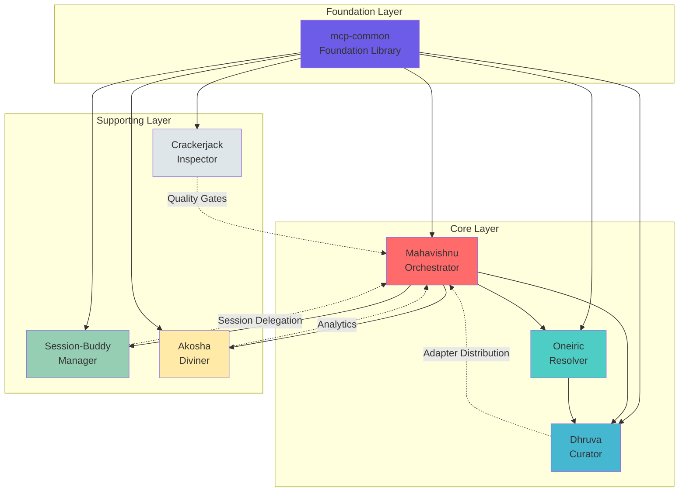
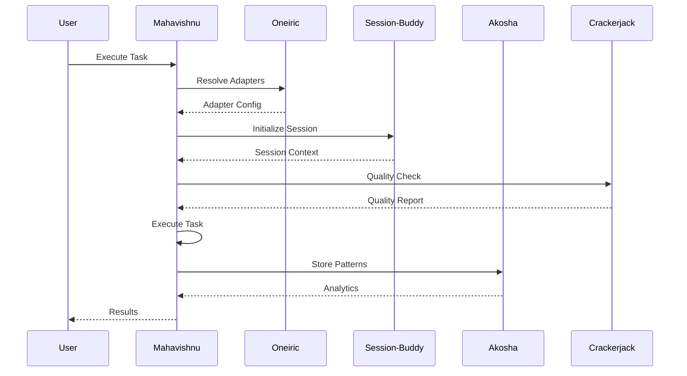

# Mahavishnu Ecosystem

> Multi-engine orchestration platform for AI agent workflows

[](https://opensource.org/licenses/BSD-3-Clause)
[](https://www.python.org/downloads/)
[](https://github.com/lesaker)

---

## Overview

The Mahavishnu ecosystem is a comprehensive platform for orchestrating AI agents across multiple repositories. It provides unified interfaces for managing workflows, sessions, adapters, quality checks, and configuration.

### Ecosystem Architecture

```
┌─────────────────────────────────────────────────────────────────┐
│                     Mahavishnu Ecosystem                        │
├─────────────────────────────────────────────────────────────────┤
│                                                                   │
│  ┌──────────────┐  ┌──────────────┐  ┌──────────────┐        │
│  │ Mahavishnu   │  │  Oneiric     │  │   Dhruva     │        │
│  │(Orchestrator)│◄─┤ (Resolver)   │◄─┤  (Curator)    │        │
│  │              │  │              │  │              │        │
│  │ • Multi-     │  │ • Component  │  │ • Persistent │        │
│  │   engine     │  │   resolution │  │   object     │        │
│  │ • Swarm      │  │ • Lifecycle  │  │   storage    │        │
│  │   coord      │  │ • Remote     │  │ • ACID       │        │
│  │ • Pools      │  │   manifests │  │   txns       │        │
│  └──────┬───────┘  └──────┬───────┘  └──────┬───────┘        │
│         │                  │                  │                │
│         ▼                  ▼                  ▼                │
│  ┌──────────────┐  ┌──────────────┐  ┌──────────────┐        │
│  │Session-Buddy │  │   Akosha     │  │ Crackerjack  │        │
│  │ (Manager)     │◄─┤ (Diviner)    │  │ (Inspector)   │        │
│  │              │  │              │  │              │        │
│  │ • Session    │  │ • Semantic   │  │ • Quality    │        │
│  │   mgmt       │  │   search     │  │   gates      │        │
│  │ • Memory     │  │ • Analytics  │  │ • AI auto-   │        │
│  │   tracking   │  │ • Knowledge  │  │   fix        │        │
│  │ • Auto       │  │   graphs     │  │ • Coverage   │        │
│  │   capture    │  │ • 3-tier     │  │   ratchet    │        │
│  └──────────────┘  │   storage    │  └──────────────┘        │
│                   └──────────────┘                            │
│         │                                                        │
│         ▼                                                        │
│  ┌──────────────────────────────────────────────────────────┐  │
│  │              mcp-common (Foundation)                      │  │
│  │         Shared utilities and base classes                 │  │
│  │  • HTTP Client Adapter (11x performance)                 │  │
│  │  • CLI Factory (lifecycle management)                    │  │
│  │  • Settings Management (YAML + env vars)                 │  │
│  │  • Security Utilities (validation + sanitization)       │  │
│  │  • Rich Console UI (professional terminal output)        │  │
│  └──────────────────────────────────────────────────────────┘  │
└─────────────────────────────────────────────────────────────────┘
```

---

## Projects

### Core Projects

| Project | Role | Status | Description |
|---------|------|--------|-------------|
| **[Mahavishnu](#mahavishnu)** | Orchestrator | ✅ Production | Multi-engine workflow coordination with AI-powered optimizations |
| **[Oneiric](#oneiric)** | Resolver | ✅ Production | Component resolution, lifecycle management, remote delivery |
| **[mcp-common](#mcp-common)** | Foundation | ✅ Production | Shared MCP utilities and base classes |

### Supporting Projects

| Project | Role | Status | Description |
|---------|------|--------|-------------|
| **[Dhruva](#dhruva)** | Curator | ✅ Production | Persistent object storage with ACID transactions |
| **[Session-Buddy](#session-buddy)** | Manager | ✅ Production | Session and memory management with cross-project intelligence |
| **[Akosha](#akosha)** | Diviner | ✅ Production | Pattern recognition, analytics, and knowledge aggregation |
| **[Crackerjack](#crackerjack)** | Inspector | ✅ Production | Quality control, CI/CD, and AI-powered code enforcement |

---

## Quick Start

### Option 1: Lite Mode (5 minutes) - Single Project

**For local development and testing**

```bash
# Clone and setup Mahavishnu
cd /Users/les/Projects/mahavishnu
uv sync --group dev

# Start in lite mode
uv run mahavishnu start --mode=lite

# Execute task
uv run mahavishnu execute "Build REST API endpoint"
```

**Use case**: Local development, testing, learning

### Option 2: Standard Mode (15 minutes) - Core Ecosystem

**For team development and distributed execution**

```bash
# Setup Session-Buddy (session manager)
cd /Users/les/Projects/session-buddy
uv sync --group dev
uv run session-buddy &

# Setup Mahavishnu
cd /Users/les/Projects/mahavishnu
uv sync --group dev

# Start in standard mode
uv run mahavishnu start --mode=standard

# Execute with swarm coordination
uv run mahavishnu execute --agents 3 "Build authentication system"
```

**Use case**: Team development, distributed execution

### Option 3: Full Ecosystem (30 minutes) - All Services

**For production deployments with full observability**

```bash
# Clone all projects
cd /Users/les/Projects

# Setup each project
for project in mahavishnu session-buddy akosha crackerjack dhruva oneiric mcp-common; do
    cd $project
    uv sync --group dev
    cd ..
done

# Start ecosystem services
cd mahavishnu
./scripts/start-ecosystem.sh full
```

**Use case**: Production deployments, full observability

### Progressive Complexity

| Level | Setup Time | Services | Features |
|-------|------------|----------|----------|
| **Lite** | 5 min | 1 (Mahavishnu) | Local execution |
| **Standard** | 15 min | 3 (Mahavishnu + Session-Buddy + Oneiric) | Distributed execution |
| **Full** | 30 min | 7+ (full ecosystem) | Production-grade |

[Learn more about progressive complexity](docs/guides/progressive-complexity.md)

---

## Project Details

### Mahavishnu

**Multi-engine orchestration platform**

- **Multi-Pool Orchestration**: Horizontal scaling across local, delegated, and cloud workers
- **Swarm Coordination**: 4 topologies, 5 consensus protocols, fault-tolerant execution
- **AI-Powered Optimizations**:
  - Three-tier model routing (75% cost savings)
  - Enhanced semantic search (150x-12,500x faster)
  - Self-optimizing neural router (89% accuracy)
  - WASM booster (352x faster transformations)
- **Quality Score**: 95/100 (Production Ready)

```bash
# Start Mahavishnu
cd /Users/les/Projects/mahavishnu
uv run mahavishnu start

# List repositories
uv run mahavishnu list-repos --role orchestrator

# Execute task
uv run mahavishnu execute "Build authentication system"
```

**Documentation**: [README.md](README.md) | [Architecture](ARCHITECTURE.md)

---

### Oneiric

**Component resolution and lifecycle management**

- **Deterministic Resolver**: 4-tier precedence with explainable decisions
- **Lifecycle Orchestration**: Activation, health, binding, cleanup, rollback
- **Remote Manifests**: ED25519-signed component delivery from CDN
- **Domain Coverage**: Adapters, Services, Tasks, Events, Workflows, Actions
- **Quality Score**: 95/100 (Production Ready)

```bash
# Start Oneiric
cd /Users/les/Projects/oneiric
uv run python -m oneiric.cli status

# List components
uv run python -m oneiric.cli list --domain adapter

# Explain resolution
uv run python -m oneiric.cli explain status --domain service
```

**Documentation**: [README.md](/Users/les/Projects/oneiric/README.md)

---

### Session-Buddy

**Session management and memory tracking**

- **Automatic Session Management**: Git-aware auto initialization and cleanup
- **Intelligence Features**:
  - Automatic insights capture (no manual effort)
  - Cross-project knowledge sharing
  - Team collaboration with voting
- **Memory System**: DuckDB + ONNX embeddings (no external APIs)
- **79+ MCP Tools**: Session lifecycle, search, knowledge graph

```bash
# Start Session-Buddy
cd /Users/les/Projects/session-buddy
uv run session-buddy

# Initialize session
/session-buddy:start

# Search insights
/session-buddy:search_insights "authentication"
```

**Documentation**: [README.md](/Users/les/Projects/session-buddy/README.md)

---

### Akosha

**Universal memory aggregation system**

- **Semantic Search**: Vector embeddings for finding patterns across systems
- **Time-Series Analytics**: Trend detection, anomaly spotting, correlation
- **Knowledge Graph**: Entity relationships and path finding
- **Three-Tier Storage**: Hot (in-memory) → Warm (on-disk) → Cold (Cloudflare R2)
- **11 MCP Tools**: Search, analytics, graph queries

```bash
# Start Akosha
cd /Users/les/Projects/akosha
uv run python -m akosha.mcp

# Semantic search
python -c "
import asyncio
from akosha.processing.embeddings import get_embedding_service
service = get_embedding_service()
await service.initialize()
results = await service.semantic_search('authentication')
print(results)
"
```

**Documentation**: [README.md](/Users/les/Projects/akosha/README.md)

---

### Crackerjack

**Quality control and CI/CD**

- **AI Auto-Fix**: 12 specialized agents fix all code quality issues
- **Quality Hooks**: 17 tools (format, lint, type check, security, etc.)
- **Coverage Ratchet**: 100% coverage target with milestone tracking
- **Rust Tools**: Skylos (20x faster dead code detection), Zuban (200x faster type checking)
- **MCP Server**: 7 tools for AI agent integration

```bash
# Run quality checks
cd /Users/les/Projects/crackerjack
uv run python -m crackerjack run

# AI auto-fix mode
uv run python -m crackerjack run --ai-fix --run-tests

# Start MCP server
uv run python -m crackerjack start
```

**Documentation**: [README.md](/Users/les/Projects/crackerjack/README.md)

---

### Dhruva

**Persistent object storage**

- **ACID Transactions**: Atomicity, Consistency, Isolation, Durability
- **Client/Server Model**: Concurrency via shared storage
- **Read-Optimized**: Aggressive caching for heavy read workloads
- **Multiple Backends**: FileStorage, FileStorage2, SqliteStorage

```bash
# Start Dhruva server
cd /Users/les/Projects/dhruva
uv run dhruva -s --file test.dhruva

# Connect client
uv run dhruva -c
```

**Documentation**: [README.md](/Users/les/Projects/dhruva/README.md)

---

### mcp-common

**Foundation library for MCP servers**

- **HTTP Client Adapter**: Connection pooling with 11x performance improvement
- **CLI Factory**: Standardized server lifecycle (start/stop/restart/status/health)
- **Settings Management**: YAML + environment variable configuration
- **Security Utilities**: API key validation with 90% faster caching
- **Rich Console UI**: Beautiful panels and notifications
- **615 Tests**: 99.2% coverage

```bash
# Install
cd /Users/les/Projects/mcp-common
uv pip install -e ".[dev]"

# Run examples
cd examples
python cli_server.py start
python cli_server.py status
python cli_server.py health
python cli_server.py stop
```

**Documentation**: [README.md](/Users/les/Projects/mcp-common/README.md)

---

## Key Features

### Multi-Engine Support

- **LlamaIndex**: RAG pipelines ✅
- **Prefect**: Workflow orchestration ✅
- **Agno**: Agent coordination ✅

### Swarm Coordination

- **Topologies**: Hierarchical, Mesh, Ring, Star
- **Consensus**: Majority, Weighted, PBFT, Raft, Honeybee
- **Fault Tolerance**: Graceful degradation with partial failures

### Pool Management

- **MahavishnuPool**: Direct local worker management
- **SessionBuddyPool**: Delegated execution via Session-Buddy
- **KubernetesPool**: Cloud-native worker deployment
- **Auto-scaling**: Dynamic scaling based on load

### Quality Assurance

- **Automated Testing**: pytest with comprehensive coverage
- **Code Quality**: ruff formatting and linting
- **Security Scanning**: bandit vulnerability detection
- **Coverage Reporting**: HTML coverage reports with ratchet system

---

## Architecture

### Component Interactions



### Data Flow



---

## Documentation

### Ecosystem-Wide

- **[Architecture](docs/ECOSYSTEM_ARCHITECTURE.md)** - Complete ecosystem architecture
- **[Progressive Complexity](docs/guides/progressive-complexity.md)** - Operational modes guide
- **[Service Dependencies](docs/reference/service-dependencies.md)** - Integration reference

### Project-Specific

- **[Mahavishnu Docs](README.md)** - Multi-engine orchestration
- **[Oneiric Docs](/Users/les/Projects/oneiric/README.md)** - Component resolution
- **[Session-Buddy Docs](/Users/les/Projects/session-buddy/README.md)** - Session management
- **[Akosha Docs](/Users/les/Projects/akosha/README.md)** - Memory aggregation
- **[Crackerjack Docs](/Users/les/Projects/crackerjack/README.md)** - Quality control
- **[Dhruva Docs](/Users/les/Projects/dhruva/README.md)** - Persistent storage
- **[mcp-common Docs](/Users/les/Projects/mcp-common/README.md)** - Foundation library

---

## Development

### Prerequisites

- Python 3.13+
- uv (recommended) or pip
- Git

### Setup All Projects

```bash
# Clone all repositories
cd /Users/les/Projects

# Install dependencies for each project
for dir in mahavishnu session-buddy akosha crackerjack dhruva oneiric mcp-common; do
    cd $dir
    uv sync --group dev
    cd ..
done
```

### Run All Tests

```bash
# Run tests for all projects
for dir in mahavishnu session-buddy akosha crackerjack dhruva oneiric mcp-common; do
    cd $dir
    uv run pytest --cov=$dir --cov-report=html
    cd ..
done
```

### Code Quality

```bash
# Run quality checks across ecosystem
for dir in mahavishnu session-buddy akosha crackerjack dhruva oneiric mcp-common; do
    cd $dir
    uv run ruff check $dir/
    uv run ruff format $dir/
    cd ..
done
```

---

## CI/CD

All projects use:

- **GitHub Actions** for CI/CD
- **Crackerjack** for quality gates
- **Coverage thresholds** (60-85% minimum depending on project)
- **Automated releases** on tag push

### Quality Metrics

| Project | Coverage | Quality Score | Status |
|---------|----------|---------------|--------|
| Mahavishnu | 85%+ | 95/100 | ✅ Production |
| Oneiric | 79%+ | 95/100 | ✅ Production |
| Session-Buddy | 45%+ | 90/100 | ✅ Production |
| Akosha | 85%+ | 92/100 | ✅ Production |
| Crackerjack | 21%+ | 92/100 | ✅ Production |
| Dhruva | N/A | 85/100 | ✅ Production |
| mcp-common | 99%+ | 92/100 | ✅ Production |

---

## Contributing

We welcome contributions! Please see:

- **[Contributing Guide](CONTRIBUTING.md)** - Contribution guidelines
- **[Code of Conduct](CODE_OF_CONDUCT.md)** - Community standards
- **[Development Setup](docs/development/setup.md)** - Development environment

### Development Workflow

1. Fork the repository
1. Create a feature branch: `git checkout -b feature/amazing-feature`
1. Make your changes
1. Run tests: `pytest`
1. Run quality checks: `ruff check .` and `mypy .`
1. Commit your changes: `git commit -m 'Add amazing feature'`
1. Push to branch: `git push origin feature/amazing-feature`
1. Submit a pull request

### Development Guidelines

- Follow PEP 8 style guide
- Add tests for new features (85%+ coverage)
- Update documentation as needed
- Keep PRs focused and small
- Write clear commit messages

---

## License

All projects are licensed under the **BSD 3-Clause License** unless otherwise noted.

See individual project LICENSE files for details.

---

## Acknowledgments

Built with:

- **[FastMCP](https://github.com/jlowin/fastmcp)** - MCP server framework
- **[Typer](https://typer.tiangolo.com/)** - CLI framework
- **[Pydantic](https://docs.pydantic.dev/)** - Data validation
- **[pytest](https://pytest.org/)** - Testing framework
- **[Ruff](https://github.com/astral-sh/ruff)** - Fast Python linter

---

**Last Updated**: 2026-02-09
**Ecosystem Version**: 1.0.0
**Maintainer**: @lesaker

---

## Quick Reference

### Common Commands

```bash
# Mahavishnu
mahavishnu start --mode=lite
mahavishnu list-repos
mahavishnu execute "Build API"

# Oneiric
oneiric status
oneiric list --domain adapter
oneiric explain <component>

# Session-Buddy
session-buddy
/session-buddy:start
/session-buddy:checkpoint

# Akosha
akosha start
akosha search "authentication"

# Crackerjack
crackerjack run
crackerjack run --ai-fix
crackerjack run --run-tests

# Dhruva
dhruva -s --file data.dhruva
dhruva -c

# mcp-common
python -m mcp_common.cli start
python -m mcp_common.cli status
```

### MCP Servers

All projects expose MCP servers for AI agent integration:

```json
{
  "mcpServers": {
    "mahavishnu": {"command": "mahavishnu", "args": ["mcp", "start"]},
    "session-buddy": {"command": "session-buddy"},
    "akosha": {"command": "python", "args": ["-m", "akosha.mcp"]},
    "crackerjack": {"command": "python", "args": ["-m", "crackerjack", "start"]}
  }
}
```

### Environment Variables

```bash
# Mahavishnu
export MAHAVISHNU_AUTH__SECRET="your-secret"
export MAHAVISHNU_POOLS__ENABLED="true"

# Oneiric
export ONEIRIC_CONFIG="/path/to/config.toml"
export ONEIRIC_PROFILE="serverless"

# Session-Buddy
export SESSION_BUDDY_HOME="/path/to/session/data"

# Akosha
export AKOSHA_COLD_BUCKET="your-bucket"
export AKOSHA_COLD_ENDPOINT="https://..."

# Crackerjack
export UV_PUBLISH_TOKEN="pypi-..."
export AI_AGENT="1"

# mcp-common
export MCP_SERVER__CACHE_ROOT=".mcp_cache"
```

---

> **Note**: The ecosystem is internally referred to as **ORB** (Omniscient Runtime Brain) - representing the intelligent, aware coordination of runtime operations across all services.

**For questions and support, please open an issue on the respective project repository.**
