# FastEmbed and Ollama Setup Guide

**Date**: 2026-02-03
**Purpose**: Set up FastEmbed (production) and Ollama (development) for embeddings

**📊 Visual Aids Available**: See [diagrams/embedding-architecture.md](diagrams/embedding-architecture.md) for comprehensive system diagrams.

______________________________________________________________________

## Quick Overview

### Architecture at a Glance

```mermaid
graph LR
    subgraph "Your Code"
        APP[Your Application]
    end

    subgraph "Mahavishnu Embeddings"
        CONFIG[EmbeddingConfig<br/>Oneiric]
        SERVICE[EmbeddingService]
    end

    subgraph "Providers"
        FAST[🏭 FastEmbed<br/>Production]
        OLLAMA[🔧 Ollama<br/>Development]
        OPENAI[☁️ OpenAI<br/>Cloud]
    end

    APP --> CONFIG
    CONFIG --> SERVICE
    SERVICE --> FAST
    SERVICE --> OLLAMA
    SERVICE --> OPENAI

    style FAST fill:#90EE90
    style OLLAMA fill:#87CEEB
    style OPENAI fill:#FFD700
```



### Provider Selection Decision Tree

```mermaid
flowchart TD
    START([Need Embeddings]) --> ENV{Environment?}

    ENV -->|Production| PROD{Need<br/>Privacy?}
    ENV -->|Development| DEV{Local<br/>Machine?}

    PROD -->|Yes| FAST[🏭 FastEmbed]
    PROD -->|No| CLOUD{Have<br/>API Key?}
    DEV -->|Yes| OLLAMA[🔧 Ollama]
    DEV -->|No| CLOUD

    CLOUD -->|Yes| OPENAI[☁️ OpenAI]
    CLOUD -->|No| FALLBACK{FastEmbed<br/>Available?}
    FALLBACK -->|Yes| FAST
    FALLBACK -->|No| ERROR[❌ No provider]

    style FAST fill:#90EE90,stroke:#333,stroke-width:3px
    style OLLAMA fill:#87CEEB,stroke:#333,stroke-width:3px
    style OPENAI fill:#FFD700,stroke:#333,stroke-width:3px
    style ERROR fill:#FFB6C1,stroke:#333,stroke-width:3px
```



______________________________________________________________________

## Quick Start

### Option 1: FastEmbed (Production) ⭐ RECOMMENDED

**Installation**:

```bash
# FastEmbed is already installed as a core dependency
# No additional installation needed!

# Verify it works
python -c "from fastembed import SentenceTransformer; print('✅ FastEmbed available')"
```

**Usage**:

```python
from mahavishnu.core.embeddings_oneiric import get_embeddings_with_oneiric

# Auto-load configuration from settings/mahavishnu.yaml
embeddings = await get_embeddings_with_oneiric(["hello", "world"])

print(f"Generated {len(embeddings)} embeddings")
print(f"Dimension: {len(embeddings[0])}")
```

**Configuration**:

```yaml
# In settings/mahavishnu.yaml
embeddings:
  provider: fastembed
  model: BAAI/bge-small-en-v1.5
  batch_size: 32
```

______________________________________________________________________

### Option 2: Ollama (Development) ⭐ PRIVACY-FIRST

**Installation**:

```bash
# Install Ollama
brew install ollama

# Start Ollama service
ollama serve &

# Pull embedding model
ollama pull nomic-embed-text

# Install Python dependencies
uv sync --extra ollama

# Verify
python -c "import socket; s=socket.socket(); s.connect(('localhost', 11434)); print('✅ Ollama available')"
```

**Usage**:

```python
# Configure to use Ollama
# In settings/mahavishnu.yaml:
embeddings:
  provider: ollama
  model: nomic-embed-text

# Or override programmatically
from mahavishnu.core.embeddings import EmbeddingProvider
from mahavishnu.core.embeddings_oneiric import get_embeddings_with_oneiric, EmbeddingConfig

config = EmbeddingConfig(provider=EmbeddingProvider.OLLAMA)
embeddings = await get_embeddings_with_oneiric(["hello", "world"], config)
```

______________________________________________________________________

## Configuration Examples

### Oneiric Configuration Loading Pattern

Mahavishnu uses a **layered configuration loading** pattern (Oneiric):


**Priority Order** (higher overrides lower):

1. ✅ **Environment Variables** (highest priority)
1. ✅ **settings/local.yaml** (local development)
1. ✅ **settings/mahavishnu.yaml** (committed defaults)
1. ✅ **Pydantic defaults** (fallback)

______________________________________________________________________

### Production: FastEmbed (default)

```yaml
# settings/mahavishnu.yaml
embeddings:
  provider: fastembed
  model: BAAI/bge-small-en-v1.5
  batch_size: 32
  enable_cache: true
```

### Development: Ollama (local, private)

```yaml
# settings/mahavishnu.yaml
embeddings:
  provider: ollama
  model: nomic-embed-text
  ollama_base_url: http://localhost:11434
  batch_size: 32
```

### Cloud: OpenAI API (high quality)

```yaml
# settings/mahavishnu.yaml
embeddings:
  provider: openai
  model: text-embedding-3-small
  # Set API key via environment:
  # export MAHAVISHNU_EMBEDDINGS_OPENAI_API_KEY=sk-...
```

______________________________________________________________________

## Programmatic Usage

### Basic Usage

```python
from mahavishnu.core.embeddings_oneiric import get_embeddings_with_oneiric

# Auto-load configuration from Oneiric
embeddings = await get_embeddings_with_oneiric([
    "Hello world",
    "Mahavishnu MCP orchestrator",
])

print(f"Generated {len(embeddings)} embeddings of dimension {len(embeddings[0])}")
```

### With Specific Provider

```python
from mahavishnu.core.embeddings import EmbeddingProvider
from mahavishnu.core.embeddings_oneiric import EmbeddingConfig, get_embeddings_with_oneiric

# Use Ollama for development
config = EmbeddingConfig(
    provider=EmbeddingProvider.OLLAMA,
    model="nomic-embed-text",
)

embeddings = await get_embeddings_with_oneiric(["hello"], config)
```

### Oneiric Adapter (for MCP Tools)

```python
from mahavishnu.core.embeddings_oneiric import OneiricEmbeddingsAdapter

# Initialize with config
adapter = OneiricEmbeddingsAdapter()

# Generate embeddings
embeddings = await adapter.embed(["Hello", "World"])

# Single text embedding
embedding = await adapter.embed_single("Hello World")

# Get provider info
info = adapter.get_provider_info()
print(f"Using: {info['provider']} with model {info['model']}")
```

______________________________________________________________________

## MCP Tool Integration

### Add Embeddings to MCP Server

```python
# In mahavishnu/mcp/server_core.py
from mahavishnu.core.embeddings_oneiric import mcp_tool_get_embeddings

@mcp.tool()
async def get_embeddings(
    texts: list[str],
    provider: str | None = None,
    model: str | None = None,
) -> dict:
    """Generate embeddings for texts using configured provider.

    Args:
        texts: List of text strings to embed
        provider: Override provider (fastembed, ollama, openai)
        model: Override model name

    Returns:
        Dictionary with embeddings and metadata
    """
    return await mcp_tool_get_embeddings(texts, provider, model)
```

### Usage from MCP Client

```bash
# Call the tool
mahavishnu mcp call get_embeddings \
    --texts '["Hello world", "Mahavishnu orchestrator"]' \
    --provider fastembed
```

______________________________________________________________________

## Model Comparison

### Model Dimensions & Quality Visualization

```mermaid
graph LR
    subgraph "FastEmbed Models 🏭"
        FE1[bge-small<br/>384-d<br/>⚡⚡⚡ Fast<br/>⭐⭐ Quality]
        FE2[bge-base<br/>768-d<br/>⚡⚡ Medium<br/>⭐⭐⭐ Quality]
        FE3[bge-large<br/>1024-d<br/>⚡ Slow<br/>⭐⭐⭐⭐ Quality]
    end

    subgraph "Ollama Models 🔧"
        O1[nomic-embed-text<br/>768-d<br/>⚡⚡ Medium<br/>⭐⭐⭐ Quality]
        O2[mxbai-embed-large<br/>1024-d<br/>⚡ Slow<br/>⭐⭐⭐ Quality]
    end

    subgraph "OpenAI Models ☁️"
        AI1[text-embedding-3-small<br/>1536-d<br/>⚡⚡⚡ Fast<br/>⭐⭐⭐⭐ Best]
        AI2[text-embedding-3-large<br/>3072-d<br/>⚡⚡ Medium<br/>⭐⭐⭐⭐ Best]
    end

    style FE1 fill:#90EE90
    style FE2 fill:#98FB98
    style FE3 fill:#00FF7F
    style O1 fill:#87CEEB
    style O2 fill:#00BFFF
    style AI1 fill:#FFD700
    style AI2 fill:#FFA500
```



**📏 Dimension Guide:**

- **384-d**: Fastest, good for quick similarity matching
- **768-d**: Balanced speed/quality, good for most use cases
- **1024-d**: High quality, better for nuanced semantic search
- **1536-3072-d**: Best quality, ideal for complex reasoning tasks

### Comparison Table

| Model | Dimension | Speed | Quality | Best For |
|-------|-----------|-------|---------|----------|
| **FastEmbed** | | | | | |
| - BAAI/bge-small-en-v1.5 | 384 | ⭐⭐⭐ | ⭐⭐ | Production, fast |
| - BAAI/bge-base-en-v1.5 | 768 | ⭐⭐ | ⭐⭐⭐ | Better quality |
| - BAAI/bge-large-en-v1.5 | 1024 | ⭐ | ⭐⭐⭐⭐ | Best quality |
| **Ollama** | | | | | |
| - nomic-embed-text | 768 | ⭐⭐ | ⭐⭐⭐ | Development |
| - mxbai-embed-large-v1 | 1024 | ⭐ | ⭐⭐⭐ | High quality |
| **OpenAI** | | | | | |
| - text-embedding-3-small | 1536 | ⭐⭐⭐ | ⭐⭐⭐⭐ | Best quality |
| - text-embedding-3-large | 3072 | ⭐ | ⭐⭐⭐⭐ | Best quality |

______________________________________________________________________

## Troubleshooting

### FastEmbed: Model Download Slow on First Use

**Issue**: First embedding generation is slow while downloading model

**Solution**: Pre-download model

```python
from fastembed import SentenceTransformer

# Download model during deployment
model = SentenceTransformer("BAAI/bge-small-en-v1.5")
# Model is now cached for future use
```

### Ollama: Connection Refused

**Issue**: Cannot connect to Ollama API

**Solution**: Start Ollama service

```bash
# Start Ollama
ollama serve &

# Verify it's running
curl http://localhost:11434/api/tags

# Pull model
ollama pull nomic-embed-text
```

### OpenAI: API Key Not Found

**Issue**: OpenAI provider says API key not found

**Solution**: Set environment variable

```bash
export OPENAI_API_KEY=sk-...
export MAHAVISHNU_EMBEDDINGS_OPENAI_API_KEY=sk-...
```

______________________________________________________________________

## Performance Benchmarks

### Visual Performance Comparison


**📊 Key Insights:**

- 🟢 **FastEmbed**: 4x faster than Ollama, 12x faster than OpenAI (subsequent calls)
- 🟡 **Ollama**: 3x faster than OpenAI, but slower than FastEmbed
- 🔵 **OpenAI**: Slowest due to network latency, but best quality

### Detailed Benchmarks (Intel Mac x86_64)

On Intel Mac (x86_64):

| Provider | Init Time | First Embed | Subsequent | Batch (32) |
|----------|-----------|------------|------------|------------|
| **FastEmbed** | 0.5s | 50ms | 20ms | 600ms |
| **Ollama** | 0s (service) | 100ms | 80ms | 2.5s |
| **OpenAI** | 0s | 300ms | 250ms | 6s |

______________________________________________________________________

## Migration from sentence-transformers

### Before (incompatible)

```python
from sentence_transformers import SentenceTransformer

model = SentenceTransformer('all-MiniLM-L6-v2')
embeddings = model.encode(["hello", "world"])
```

### After (FastEmbed)

```python
from mahavishnu.core.embeddings_oneiric import get_embeddings_with_oneiric

embeddings = await get_embeddings_with_oneiric(["hello", "world"])
```

### After (Ollama)

```python
from mahavishnu.core.embeddings_oneiric import get_embeddings_with_oneiric, EmbeddingConfig, EmbeddingProvider

config = EmbeddingConfig(provider=EmbeddingProvider.OLLAMA)
embeddings = await get_embeddings_with_oneiric(["hello", "world"], config)
```

______________________________________________________________________

## Environment Variables

All embedding configuration can be overridden via environment variables:

```bash
# Provider selection
export MAHAVISHNU_EMBEDDINGS_PROVIDER=fastembed
export MAHAVISHNU_EMBEDDINGS_MODEL=BAAI/bge-base-en-v1.5

# Ollama
export MAHAVISHNU_EMBEDDINGS_OLLAMA_BASE_URL=http://localhost:11434

# OpenAI
export MAHAVISHNU_EMBEDDINGS_OPENAI_API_KEY=sk-...
export MAHAVISHNU_EMBEDDINGS_OPENAI_MODEL=text-embedding-3-small

# Performance
export MAHAVISHNU_EMBEDDINGS_BATCH_SIZE=64
export MAHAVISHNU_EMBEDDINGS_ENABLE_CACHE=true
```

______________________________________________________________________

## Summary

✅ **FastEmbed**: Production-ready, cross-platform, fast
✅ **Ollama**: Development, local privacy, works on Intel Macs
✅ **OpenAI**: Cloud-based, best quality, simple API

**Recommendation**: Use FastEmbed for production, Ollama for development!

______________________________________________________________________

**Last Updated**: 2026-02-02
**Status**: ✅ Ready to use
