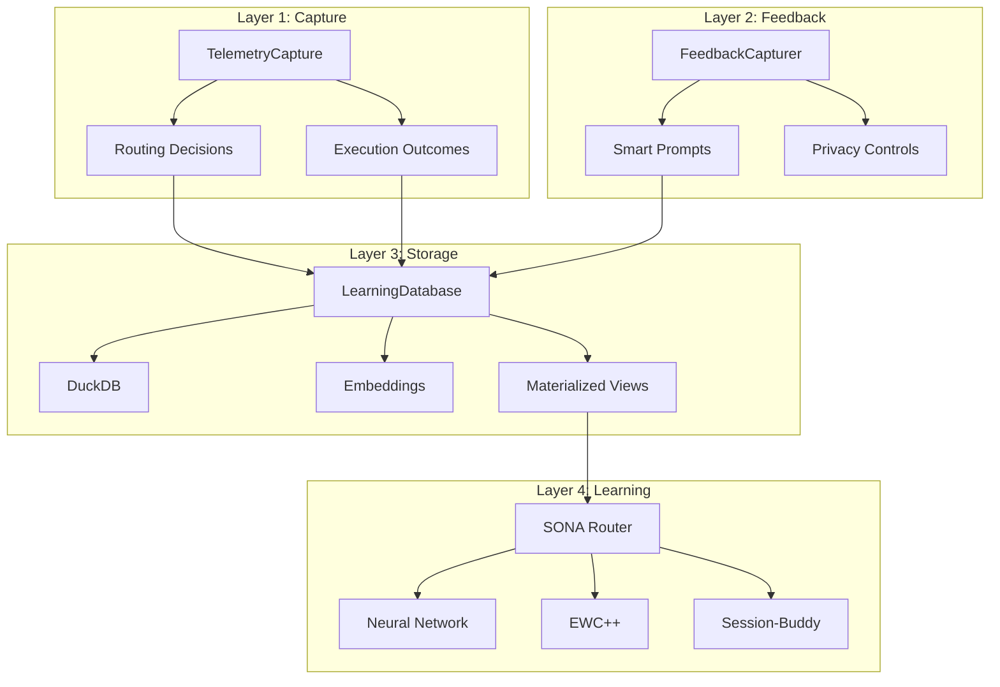

# Learning Feedback System - Integration Guide

This guide is for developers who want to integrate the learning feedback system into their components, tools, or adapters.

## Architecture Overview

The learning feedback system is organized into 4 layers:



### Layer 1: Telemetry Capture

**Purpose:** Automatically capture routing decisions and execution outcomes

**Components:**
- `TelemetryCapture` - Subscribes to message bus events
- Captures routing decisions from model router
- Captures execution outcomes from pool manager
- Publishes complete execution records

**Location:** `mahavishnu/learning/execution/telemetry.py`

### Layer 2: Feedback Collection

**Purpose:** Collect user feedback with intelligent prompting

**Components:**
- `FeedbackCapturer` - Interactive prompts with contextual questions
- `FeedbackSubmission` - Pydantic model for validation
- Smart prompting rules to avoid fatigue
- Privacy controls (private/team/public)

**Location:** `mahavishnu/learning/feedback/`

### Layer 3: Learning Database

**Purpose:** Store and query execution analytics

**Components:**
- `LearningDatabase` - DuckDB-based analytics database
- Semantic search via embeddings
- Materialized views for dashboards
- Connection pooling for concurrent queries

**Location:** `mahavishnu/learning/database.py`

### Layer 4: Neural Learning

**Purpose:** Learn from feedback to improve routing

**Components:**
- `SONARouter` - Self-optimizing neural architecture
- EWC++ - Continual learning without forgetting
- Session-Buddy integration - Historical context
- 89% routing accuracy

**Location:** `mahavishnu/core/learning_router.py`

## How to Add Telemetry to Your Component

### Step 1: Create Execution Records

```python
from datetime import UTC, datetime
from uuid import uuid4
from mahavishnu.learning.models import ExecutionRecord, ErrorType

# After your component completes a task
async def track_task_execution(
    task_type: str,
    task_description: str,
    repo: str,
    model_tier: str,
    pool_type: str,
    success: bool,
    duration_seconds: float,
    cost_estimate: float = 0.0,
    actual_cost: float = 0.0,
    quality_score: int | None = None,
    error_message: str | None = None,
):
    """Create execution record for learning analytics."""

    record = ExecutionRecord(
        task_id=uuid4(),
        timestamp=datetime.now(UTC),
        task_type=task_type,
        task_description=task_description,
        repo=repo,
        file_count=0,  # Your component tracks this
        estimated_tokens=0,  # Your component tracks this
        model_tier=model_tier,
        pool_type=pool_type,
        swarm_topology=None,  # If using swarm
        routing_confidence=0.85,  # Router confidence
        complexity_score=50,  # 0-100
        success=success,
        duration_seconds=duration_seconds,
        quality_score=quality_score,
        cost_estimate=cost_estimate,
        actual_cost=actual_cost,
        error_type=ErrorType.UNKNOWN if not success else None,
        error_message=error_message if not success else None,
    )

    # Store in learning database
    await learning_db.store_execution(record)

    return record
```

### Step 2: Publish to Message Bus

```python
from mahavishnu.mcp.protocols.message_bus import MessageBus

async def publish_execution_complete(
    message_bus: MessageBus,
    task_id: str,
    success: bool,
    duration_seconds: float,
    quality_score: int | None = None,
    actual_cost: float = 0.0,
    pool_id: str | None = None,
):
    """Publish TASK_COMPLETED event for telemetry capture."""

    await message_bus.publish({
        "type": "TASK_COMPLETED",
        "source_pool_id": pool_id,
        "target_pool_id": None,
        "payload": {
            "task_id": task_id,
            "success": success,
            "duration_seconds": duration_seconds,
            "quality_score": quality_score,
            "actual_cost": actual_cost,
            "pool_id": pool_id,
        },
    })
```

### Step 3: Integrate TelemetryCapture

```python
from mahavishnu.learning.execution.telemetry import TelemetryCapture
from mahavishnu.mcp.protocols.message_bus import MessageBus

# Initialize telemetry capture
message_bus = MessageBus()
telemetry = TelemetryCapture(message_bus=message_bus)
await telemetry.initialize()

# Capture routing decision
await telemetry.capture_routing_decision({
    "task_id": "task-abc-123",
    "routing": routing_decision,  # ModelRouting object
    "timestamp": datetime.now(UTC),
    "task_data": {
        "type": "refactor",
        "description": "Optimize database queries",
        "repo": "my-repo",
        "files": ["models.py", "queries.py"],
        "estimated_tokens": 5000,
    },
})

# Later, when task completes
await telemetry.capture_execution_outcome({
    "task_id": "task-abc-123",
    "success": True,
    "duration_seconds": 45.2,
    "quality_score": 85,
    "actual_cost": 0.003,
    "pool_id": "pool-local",
})
```

## How to Register Feedback Tools

### Option 1: Use Built-in MCP Tools

The feedback tools are already registered in the FastMCP server. No additional setup needed.

Available tools:
- `submit_feedback` - Submit feedback for completed task
- `feedback_help` - Get help with feedback system

### Option 2: Add Custom Feedback Tools

```python
from fastmcp import FastMCP
from mahavishnu.learning.feedback.models import FeedbackSubmission
from mahavishnu.learning.feedback.capture import FeedbackCapturer

def register_my_feedback_tools(mcp: FastMCP) -> None:
    """Register custom feedback tools."""

    @mcp.tool()
    async def submit_component_feedback(
        component_name: str,
        task_id: str,
        satisfaction: str,
        comment: str | None = None,
    ) -> dict:
        """Submit feedback for custom component.

        Args:
            component_name: Name of your component
            task_id: Task identifier
            satisfaction: excellent/good/fair/poor
            comment: Optional comment

        Returns:
            Feedback submission result
        """
        feedback = FeedbackSubmission(
            task_id=task_id,
            satisfaction=satisfaction,
            comment=comment,
            visibility="private",  # Default
        )

        # Store in learning database
        # TODO: Your storage logic here

        return {
            "feedback_id": str(feedback.feedback_id),
            "status": "submitted",
            "component": component_name,
        }
```

## Database Schema Reference

### executions Table

```sql
CREATE TABLE executions (
    -- Identification
    task_id UUID PRIMARY KEY,
    timestamp TIMESTAMP NOT NULL,

    -- Task characteristics
    task_type VARCHAR NOT NULL,
    task_description TEXT NOT NULL,
    repo VARCHAR NOT NULL,
    file_count INT NOT NULL,
    estimated_tokens INT NOT NULL,

    -- Routing decisions
    model_tier VARCHAR NOT NULL,
    pool_type VARCHAR NOT NULL,
    swarm_topology VARCHAR,
    routing_confidence FLOAT NOT NULL,
    complexity_score INT NOT NULL,

    -- Execution outcomes
    success BOOLEAN NOT NULL,
    duration_seconds FLOAT NOT NULL,
    quality_score INT,

    -- Cost tracking
    cost_estimate FLOAT NOT NULL,
    actual_cost FLOAT NOT NULL,

    -- Error context
    error_type VARCHAR,
    error_message TEXT,

    -- User feedback
    user_accepted BOOLEAN,
    user_rating INT,

    -- Resource utilization
    peak_memory_mb FLOAT,
    cpu_time_seconds FLOAT,

    -- Solution extraction
    solution_summary TEXT,

    -- Semantic search
    embedding FLOAT[384],

    -- Metadata
    metadata JSON,
    uploaded_at TIMESTAMP DEFAULT NOW()
);
```

### Composite Indexes

```sql
-- Most common query: performance by task type and repo
CREATE INDEX idx_executions_repo_task
ON executions (repo, task_type, timestamp DESC);

-- For auto-tuning router: tier performance history
CREATE INDEX idx_executions_tier_success
ON executions (model_tier, success, timestamp DESC);

-- For pool optimization: pool performance by duration
CREATE INDEX idx_executions_pool_duration
ON executions (pool_type, success, duration_seconds);

-- For quality trend analysis
CREATE INDEX idx_executions_quality_trend
ON executions (repo, quality_score, timestamp DESC);
```

### Materialized Views

#### tier_performance_mv

```sql
CREATE VIEW tier_performance_mv AS
SELECT
    repo,
    model_tier,
    task_type,
    DATE_TRUNC('day', timestamp) as date,
    COUNT(*) as total_executions,
    SUM(CASE WHEN success THEN 1 ELSE 0 END) as successful_count,
    AVG(duration_seconds) as avg_duration,
    AVG(actual_cost) as avg_cost,
    AVG(quality_score) as avg_quality,
    PERCENTILE_CONT(0.95) WITHIN GROUP (ORDER BY duration_seconds) as p95_duration
FROM executions
WHERE timestamp >= NOW() - INTERVAL '30 days'
GROUP BY repo, model_tier, task_type, DATE_TRUNC('day', timestamp);
```

#### pool_performance_mv

```sql
CREATE VIEW pool_performance_mv AS
SELECT
    pool_type,
    repo,
    DATE_TRUNC('hour', timestamp) as hour,
    COUNT(*) as total_tasks,
    SUM(CASE WHEN success THEN 1 ELSE 0 END) as successful_tasks,
    AVG(duration_seconds) as avg_duration,
    AVG(actual_cost) as avg_cost,
    SUM(CASE WHEN success THEN 1 ELSE 0 END)::float / COUNT(*) as success_rate
FROM executions
WHERE timestamp >= NOW() - INTERVAL '7 days'
GROUP BY pool_type, repo, DATE_TRUNC('hour', timestamp);
```

#### solution_patterns_mv

```sql
CREATE VIEW solution_patterns_mv AS
SELECT
    solution_summary,
    repo,
    array_agg(DISTINCT task_type) as task_types,
    COUNT(*) as usage_count,
    SUM(CASE WHEN success THEN 1 ELSE 0 END) as success_count,
    AVG(quality_score) as avg_quality,
    MIN(timestamp) as first_seen,
    MAX(timestamp) as last_seen,
    SUM(CASE WHEN success THEN 1 ELSE 0 END)::float / COUNT(*) as success_rate
FROM executions
WHERE solution_summary IS NOT NULL
  AND timestamp >= NOW() - INTERVAL '90 days'
GROUP BY solution_summary, repo
HAVING COUNT(*) >= 5;
```

## API Reference for LearningDatabase

### Initialization

```python
from mahavishnu.learning.database import LearningDatabase

# Create database instance
db = LearningDatabase(
    database_path="data/learning.db",
    embedding_model="all-MiniLM-L6-v2",
    pool_size=4,
)

# Initialize schema and load models
await db.initialize()
```

### Store Execution Record

```python
await db.store_execution(execution_record)
```

### Semantic Search

```python
# Find similar past executions
similar = await db.find_similar_executions(
    task_description="Optimize database queries",
    repo="my-repo",
    limit=10,
    days_back=90,
    threshold=0.7,
)

# Returns:
# [
#     {
#         "task_id": "abc-123",
#         "task_type": "refactor",
#         "similarity": 0.92,
#         "model_tier": "medium",
#         "success": True,
#         ...
#     },
#     ...
# ]
```

### Query Materialized Views

```python
# Get tier performance
performance = await db.get_tier_performance(
    repo="my-repo",
    days_back=30,
)

# Get pool performance
pools = await db.get_pool_performance(
    repo="my-repo",
    days_back=7,
)

# Get solution patterns
patterns = await db.get_solution_patterns(
    repo="my-repo",
    min_usage=5,
    limit=10,
)
```

### Close Database

```python
await db.close()

# Or use async context manager
async with LearningDatabase("data/learning.db") as db:
    await db.initialize()
    await db.store_execution(record)
    # Automatically closed on exit
```

## Integration Example: Custom Adapter

Here's a complete example of integrating the learning system into a custom adapter:

```python
from mahavishnu.core.adapters.base import OrchestratorAdapter
from mahavishnu.learning.execution.telemetry import TelemetryCapture
from mahavishnu.learning.database import LearningDatabase
from mahavishnu.learning.models import ExecutionRecord
from mahavishnu.mcp.protocols.message_bus import MessageBus
from datetime import UTC, datetime

class MyLearningAdapter(OrchestratorAdapter):
    """Custom adapter with learning integration."""

    def __init__(self, config: dict):
        super().__init__(config)
        self.message_bus = MessageBus()
        self.telemetry = TelemetryCapture(message_bus=self.message_bus)
        self.learning_db = LearningDatabase()

    async def initialize(self):
        """Initialize adapter and learning components."""
        await super().initialize()
        await self.telemetry.initialize()
        await self.learning_db.initialize()

    async def execute_task(
        self,
        task_type: str,
        task_description: str,
        **kwargs
    ) -> dict:
        """Execute task with learning telemetry."""

        # Capture routing decision
        routing_decision = self._select_model(task_description)
        await self.telemetry.capture_routing_decision({
            "task_id": task_id,
            "routing": routing_decision,
            "timestamp": datetime.now(UTC),
            "task_data": kwargs,
        })

        # Execute task
        start_time = datetime.now(UTC)
        try:
            result = await self._do_execute(task_type, task_description, **kwargs)
            success = True
            error_message = None
        except Exception as e:
            success = False
            error_message = str(e)
            result = None

        duration = (datetime.now(UTC) - start_time).total_seconds()

        # Capture execution outcome
        await self.telemetry.capture_execution_outcome({
            "task_id": task_id,
            "success": success,
            "duration_seconds": duration,
            "error_message": error_message,
            "actual_cost": routing_decision.cost_estimate,
        })

        return result

    async def _do_execute(self, task_type: str, description: str, **kwargs):
        """Your actual execution logic here."""
        # ... your implementation ...
        pass

    def _select_model(self, description: str):
        """Your model selection logic here."""
        # ... your implementation ...
        pass
```

## Testing Your Integration

```python
import pytest
from mahavishnu.learning.execution.telemetry import TelemetryCapture
from mahavishnu.learning.database import LearningDatabase

@pytest.mark.asyncio
async def test_telemetry_capture():
    """Test telemetry capture integration."""
    # Initialize
    telemetry = TelemetryCapture(message_bus=MessageBus())
    await telemetry.initialize()

    # Capture routing decision
    await telemetry.capture_routing_decision({
        "task_id": "test-123",
        "routing": mock_routing,
        "timestamp": datetime.now(UTC),
        "task_data": {"type": "test"},
    })

    # Capture execution outcome
    await telemetry.capture_execution_outcome({
        "task_id": "test-123",
        "success": True,
        "duration_seconds": 10.0,
    })

    # Verify captured
    assert telemetry.get_routing_decisions_count() == 0  # Published and cleared
    assert telemetry.get_execution_outcomes_count() == 0

@pytest.mark.asyncio
async def test_learning_database():
    """Test learning database integration."""
    # Initialize database
    async with LearningDatabase("test.db") as db:
        await db.initialize()

        # Store execution
        await db.store_execution(test_record)

        # Find similar
        similar = await db.find_similar_executions("test query")
        assert len(similar) >= 0
```

## Best Practices

### 1. Always Capture Routing Decisions

Capture routing decisions **before** task execution:

```python
# Good: Capture before execution
await telemetry.capture_routing_decision({...})
result = await execute_task(...)

# Bad: Capture after execution (loses timing context)
result = await execute_task(...)
await telemetry.capture_routing_decision({...})
```

### 2. Use Consistent Task Types

Use consistent task type names for better aggregation:

```python
# Good: Consistent types
task_types = ["refactor", "test", "docs", "bugfix", "feature"]

# Bad: Inconsistent types
task_types = ["Refactor", "refactoring", "REFACTOR", "refactor-code"]
```

### 3. Include Quality Scores

Include quality scores when available:

```python
# Good: Include quality
await telemetry.capture_execution_outcome({
    "quality_score": quality_gate.score,  # 0-100
    ...
})

# Acceptable: None if not available
await telemetry.capture_execution_outcome({
    "quality_score": None,  # No quality gate
    ...
})
```

### 4. Use Connection Pooling

The learning database uses connection pooling for concurrent queries:

```python
# Good: Reuse database instance
db = LearningDatabase(pool_size=4)
await db.initialize()

# Multiple concurrent queries
results = await asyncio.gather(
    db.get_tier_performance(),
    db.get_pool_performance(),
    db.get_solution_patterns(),
)

# Bad: Create new instance per query
for query in queries:
    db = LearningDatabase()  # Inefficient
    await db.initialize()
    result = await db.query(...)
```

## Next Steps

- **[Quick Start Guide](LEARNING_FEEDBACK_LOOPS_QUICKSTART.md)** - User-facing documentation
- **[API Reference](LEARNING_API_REFERENCE.md)** - Complete API documentation
- **[Troubleshooting](LEARNING_TROUBLESHOOTING.md)** - Common integration issues

## Additional Resources

- **Source Code:**
  - `mahavishnu/learning/` - Learning system implementation
  - `mahavishnu/core/learning_router.py` - SONA router
  - `mahavishnu/mcp/tools/feedback_tools.py` - MCP tools

- **Tests:**
  - `tests/unit/test_learning_router.py` - SONA router tests
  - `tests/unit/test_learning_database.py` - Database tests
