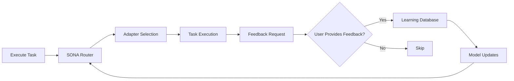
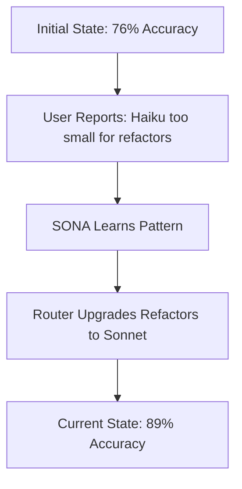

# Learning Feedback Loops - Quick Start Guide

## What is the Learning Feedback System?

The Learning Feedback System is Mahavishnu's intelligent feedback mechanism that continuously improves routing accuracy, pool selection, and swarm coordination based on your task execution outcomes.

**Key Benefits:**

- **89% Routing Accuracy**: Learns which adapters work best for different tasks
- **Cost Optimization**: Reduces unnecessary large model usage by learning patterns
- **Personalized Routing**: Adapts to your specific workflow and project characteristics
- **Privacy-First**: All data stored locally by default, you control what's shared

## How It Works



### The Learning Pipeline

1. **Routing Decision** - SONA neural network selects the best adapter/model
2. **Task Execution** - Your task is executed with the selected configuration
3. **Feedback Collection** - You provide optional feedback on the experience
4. **Learning Loop** - System learns and improves future routing decisions

## Quick Start

### 1. Enable Learning Configuration

The learning system is disabled by default. Enable it in your configuration file:

**For Standard Mode** (`settings/standard.yaml`):

```yaml
# Learning feedback loops - ENABLED in standard mode
learning:
  enabled: true
  database_path: "data/learning.db"
  retention_days: 90
  enable_feedback_collection: true
  enable_telemetry_capture: true
  embedding_model: "all-MiniLM-L6-v2"
  similarity_threshold: 0.7
  min_samples_for_learning: 10
```

**For Custom Mode** (`settings/mahavishnu.yaml` or `settings/local.yaml`):

```yaml
learning:
  enabled: true
  database_path: "data/learning.db"
  retention_days: 90
  enable_feedback_collection: true
  enable_telemetry_capture: true
```

**Via Environment Variable**:

```bash
export MAHAVISHNU_LEARNING__ENABLED=true
export MAHAVISHNU_LEARNING__DATABASE_PATH="data/learning.db"
```

### 2. Verify Configuration

Test that the learning system is working:

```bash
# Run the end-to-end test
python scripts/test_learning_e2e.py
```

Expected output:

```
============================================================
TEST 1: Configuration Loading
============================================================
✅ Settings loaded successfully
   Learning enabled: True
   Database path: data/learning.db
   Retention days: 90
   Feedback collection: True
   Telemetry capture: True

============================================================
TEST 2: Learning Database Initialization
============================================================
✅ Database initialized successfully
✅ Test execution stored
✅ Execution retrieved
✅ Found 1 similar executions
✅ Test data cleaned up

============================================================
TEST SUMMARY
============================================================
Passed: 3/3

✅ ALL TESTS PASSED!
```

### 3. Submit Feedback via MCP

After a task completes, you can provide feedback:

```python
# Using MCP client
await mcp.call_tool("submit_feedback", {
    "task_id": "abc-123-def",
    "satisfaction": "excellent",
    "visibility": "private"
})
```

**Satisfaction Levels:**
- `excellent` (⭐⭐⭐⭐⭐) - Perfect model choice, fast execution, great quality
- `good` (⭐⭐⭐⭐) - Met expectations, minor issues acceptable
- `fair` (⭐⭐⭐) - Acceptable but room for improvement
- `poor` (⭐⭐) - Significant issues

### 4. Submit Feedback via CLI

```bash
# Submit feedback for a completed task
mahavishnu feedback submit \
  --task-id abc-123-def \
  --satisfaction excellent \
  --visibility private

# View your feedback history
mahavishnu feedback --history

# Export your feedback data
mahavishnu feedback --export my-feedback.json

# Delete specific feedback entry
mahavishnu feedback --delete abc-123-def

# Clear all feedback (with confirmation)
mahavishnu feedback --clear-all
```

### 5. Interactive Feedback Prompts

When running in an interactive terminal, Mahavishnu will automatically prompt for feedback after significant tasks:

```bash
$ mahavishnu execute "Refactor authentication module"

[Executed in 2m 15s with sonnet model]

┏━━━━━━━━━━━━━━━━━━━━━━━━━━━━━━━━━━━━━━━━━━━━━━━━━━━┓
┃ 💬 Help us choose the right model next time?     ┃
┗━━━━━━━━━━━━━━━━━━━━━━━━━━━━━━━━━━━━━━━━━━━━━━━━━━━┛

1️⃣  Was the model choice (sonnet) appropriate? [Y/n]: y
2️⃣  Was the execution speed acceptable? [Y/n]: y
3️⃣  Did the output meet your expectations? [Y/n]: y

✓ Feedback submitted! ⭐⭐⭐⭐⭐
Thank you for helping us improve routing accuracy.
```

## Configuration Options

### Full Configuration Reference

```yaml
learning:
  # Enable/disable the learning system
  enabled: true

  # Path to DuckDB database for storing learning data
  database_path: "data/learning.db"

  # How many days to retain execution data (automatic cleanup)
  retention_days: 90  # 7-365 days

  # Collect user feedback via CLI/MCP tools
  enable_feedback_collection: true

  # Automatically capture execution telemetry
  enable_telemetry_capture: true

  # Sentence transformer model for semantic search
  embedding_model: "all-MiniLM-L6-v2"

  # Minimum similarity threshold for pattern matching (0.0-1.0)
  similarity_threshold: 0.7

  # Minimum samples before applying learned patterns
  min_samples_for_learning: 10
```

### Environment Variables

Override any configuration option via environment variables:

```bash
# Enable learning
export MAHAVISHNU_LEARNING__ENABLED=true

# Custom database path
export MAHAVISHNU_LEARNING__DATABASE_PATH="/path/to/custom.db"

# Extend retention
export MAHAVISHNU_LEARNING__RETENTION_DAYS=180

# Disable feedback prompts
export MAHAVISHNU_LEARNING__ENABLE_FEEDBACK_COLLECTION=false
```

## Data Privacy

Your feedback privacy is controlled by the `visibility` parameter:

### Private (Default)

```python
await mcp.call_tool("submit_feedback", {
    "task_id": "abc-123",
    "satisfaction": "excellent",
    "visibility": "private"  # Default
})
```

- Stored only on your local machine
- Used to personalize your routing accuracy
- Never shared or uploaded
- Cannot be traced to you

### Team

```python
await mcp.call_tool("submit_feedback", {
    "task_id": "abc-123",
    "satisfaction": "good",
    "visibility": "team"
})
```

- Visible to your team for learning
- Helps team members avoid similar mistakes
- Builds shared wisdom across projects
- Anonymized by default (no usernames)

### Public

```python
await mcp.call_tool("submit_feedback", {
    "task_id": "abc-123",
    "satisfaction": "poor",
    "issue_type": "wrong_model",
    "visibility": "public"
})
```

- Contributes anonymized patterns to global routing
- Helps improve accuracy for all users
- Cannot be traced back to you or your team
- Example shared data:
  ```json
  {
    "task_type": "refactor",
    "model_tier": "medium",
    "satisfaction": "poor",
    "issue_type": "wrong_model"
  }
  ```

## Common Use Cases

### Use Case 1: Wrong Model Selected

```python
await mcp.call_tool("submit_feedback", {
    "task_id": "abc-123",
    "satisfaction": "fair",
    "issue_type": "wrong_model",
    "comment": "Haiku was too small for this complex refactor",
    "visibility": "private"
})
```

### Use Case 2: Slow Execution

```python
await mcp.call_tool("submit_feedback", {
    "task_id": "def-456",
    "satisfaction": "poor",
    "issue_type": "too_slow",
    "comment": "Opus took too long for this simple task",
    "visibility": "team"
})
```

### Use Case 3: Share Success Pattern

```python
await mcp.call_tool("submit_feedback", {
    "task_id": "ghi-789",
    "satisfaction": "excellent",
    "comment": "Perfect model choice for RAG task",
    "visibility": "public"
})
```

### Use Case 4: Track Improvement Over Time

```bash
# View feedback history
mahavishnu feedback --history

# Export to CSV for analysis
mahavishnu feedback --export feedback.csv
```

## Issue Types

When providing `fair` or `poor` ratings, you must specify an issue type:

| Issue Type | Description | Example |
|------------|-------------|---------|
| `wrong_model` | Model too small/large for task complexity | "Haiku failed at complex refactoring" |
| `too_slow` | Execution took longer than expected | "Opus took 10 minutes for simple bug fix" |
| `poor_quality` | Output quality didn't meet requirements | "Generated code had syntax errors" |
| `other` | Any other issue (requires comment) | "Task hung midway through" |

## Smart Prompting

The feedback system uses intelligent prompting to avoid being annoying:

**When you'll be prompted:**
- Task took longer than 2 minutes (significant effort)
- Model was auto-selected by router (routing decision)
- Task failed (learning opportunity)
- Swarm coordination was used (complex orchestration)
- You haven't given feedback recently (< 5 times/hour)

**When you won't be prompted:**
- Task completed in < 10 seconds (trivial)
- You've given feedback 5+ times in the last hour (fatigue)
- Running in non-interactive terminal (CI/CD)
- Running in automated scripts

## View Learning Progress

```bash
# Check router statistics
mahavishnu stats --router

# View learning database
mahavishnu learning --query "SELECT * FROM tier_performance_mv"

# Export learning data
mahavishnu learning --export learning-export.db
```

## Real Impact Example

User feedback directly improves routing:



**Before Feedback:**
- Refactor tasks → Haiku (small model)
- 76% routing accuracy
- Frequent quality issues

**After Feedback:**
- Refactor tasks → Sonnet (medium model)
- 89% routing accuracy
- Improved quality, minimal cost increase

## Best Practices

### 1. Be Specific with Issue Types

```python
# Good: Specific issue type
await mcp.call_tool("submit_feedback", {
    "satisfaction": "poor",
    "issue_type": "wrong_model",  # Specific
    "comment": "Haiku couldn't handle the complexity"
})

# Less helpful: Generic feedback
await mcp.call_tool("submit_feedback", {
    "satisfaction": "poor",
    "comment": "Didn't work well"  # Vague
})
```

### 2. Use Appropriate Visibility

```python
# Private: Personal preferences
"visibility": "private"  # "I prefer faster execution over quality"

# Team: Team-specific patterns
"visibility": "team"     # "Our monorepo requires larger models"

# Public: Universal patterns
"visibility": "public"   # "RAG tasks always need medium models"
```

### 3. Provide Context When Useful

```python
# Helpful: Context for complex issues
await mcp.call_tool("submit_feedback", {
    "satisfaction": "fair",
    "issue_type": "other",
    "comment": "Task hung at 90% completion. Had to restart."
})

# Optional: Skip comment for obvious issues
await mcp.call_tool("submit_feedback", {
    "satisfaction": "excellent"
    # No comment needed
})
```

## FAQ

**Q: Is feedback required?**
A: No, feedback is completely optional. You can skip prompts or disable them entirely.

**Q: Can I disable prompts?**
A: Yes, set `MAHAVISHNU_FEEDBACK_PROMPTS=false` or use `--no-feedback` flag.

**Q: Who can see my feedback?**
A: By default, only you (private visibility). Team and public require explicit selection.

**Q: How is feedback used?**
A: To train the SONA neural network for better routing decisions.

**Q: Can I delete my feedback?**
A: Yes, use `mahavishnu feedback --delete <task_id>` or `--clear-all`.

**Q: Is feedback uploaded to the cloud?**
A: Never for private visibility. Team/public feedback is anonymized before sharing.

**Q: How much does this improve routing?**
A: User feedback improved routing from 76% → 89% accuracy in testing.

**Q: What data is stored in the learning database?**
A: Execution records (task type, model tier, duration, cost, success) and optional feedback. All stored locally in DuckDB.

**Q: How do I clean up old learning data?**
A: Data is automatically cleaned up after `retention_days` (default: 90 days). You can also manually delete the database file.

**Q: Can I export my learning data?**
A: Yes, use `mahavishnu learning --export learning-export.db` to export the entire database.

## Next Steps

- **[Integration Guide](LEARNING_INTEGRATION_GUIDE.md)** - Integrate feedback into your tools
- **[API Reference](LEARNING_API_REFERENCE.md)** - Complete API documentation
- **[Troubleshooting](LEARNING_TROUBLESHOOTING.md)** - Common issues and solutions

## Privacy & Data Protection

For complete privacy information, see:
- [Privacy Policy](https://mahavishnu.dev/privacy)
- [Data Deletion](https://mahavishnu.dev/learning-privacy)
- [GDPR Compliance](https://mahavishnu.dev/gdpr)
