# Embedding System Visual Documentation Index

**Last Updated**: 2026-02-03
**Purpose**: Comprehensive visual guide to the Mahavishnu embedding system

______________________________________________________________________

## 📊 Quick Visual Overview

### System Architecture at a Glance

```mermaid
graph LR
    USER[Your Code] --> MAHAVISHNU[Mahavishnu<br/>Embeddings]
    MAHAVISHNU --> FAST[🏭 FastEmbed<br/>Production]
    MAHAVISHNU --> OLLAMA[🔧 Ollama<br/>Dev]
    MAHAVISHNU --> OPENAI[☁️ OpenAI<br/>Cloud]

    style FAST fill:#90EE90
    style OLLAMA fill:#87CEEB
    style OPENAI fill:#FFD700
```



______________________________________________________________________

## 🎯 Diagram Categories

### 1. Architecture Diagrams

**Location**: [embedding-architecture.md](embedding-architecture.md)

| Diagram | Description | Use When |
|---------|-------------|----------|
| **Overall Architecture** | Complete system overview with all components | Understanding how everything fits together |
| **Provider Selection** | Decision tree for choosing a provider | Deciding which provider to use |
| **Oneiric Config Flow** | Layered configuration loading pattern | Understanding configuration priority |
| **Embedding Generation** | Sequence diagram of embedding generation | Debugging embedding flow |
| **Performance Comparison** | Visual benchmark chart | Comparing provider performance |
| **Model Dimensions** | Dimension and quality comparison | Choosing embedding model |
| **Setup Flowcharts** | Step-by-step setup guides | Installing providers |
| **Feature Matrix** | Feature comparison table | Comparing provider capabilities |
| **MCP Integration** | MCP tool integration flow | Using embeddings via MCP |

______________________________________________________________________

### 2. Setup Guide Diagrams

**Location**: [../EMBEDDINGS_SETUP_GUIDE.md](../EMBEDDINGS_SETUP_GUIDE.md)

| Diagram | Section | Description |
|---------|---------|-------------|
| **Architecture Overview** | Quick Overview | Simplified system architecture |
| **Provider Selection** | Quick Overview | Decision tree for provider choice |
| **Config Loading Pattern** | Configuration Examples | Oneiric layered loading visualization |
| **Performance Chart** | Performance Benchmarks | Bar chart comparing providers |
| **Model Dimensions** | Model Comparison | Visual model comparison by dimensions |

______________________________________________________________________

### 3. Migration Guide Diagrams

**Location**: [../SENTENCE_TRANSFORMERS_ALTERNATIVES.md](../SENTENCE_TRANSFORMERS_ALTERNATIVES.md)

| Diagram | Section | Description |
|---------|---------|-------------|
| **Solution Comparison** | Quick Comparison | Problem vs solutions comparison |
| **Platform Matrix** | Quick Comparison | Compatibility table |
| **Migration Decision Tree** | Migration Guide | Choose migration path based on priorities |

______________________________________________________________________

## 🚀 Quick Start Guides

### For Visual Learners

#### Step 1: Choose Your Provider

```mermaid
flowchart TD
    START([Need Embeddings]) --> YOU{Who are you?}

    YOU -->|Production Dev| PROD{Need<br/>Privacy?}
    YOU -->|Dev/Testing| DEV{On Intel<br/>Mac?}
    YOU -->|Data Scientist| CLOUD{Have<br/>Budget?}

    PROD -->|Yes| FAST[🏭 FastEmbed<br/>See: Setup Guide → Option 1]
    PROD -->|No| CLOUD
    DEV -->|Yes| OLLAMA[🔧 Ollama<br/>See: Setup Guide → Option 2]
    DEV -->|No| FAST
    CLOUD -->|Yes| OPENAI[☁️ OpenAI<br/>See: Setup Guide → Cloud]
    CLOUD -->|No| FAST

    style FAST fill:#90EE90,stroke:#333,stroke-width:3px
    style OLLAMA fill:#87CEEB,stroke:#333,stroke-width:3px
    style OPENAI fill:#FFD700,stroke:#333,stroke-width:3px
```



#### Step 2: Understand Configuration


**Configuration Priority** (highest to lowest):
4\. ✅ Environment Variables
3\. ✅ `settings/local.yaml`
2\. ✅ `settings/mahavishnu.yaml`

1. ✅ Pydantic defaults

______________________________________________________________________

## 📈 Performance Visualization

### Speed Comparison (Intel Mac x86_64)


### Quality vs Speed Trade-off

```mermaid
graph LR
    subgraph "Fast ⚡"
        SPEED1[FastEmbed<br/>20ms<br/>⭐⭐ Quality]
    end

    subgraph "Balanced ⚖️"
        SPEED2[Ollama<br/>80ms<br/>⭐⭐⭐ Quality]
    end

    subgraph "Quality 🏆"
        SPEED3[OpenAI<br/>250ms<br/>⭐⭐⭐⭐ Quality]
    end

    style SPEED1 fill:#90EE90
    style SPEED2 fill:#87CEEB
    style SPEED3 fill:#FFD700
```



______________________________________________________________________

## 🔧 Troubleshooting Flows

### Provider Not Working?


______________________________________________________________________

## 📚 Recommended Reading Order

### For New Users

1. **Start Here** → [Quick Overview](../EMBEDDINGS_SETUP_GUIDE.md#quick-overview)

   - Architecture overview
   - Provider selection decision tree

1. **Choose Provider** → [Provider Selection](#step-1-choose-your-provider)

   - Decision flowchart
   - Comparison matrix

1. **Setup Guide** → [Setup Guide](../EMBEDDINGS_SETUP_GUIDE.md)

   - Option 1: FastEmbed (production)
   - Option 2: Ollama (development)
   - Option 3: OpenAI (cloud)

1. **Configuration** → [Configuration Examples](../EMBEDDINGS_SETUP_GUIDE.md#configuration-examples)

   - Oneiric loading pattern
   - YAML configuration
   - Environment variables

1. **Usage** → [Programmatic Usage](../EMBEDDINGS_SETUP_GUIDE.md#programmatic-usage)

   - Basic usage
   - MCP integration
   - Advanced patterns

### For Migrating Users

1. **Migration Decision** → [Migration Decision Tree](../SENTENCE_TRANSFORMERS_ALTERNATIVES.md#migration-decision-tree)

   - Choose migration path
   - Compare solutions

1. **Code Changes** → [Replace sentence-transformers](../SENTENCE_TRANSFORMERS_ALTERNATIVES.md#replace-sentence-transformers-in-code)

   - Before/after examples
   - Migration patterns

1. **Testing** → [Verify Migration](../EMBEDDINGS_SETUP_GUIDE.md#troubleshooting)

   - Test embeddings
   - Validate results

______________________________________________________________________

## 🎨 Diagram Rendering

### View Diagrams

**Option 1: GitHub/GitLab** (Automatic)

- Diagrams render automatically in supported Markdown viewers
- Just open any `.md` file with Mermaid code blocks

**Option 2: Mermaid Live Editor**

1. Visit https://mermaid.live
1. Copy Mermaid code from any diagram
1. Paste into editor
1. Export as PNG/SVG

**Option 3: VS Code**

- Install Mermaid Preview extension
- Open Markdown file
- Right-click → "Mermaid: Open Preview"

**Option 4: Command Line**

```bash
# Install Mermaid CLI
npm install -g @mermaid-js/mermaid-cli

# Render diagram to PNG
mmdc -i docs/diagrams/embedding-architecture.md -o output.png

# Render diagram to SVG
mmdc -i docs/diagrams/embedding-architecture.md -o output.svg
```

______________________________________________________________________

## 🔗 Quick Links

| Resource | Link |
|----------|------|
| **Main Architecture Diagrams** | [embedding-architecture.md](embedding-architecture.md) |
| **Setup Guide** | [../EMBEDDINGS_SETUP_GUIDE.md](../EMBEDDINGS_SETUP_GUIDE.md) |
| **Migration Guide** | [../SENTENCE_TRANSFORMERS_ALTERNATIVES.md](../SENTENCE_TRANSFORMERS_ALTERNATIVES.md) |
| **Configuration Reference** | [../../settings/embeddings.yaml](../../settings/embeddings.yaml) |
| **API Documentation** | [../../mahavishnu/core/embeddings_oneiric.py](../../mahavishnu/core/embeddings_oneiric.py) |
| **Test Examples** | [../../tests/unit/test_embeddings.py](../../tests/unit/test_embeddings.py) |

______________________________________________________________________

## 💡 Tips for Visual Learners

1. **Start with diagrams** - They provide context before reading details
1. **Follow decision trees** - They guide you to the right solution
1. **Compare visualizations** - Side-by-side comparisons aid understanding
1. **Print key diagrams** - Physical reference while implementing
1. **Use sequence diagrams** - Understand flow and timing
1. **Check flowcharts** - Troubleshoot issues step-by-step

______________________________________________________________________

**Status**: ✅ Complete
**Format**: Mermaid v10+ diagrams
**Maintenance**: Updated with embedding system changes
