# Embedding System Architecture Diagrams

## 1. Overall Architecture

```mermaid
graph TB
    subgraph "Mahavishnu Application"
        APP[Mahavishnu App]
        CONFIG[EmbeddingConfig<br/>Oneiric Layered Loading]
    end

    subgraph "Embedding Service"
        SERVICE[EmbeddingService]
        ADAPTER[OneiricEmbeddingsAdapter]
    end

    subgraph "Providers"
        FASTEMBED[FastEmbedProvider<br/>🏭 Production<br/>✅ Cross-platform<br/>⚡ Fast]
        OLLAMA[OllamaProvider<br/>🔧 Development<br/>'🔒 Privacy-first<br/>🏠 Local]
        OPENAI[OpenAIProvider<br/>☁️ Cloud<br/>🏆 Best Quality<br/>💰 Pay-per-use]
    end

    subgraph "Storage & Caching"
        CACHE[Embedding Cache<br/>Optional]
        MODELS[Model Cache<br/>Local Storage]
    end

    subgraph "MCP Integration"
        MCP[MCP Server Tools]
        CLIENT[MCP Clients<br/>Session-Buddy<br/>Akosha<br/>Crackerjack]
    end

    APP --> CONFIG
    APP --> SERVICE
    APP --> ADAPTER
    APP --> MCP

    CONFIG --> SERVICE
    CONFIG --> ADAPTER

    SERVICE --> FASTEMBED
    SERVICE --> OLLAMA
    SERVICE --> OPENAI

    ADAPTER --> SERVICE

    FASTEMBED --> MODELS
    OLLAMA --> MODELS
    OPENAI --> MODELS

    SERVICE --> CACHE

    MCP --> ADAPTER
    CLIENT --> MCP

    style FASTEMBED fill:#90EE90
    style OLLAMA fill:#87CEEB
    style OPENAI fill:#FFD700
    style CONFIG fill:#DDA0DD
    style SERVICE fill:#F0E68C
```



______________________________________________________________________

## 2. Provider Selection Flowchart

```mermaid
flowchart TD
    START([Need Embeddings]) -> CHECK{Environment?}

    CHECK -->|Production| PROD{Need<br/>Privacy?}
    CHECK -->|Development| DEV{Local<br/>Machine?}
    CHECK -->|Cloud| CLOUD{Have<br/>API Key?}

    PROD -->|Yes| FASTEMBED1[🏭 FastEmbed<br/>✅ Cross-platform<br/>⚡ Fast<br/>🔒 Local]
    PROD -->|No| CLOUD

    DEV -->|Yes| OLLAMA[🔧 Ollama<br/>🏠 Local service<br/>🔒 Private<br/>✅ Works on Intel Macs]
    DEV -->|No| CLOUD

    CLOUD -->|Yes| OPENAI[☁️ OpenAI API<br/>🏆 Best quality<br/>💰 Pay-per-use<br/>⚡ Zero setup]
    CLOUD -->|No| FALLBACK{FastEmbed<br/>Available?}

    FALLBACK -->|Yes| FASTEMBED1
    FALLBACK -->|No| ERROR[❌ No provider<br/>available]

    FASTEMBED1 --> END([✅ Generate Embeddings])
    OLLAMA --> END
    OPENAI --> END
    ERROR --> END

    style FASTEMBED1 fill:#90EE90,stroke:#333,stroke-width:3px
    style OLLAMA fill:#87CEEB,stroke:#333,stroke-width:3px
    style OPENAI fill:#FFD700,stroke:#333,stroke-width:3px
    style ERROR fill:#FFB6C1,stroke:#333,stroke-width:3px
```

______________________________________________________________________

## 3. Oneiric Configuration Loading Pattern

```mermaid
flowchart TD
    START([Load EmbeddingConfig]) -> LAYER1{Layer 1:<br/>Default Values}

    LAYER1 -->|Apply| LAYER2{Layer 2:<br/>settings/mahavishnu.yaml}
    LAYER2 -->|File exists?| LOAD2[Load YAML Config]
    LAYER2 -->|No file| SKIP2[Skip]
    LAYER2 -->|Invalid| SKIP2

    LOAD2 --> LAYER3{Layer 3:<br/>settings/local.yaml}
    SKIP2 --> LAYER3

    LAYER3 -->|File exists?| LOAD3[Load Local Config]
    LAYER3 -->|No file| SKIP3[Skip]
    LAYER3 -->|Invalid| SKIP3

    LOAD3 --> LAYER4{Layer 4:<br/>Environment Variables}
    SKIP3 --> LAYER4

    LAYER4 -->|MAHAVISHNU_EMBEDDINGS_*<br/>Set?| LOAD4[Override from ENV]
    LAYER4 -->|No ENV| SKIP4[Skip]

    LOAD4 --> CONFIG[Final EmbeddingConfig]
    SKIP4 --> CONFIG

    CONFIG --> VALIDATE{Validate<br/>Config}
    VALIDATE -->|Invalid| ERROR[❌ Config Error]
    VALIDATE -->|Valid| RETURN([✅ Return Config])

    style LAYER1 fill:#E6E6FA
    style LAYER2 fill:#DDA0DD
    style LAYER3 fill:#DA70D6
    style LAYER4 fill:#BA55D3
    style CONFIG fill:#90EE90
    style ERROR fill:#FFB6C1
```

______________________________________________________________________

## 4. Embedding Generation Flow


______________________________________________________________________

## 5. Performance Comparison Chart


**Legend:**

- 🟦 **Bar**: Subsequent embeddings (warmed cache)
- 📈 **Line**: First embedding (cold start)

______________________________________________________________________

## 6. Model Dimension Comparison

```mermaid
graph LR
    subgraph "FastEmbed Models"
        FE1[BAAI/bge-small-en-v1.5<br/>384 dimensions<br/>⚡⚡⚡ Fast<br/>⭐⭐ Quality]
        FE2[BAAI/bge-base-en-v1.5<br/>768 dimensions<br/>⚡⚡ Medium<br/>⭐⭐⭐ Quality]
        FE3[BAAI/bge-large-en-v1.5<br/>1024 dimensions<br/>⚡ Slow<br/>⭐⭐⭐⭐ Quality]
    end

    subgraph "Ollama Models"
        O1[nomic-embed-text<br/>768 dimensions<br/>⚡⚡ Medium<br/>⭐⭐⭐ Quality]
        O2[mxbai-embed-large-v1<br/>1024 dimensions<br/>⚡ Slow<br/>⭐⭐⭐ Quality]
    end

    subgraph "OpenAI Models"
        AI1[text-embedding-3-small<br/>1536 dimensions<br/>⚡⚡⚡ Fast<br/>⭐⭐⭐⭐ Best]
        AI2[text-embedding-3-large<br/>3072 dimensions<br/>⚡⚡ Medium<br/>⭐⭐⭐⭐ Best]
    end

    style FE1 fill:#90EE90
    style FE2 fill:#98FB98
    style FE3 fill:#00FF7F
    style O1 fill:#87CEEB
    style O2 fill:#00BFFF
    style AI1 fill:#FFD700
    style AI2 fill:#FFA500
```



______________________________________________________________________

## 7. Setup Flowchart - FastEmbed

```mermaid
flowchart TD
    START([Setup FastEmbed]) --> CHECK1{Python 3.13<br/>Installed?}

    CHECK1 -->|No| INSTALL_PY[Install Python 3.13]
    CHECK1 -->|Yes| CHECK2{Mahavishnu<br/>Installed?}

    INSTALL_PY --> CHECK2

    CHECK2 -->|No| INSTALL_MV[Install Mahavishnu<br/>uv pip install -e mahavishnu]
    CHECK2 -->|Yes| VERIFY1[Verify Installation]

    INSTALL_MV --> VERIFY1

    VERIFY1 --> TEST1[python -c "from fastembed import SentenceTransformer"]
    TEST1 --> SUCCESS1{✅ FastEmbed<br/>Available?}

    SUCCESS1 -->|Yes| CONFIGURE[Configure Provider<br/>settings/mahavishnu.yaml]
    SUCCESS1 -->|No| ERROR1[❌ Installation Failed<br/>Check error message]

    ERROR1 --> END1([Fix Issues])

    CONFIGURE --> SET_YAML[embeddings:<br/>  provider: fastembed<br/>  model: BAAI/bge-small-en-v1.5]

    SET_YAML --> TEST2[Test Embeddings<br/>python -c "from mahavishnu.core.embeddings_oneiric import get_embeddings_with_oneiric"]

    TEST2 --> SUCCESS2{✅ Embeddings<br/>Working?}

    SUCCESS2 -->|Yes| COMPLETE([🎉 Setup Complete!])
    SUCCESS2 -->|No| TROUBLE[Check Troubleshooting<br/>docs/EMBEDDINGS_SETUP_GUIDE.md]

    TROUBLE --> COMPLETE

    style SUCCESS1 fill:#90EE90
    style SUCCESS2 fill:#90EE90
    style ERROR1 fill:#FFB6C1
    style COMPLETE fill:#FFD700
```

______________________________________________________________________

## 8. Setup Flowchart - Ollama

```mermaid
flowchart TD
    START([Setup Ollama]) --> CHECK1{Homebrew<br/>Installed?}

    CHECK1 -->|No| INSTALL_BREW[Install Homebrew<br/>/bin/bash -c "$(curl -fsSL https://raw.githubusercontent.com/Homebrew/install/HEAD/install.sh)"]
    CHECK1 -->|Yes| INSTALL_OLLAMA[Install Ollama<br/>brew install ollama]

    INSTALL_BREW --> INSTALL_OLLAMA

    INSTALL_OLLAMA --> START_SERVICE[Start Ollama Service<br/>ollama serve &]

    START_SERVICE --> CHECK2{Service<br/>Running?}

    CHECK2 -->|No| ERROR1[❌ Service Failed<br/>Check logs]
    CHECK2 -->|Yes| PULL_MODEL[Pull Embedding Model<br/>ollama pull nomic-embed-text]

    ERROR1 --> END1([Fix Issues])

    PULL_MODEL --> CHECK3{Model<br/>Downloaded?}

    CHECK3 -->|No| ERROR2[❌ Download Failed<br/>Check internet]
    CHECK3 -->|Yes| VERIFY1[Verify Installation<br/>curl http://localhost:11434/api/tags]

    ERROR2 --> END2([Fix Issues])

    VERIFY1 --> SUCCESS1{✅ Ollama<br/>Available?}

    SUCCESS1 -->|Yes| INSTALL_DEPS[Install Python Dependencies<br/>uv sync --extra ollama]
    SUCCESS1 -->|No| ERROR3[❌ Connection Failed]

    ERROR3 --> END3([Check Ollama Service])

    INSTALL_DEPS --> CONFIGURE[Configure Provider<br/>settings/mahavishnu.yaml]

    CONFIGURE --> SET_YAML[embeddings:<br/>  provider: ollama<br/>  model: nomic-embed-text<br/>  ollama_base_url: http://localhost:11434]

    SET_YAML --> TEST2[Test Embeddings<br/>python -c "from mahavishnu.core.embeddings_oneiric import get_embeddings_with_oneiric"]

    TEST2 --> SUCCESS2{✅ Embeddings<br/>Working?}

    SUCCESS2 -->|Yes| COMPLETE([🎉 Setup Complete!])
    SUCCESS2 -->|No| TROUBLE[Check Troubleshooting<br/>docs/EMBEDDINGS_SETUP_GUIDE.md]

    TROUBLE --> COMPLETE

    style SUCCESS1 fill:#90EE90
    style SUCCESS2 fill:#90EE90
    style ERROR1 fill:#FFB6C1
    style ERROR2 fill:#FFB6C1
    style ERROR3 fill:#FFB6C1
    style COMPLETE fill:#FFD700
```

______________________________________________________________________

## 9. Provider Feature Matrix

```mermaid
graph TD
    subgraph "Features"
        FEATURE1[✅ Cross-Platform]
        FEATURE2[🔒 Privacy-First]
        FEATURE3[⚡ Fast Inference]
        FEATURE4[💰 Cost]
        FEATURE5[🏆 Quality]
        FEATURE6[🔧 Setup Complexity]
    end

    subgraph "FastEmbed"
        FE1[✅ Intel Mac]
        FE2[✅ Local]
        FE3[⚡⚡⚡ 20ms]
        FE4[💰 Free]
        FE5[⭐⭐ Good]
        FE6[🟢 Low]
    end

    subgraph "Ollama"
        O1[✅ Intel Mac]
        O2[✅ Local]
        O3[⚡⚡ 80ms]
        O4[💰 Free]
        O5[⭐⭐⭐ Very Good]
        O6[🟡 Medium]
    end

    subgraph "OpenAI"
        AI1[✅ Any Platform]
        AI2[❌ Cloud]
        AI3[⚡⚡ 250ms]
        AI4[💵 Pay-per-use]
        AI5[⭐⭐⭐⭐ Best]
        AI6[🟢 Low]
    end

    style FE1 fill:#90EE90
    style FE2 fill:#90EE90
    style FE3 fill:#90EE90
    style FE4 fill:#90EE90
    style FE5 fill:#FFFF00
    style FE6 fill:#90EE90

    style O1 fill:#87CEEB
    style O2 fill:#87CEEB
    style O3 fill:#FFFF00
    style O4 fill:#87CEEB
    style O5 fill:#90EE90
    style O6 fill:#FFFF00

    style AI1 fill:#90EE90
    style AI2 fill:#FFB6C1
    style AI3 fill:#FFFF00
    style AI4 fill:#FFB6C1
    style AI5 fill:#90EE90
    style AI6 fill:#90EE90
```



______________________________________________________________________

## 10. MCP Integration Flow


______________________________________________________________________

## Usage Instructions

### Rendering These Diagrams

1. **With Mermaid CLI**:

   ```bash
   npm install -g @mermaid-js/mermaid-cli
   mmdc -i docs/diagrams/embedding-architecture.md -o docs/diagrams/embedding-architecture.png
   ```

1. **With Mermaid Live Editor**:

   - Copy diagram code to https://mermaid.live
   - Export as PNG/SVG

1. **In Markdown (GitHub/GitLab)**:

   - Diagrams render automatically in supported Markdown viewers
   - Use fenced code blocks with `mermaid` language

1. **With Mermaid MCP Server**:

   ```bash
   # Generate diagram programmatically
   mahavishnu mcp call mermaid generate_mermaid_diagram \
     --diagram_type flowchart \
     --output docs/diagrams/architecture.png
   ```

### Including in Documentation

```markdown
# Your Documentation

## Architecture Overview


See [diagrams/embedding-architecture.md](diagrams/embedding-architecture.md) for source.
```

______________________________________________________________________

**Last Updated**: 2026-02-03
**Format**: Mermaid v10+
**Status**: ✅ Ready to render
