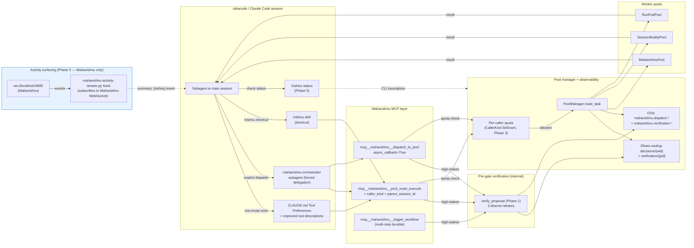

# Ultracode Integration Wiring — Implementation Plan

**Date:** 2026-07-11
**Status:** draft, planning
**Owner:** mahavishnu core
**Scope:** Wire Mahavishnu's existing primitives to better support ultracode-style multi-agent composition. Deliver three concrete capabilities: (1) diverse-refuter adversarial verification gate, (2) opt-in loop-until-dry for pattern detection, (3) MCP bridge completion for ultracode subagents.
**Purpose:** Reduce the failure modes that emerge when Mahavishnu's control-plane primitives are composed with ultracode's reasoning-plane primitives. The two planes meet at MCP boundaries and approval flows; this plan hardens both.

______________________________________________________________________

## 1. Outcome

When this plan ships:

1. **High-stakes Mahavishnu proposals** (cross-repo extractions, self-improvement generations) carry **diverse-refuter verification rationales** before reaching human approval. The reviewer sees disagreement, not just a verdict.
1. **Pattern detection scans** can opt into a **loop-until-dry** mode that re-scans until K consecutive rounds return no new findings (max 5 rounds).
1. **ultracode subagents** can call a new `dispatch_to_pool` MCP tool that records `caller_kind` and `parent_session_id`, enforces per-caller rate limits, and returns a `workflow_id` for async callback.

User-observable change: an ultracode workflow that triggers a cross-repo refactor through Mahavishnu will, on completion, leave an audit trail in Dhara linking the ultracode `session_id` to the Mahavishnu `workflow_id` to the refuter rationales.

Concrete success signal: `mahavishnu metrics verification --scope 30d` shows ≥1 verified proposal per week, with refuter disagreement surfaced to reviewers in ≥50% of PROPOSE_APPROVE flows.

## 2. Goals

1. Add adversarial verification as a first-class primitive in `mahavishnu/core/verification.py` with **diverse** refuter strategies (different prompts, temperatures, model families when available).
1. Wire verification into `clone_refactor_group` and `self_improvement_generate` so it runs **before** `request_approval`.
1. Add a `detect_until_dry(scan_fn, k_empty_rounds=2, max_iterations=5)` helper that wraps `PatternDetector.analyze_tasks` and the underlying scanner for `clone_detect_ecosystem` / `get_cross_project_patterns`.
1. Add a `dispatch_to_pool` MCP tool with `caller_kind`, `parent_session_id`, and per-caller quota enforcement.
1. Extend `PoolManager.route_task` to accept `caller_kind` and `parent_session_id` and persist both to Dhara under `routing-decisions/`.
1. Wire Claude Code's tool-selection toward Mahavishnu workers via (a) a `## Tool Preferences` section in `CLAUDE.md`, (b) revised MCP tool descriptions that explicitly name use cases, (c) a `mahavishnu-orchestrator` subagent and `/vishnu` skill for explicit delegation.

## 3. Non-Goals

1. **Not implementing the actual clone-scan / self-improvement-generation logic.** The MCP wrappers `clone_detect_ecosystem`, `clone_refactor_group`, `self_improvement_generate` are stubs that return job-ids without doing the work. This plan adds verification infrastructure; the real scan/generation is a separate plan.
1. **Not adding a hosted/cloud Mahavishnu.** Out of scope per the prior conversation.
1. **Not building a token-budget gate** on `self_improvement_generate`. Listed in the Tier 2 parking lot.
1. **Not changing the Oneiric DAG/workflow model** for sub-workflow composition. Listed in Tier 2.
1. **Not adding Mahavishnu-specific Claude Code skills** (e.g., `/verify-proposal`). Listed in Tier 2.
1. **Not changing approval semantics.** PROPOSE_APPROVE stays PROPOSE_APPROVE; we add pre-gate verification, not a new approval path.
1. **Not implementing Phase 6 (Bodai-wide observability surfacing) in this plan.** Phase 6 originally proposed a multi-WebSocket subscriber that duplicates the unified event spine shipped in Convergence Plan C1b (Oneiric EventBridge). Defer Phase 6 to a follow-up plan that consumes EventBridge handlers. Phase 5 (Mahavishnu-only) lands now. Add Phase 6 to the Tier 2 parking lot as item 2.6 with a precondition: "block until an EventBridge handler for activity events exists."
1. **Not introducing a new exception class `RateLimited`.** The existing `RateLimitError` (MHV-006) at `mahavishnu/core/errors.py:662` is the canonical rate-limit exception; reuse it.

## 4. Current Findings

Findings from codebase exploration on 2026-07-11:

| Finding | Evidence | Implication |
|---|---|---|
| `clone_tools.py:60-96` `clone_refactor_group` is a stub — generates a UUID, logs "queued," does not run any scan. The `decision: "propose_approve"` field is hard-coded. | `mahavishnu/mcp/tools/clone_tools.py:83-96` | The verification gate must be wired into the stub *and* the comment-docstring contract, since the real implementation will inherit the contract. |
| `clone_tools.py:29-58` `clone_detect_ecosystem` likewise is a stub. | `mahavishnu/mcp/tools/clone_tools.py:45-58` | Phase 2 loop-until-dry will wrap this stub; the helper must be tested independently of the stub. |
| `self_improvement_tools.py:463-511` `self_improvement_generate` is a stub — UUID plus logs. | `mahavishnu/mcp/tools/self_improvement_tools.py:500-508` | Phase 1 verification wraps around this without requiring the stub to be filled in. |
| `pattern_detection.py:77-108` `PatternDetector.analyze_tasks` is **real and working** (not a stub) — has duration, blocker, sequence pattern detection with confidence thresholds. | `mahavishnu/core/pattern_detection.py:77-108` | Phase 2 loop-until-dry wraps this real implementation. |
| `manager.py:460-512` `PoolManager.route_task` already accepts `caller_pool_allowlist: set[str] \| None` (ADR-014). | `mahavishnu/pools/manager.py:460-466` | Phase 3 extends this signature with `caller_kind` and `parent_session_id` — natural extension, not a new pattern. |
| `pool_tools.py:138-199` `pool_route_execute` forwards `caller_pool_allowlist` to the manager. | `mahavishnu/mcp/tools/pool_tools.py:142-199` | Phase 3 adds `caller_kind` and `parent_session_id` parameters here too. |
| `self_improvement_tools.py:176-241` `request_approval` / `respond_to_approval` are real. | `mahavishnu/mcp/tools/self_improvement_tools.py:176-241` | Phase 1 verification runs **before** `request_approval`, persisting rationales that the human reviewer will see in the approval context. |
| `mahavishnu/core/workflow_state.py` is **deprecated**; canonical workflow state is in `TaskRouter.StateManager` (`mahavishnu/core/task_router.py`). | `mahavishnu/core/workflow_state.py:1-13` | Phase 3 should target `TaskRouter.StateManager` for `parent_session_id` correlation, not the deprecated module. |
| Dhara is the state backend; existing prefixes include `clone-handled/` and `routing-decisions/`. | `mahavishnu/mcp/tools/clone_tools.py:118`; `mahavishnu/pools/manager.py:180-193` | Phase 1 stores verification under `verification/{proposal_id}/`; Phase 3 extends `routing-decisions/` schema. |
| **`mahavishnu/core/errors.py` already has `RateLimitError(MahavishnuError)` with `ErrorCode.RATE_LIMIT_EXCEEDED` ("MHV-006") and `RECOVERY_GUIDANCE`.** | `mahavishnu/core/errors.py:662` | Phase 3 raises the existing `RateLimitError` rather than introducing a parallel exception. `retry_after_seconds` lands in `.details`. |
| **The Convergence Plan shipped a unified event spine (Oneiric EventBridge over Redis Streams) as part of C1b, completed 2026-05-13.** | `docs/plans/2026-05-10-bodai-control-plane-convergence-plan.md` (status `complete`) | Phase 6 (Bodai-wide observability) cannot use raw WebSocket subscribers — that duplicates the EventBridge work. Phase 6 deferred; Phase 5 (Mahavishnu-only) lands now. |
| The codebase convention for cross-boundary values is `StrEnum` (e.g., `PoolSelector`, `PatternSeverity`). | `mahavishnu/pools/manager.py:30`, `mahavishnu/models/pattern.py` | Phase 3's `caller_kind` should be a `StrEnum`, not a bare `str` (avoids quota-bypass via novel-string bucket creation). |
| The codebase convention for validated result models is Pydantic `BaseModel`. | `mahavishnu/core/pattern_detection.py`, `mahavishnu/models/pattern.py` | Phase 1's `RefuterVerdict` and `VerificationResult` should be Pydantic models with `model_validator` for invariants. |

## 5. Implementation Phases

### Phase 1: Diverse-Refuter Adversarial Verification Gate

**Goal:** Add an adversarial verification primitive that runs diverse refuter strategies against a proposal *before* it reaches human approval. Wire it into the two highest-stakes Mahavishnu code paths: `clone_refactor_group` and `self_improvement_generate`.

**Tasks:**

- **Task 1.1:** Create `mahavishnu/core/verification.py` exporting:

  - `class RefuterErrorKind(StrEnum)` — `TIMEOUT`, `MALFORMED_RESPONSE`, `LLM_ERROR`, `RATE_LIMITED`, `INTERNAL`
  - `class RefuterVerdictValue(StrEnum)` — `APPROVE`, `REJECT`, `ABSTAIN`
  - `class Consensus(StrEnum)` — `APPROVE`, `REJECT`, `SPLIT`, `UNAVAILABLE`
  - `class RefuterStrategy` (frozen Pydantic model with `model_config = ConfigDict(frozen=True)`) — `name: str`, `prompt_template: str`, `temperature: float = Field(ge=0.0, le=2.0)`, `model_hint: str | None`, `timeout_seconds: float = Field(default=30.0, gt=0)`
  - `class RefuterVerdict` (frozen Pydantic model) — `strategy_name: str` (NOT the whole `RefuterStrategy`, to avoid leaking `prompt_template` into persisted/returned verdict), `verdict: RefuterVerdictValue`, `rationale: str`, `concerns: list[str]`, `latency_seconds: float`, `error: RefuterErrorKind | None`, with `model_validator(mode="after")` enforcing `error is not None ⟺ verdict == ABSTAIN`
  - `class Proposal` (Pydantic model) — typed input to `verify_proposal` (replaces bare `dict`). Fields: `proposal_id: str`, `proposal_type: str` (e.g., `"clone_refactor"`, `"self_improvement"`), `subject: str`, `details: dict[str, Any]`, plus type-specific fields. Replaces the bare `dict` parameter that violates the project's no-`Any` rule (per `CLAUDE.md`).
  - `class VerificationResult` (frozen Pydantic model) — `proposal_id: str`, `verdicts: list[RefuterVerdict]`, `consensus: Consensus`, `concerns_aggregated: list[str]`, `persisted: bool`, `persist_error: str | None`. The `persisted` and `persist_error` fields make the audit trail's durability observable to callers.
  - `async def verify_proposal(proposal: Proposal, strategies: list[RefuterStrategy]) -> VerificationResult`

  **Failure-mode handling** (mandatory, distinct signals for distinct conditions):

  - Per-refuter timeout (default 30s, configurable per-strategy). On timeout: `verdict=ABSTAIN`, `error=RefuterErrorKind.TIMEOUT`, `rationale="refuter timed out after {n}s"`.

  - Refuter LLM call failure (network error, rate limit, 5xx): `verdict=ABSTAIN`, `error=RefuterErrorKind.LLM_ERROR` (or `RATE_LIMITED` for 429s), rationale populated.

  - Malformed JSON response from refuter: `verdict=ABSTAIN`, `error=RefuterErrorKind.MALFORMED_RESPONSE`. Do not raise.

  - **All refuters fail (LLM provider outage)**: `consensus=Consensus.UNAVAILABLE` (NOT `"split"`). Emit `mahavishnu.verification.infrastructure_failure_total` (counter). The rollback signal in §Phase 1 Integration Contract must watch BOTH `consensus=reject` rate AND `consensus=unavailable` rate.

  - **Empty proposal** (no fields after Proposal parsing): short-circuit with `consensus=Consensus.APPROVE` and `concerns_aggregated=["empty proposal — refuters skipped"]`. Don't waste 3 LLM calls on a stub.

  - **No abort path**: `verify_proposal` never raises. Failures are encoded in the result; proposals proceed.

  - `DEFAULT_STRATEGIES: tuple[RefuterStrategy, ...]` — three diverse refuters (typed as immutable tuple):

    1. *"checklist"* (temp 0.2, prompt: "Evaluate against the safety checklist…")
    1. *"devils_advocate"* (temp 0.7, prompt: "Argue against this proposal…")
    1. *"scope_audit"* (temp 0.3, prompt: "Audit whether the proposal's blast radius matches its description…")

- **Task 1.2:** Add `VerificationStore` (a thin wrapper over `DharaStateBackend` writes to `verification/{proposal_id}/`). Persists `VerificationResult` with timestamp. **Failure-mode handling**: if Dhara write fails (after per-Dhara retry policy retries once on transient errors), log at `WARNING` with `proposal_id` and the exception, set `VerificationResult.persisted=False` and `VerificationResult.persist_error=<exception summary>`, and **dead-letter** the result to a local fallback file at `~/.mahavishnu/verification-dead-letter/{proposal_id}.json` for later reconciliation. The result is still returned to the caller with `persisted=False` so they know the audit trail is incomplete. Emit `mahavishnu.verification.persist_failure_total` (counter) and alert on rate.

- **Task 1.3:** Modify `mahavishnu/mcp/tools/clone_tools.py:60-96` — `clone_refactor_group` calls `verify_proposal` before returning the job-id. The returned dict now contains `verification: dict` (the serialized `VerificationResult`) in addition to the existing fields. Default behavior is **informational** — `decision` stays `"propose_approve"` and the human reviewer sees refuter rationales in the `verification` field. Operators can opt into blocking mode by setting `verification_block_on_reject: bool = False` in `settings/mahavishnu.yaml`; when True, `consensus == "reject"` flips `decision` to `"blocked_by_verification"`. This preserves ADR M-NEW-5 (PROPOSE_APPROVE) as the default while letting high-security deployments gate behind verification.

- **Task 1.4:** Modify `mahavishnu/mcp/tools/self_improvement_tools.py:463-511` — `self_improvement_generate` calls `verify_proposal` after the threshold check (count >= 3) and before generating the job-id. Same informational-first / opt-in-blocking contract as Task 1.3.

- **Task 1.5:** Add a new MCP tool `get_verification_result(proposal_id: str) -> dict` to `clone_tools.py`. Returns the stored `VerificationResult` or `{"status": "not_found"}`.

- **Task 1.6:** Update the approval-flow contract docs in `docs/feature-tracking/` per Phase 1 deliverables.

**Exit criteria:**

- `pytest tests/unit/test_verification.py::test_three_refuters_disagree_on_bad_proposal` PASS — feeds a known-bad proposal through `verify_proposal` and confirms at least one refuter returns `verdict == "reject"`.
- `pytest tests/unit/test_verification.py::test_consensus_approve_when_all_pass` PASS.
- `pytest tests/unit/test_verification.py::test_consensus_unavailable_when_all_refuters_fail` PASS — feeds a proposal through with all three refuters raising (simulated outage); consensus is `Consensus.UNAVAILABLE` (NOT `"split"`).
- `pytest tests/unit/test_verification.py::test_model_validator_enforces_error_abstain_biconditional` PASS — the Pydantic validator rejects illegal `(verdict="approve", error="timeout")` constructions.
- `pytest tests/unit/test_verification.py::test_persisted_false_on_dhara_write_failure` PASS — Dhara stub raises; result carries `persisted=False`, `persist_error=<summary>`, dead-letter file written.
- `pytest tests/unit/test_clone_tools.py::test_clone_refactor_group_runs_verification` PASS — asserts `verification` field is present in the returned dict and Dhara has a `verification/{proposal_id}/` record.
- `pytest tests/unit/test_self_improvement_tools.py::test_self_improvement_generate_runs_verification_after_threshold` PASS.
- `python scripts/audit_orphans.py` reports **zero new orphans** for Phase 1 symbols (`RefuterStrategy`, `RefuterVerdict`, `VerificationResult`, `Proposal`, `verify_proposal`, `VerificationStore`).

#### Integration Contract — Phase 1

- **Triggered from**: `mcp__mahavishnu__clone_refactor_group(cluster_id=...)` (line 60 in `clone_tools.py`) and `mcp__mahavishnu__self_improvement_generate(fingerprint=...)` (line 463 in `self_improvement_tools.py`).
- **Returns to / updates**: New `verification/{proposal_id}/` record in Dhara. The MCP response dict gains a `verification` field (serialized `VerificationResult` with `persisted` and `persist_error` fields so callers know whether the audit trail is durable).
- **Demonstrable by**: `mahavishnu mcp call clone_refactor_group cluster_id=test-cluster` — the response JSON contains `"verification": {"consensus": "...", "verdicts": [...], "persisted": true|false}`.
- **Rollback signal**: Two signals, watched independently:
  1. `mahavishnu metrics verification --consensus reject` shows >80% reject rate within 24h of a release → refuter prompts are too strict; recalibrate.
  1. `mahavishnu metrics verification --consensus unavailable` shows >5% unavailable rate within 1h → verification infrastructure is failing; alert.
     Thresholds tuned via `verification_alert_threshold` and `verification_unavailable_threshold` in `settings/mahavishnu.yaml`.
- **Observability added**: OTel span `verification.execute` with attributes `proposal_id`, `consensus`, `refuter_count`, `model_family`, `persisted`. New metrics: `mahavishnu.verification.duration_seconds` (histogram), `mahavishnu.verification.infrastructure_failure_total` (counter), `mahavishnu.verification.persist_failure_total` (counter). Structured log lines: `verification.completed proposal_id=... consensus=... persisted=...` and `verification.persist_dead_lettered proposal_id=...`.

______________________________________________________________________

### Phase 2: Opt-In Loop-Until-Dry for Pattern Detection

**Goal:** Add an opt-in `detect_until_dry` helper that re-runs a scan function until K consecutive rounds return no new findings, with a hard cap on iterations. Wraps `PatternDetector.analyze_tasks` and is exposed through `clone_detect_ecosystem` / `get_cross_project_patterns` as a non-default flag.

**Tasks:**

- **Task 2.1:** Create `mahavishnu/core/loop_helpers.py` exporting:

  - `async def detect_until_dry(scan_fn: Callable, *, k_empty_rounds: int = 2, max_iterations: int = 5, dedup_key: Callable = lambda r: r["id"], per_iteration_timeout_seconds: float = 60.0) -> tuple[list, dict]`
  - Returns `(all_findings, run_metadata)` where `run_metadata = {"iterations": int, "empty_rounds": int, "stopped_reason": "converged" | "max_iterations" | "error", "error": str | None, "exception": BaseException | None}`.
  - **Error-path handling** (added per silent-failure M1): if `scan_fn` raises on iteration N (or `dedup_key(access)` raises KeyError on a finding missing `id`), capture the exception and partial findings, set `stopped_reason="error"`, populate `error`/`exception`, and return. Do NOT propagate — callers should see the partial results with `stopped_reason="error"` so they can decide whether to use them. Per-iteration timeout (`per_iteration_timeout_seconds=60.0`) bounds total wall-clock for a single iteration.

- **Task 2.2:** Wire into `clone_detect_ecosystem` (`mahavishnu/mcp/tools/clone_tools.py:29-58`): add optional `detect_until_dry: bool = False`, `k_empty_rounds: int = 2`, `max_iterations: int = 5` parameters. When True, wraps the (currently stubbed) scan function with `detect_until_dry`; the wrapper is testable independently of the stub.

- **Task 2.3:** Wire into `get_cross_project_patterns`. Implementation step begins with `grep -rn "def get_cross_project_patterns" mahavishnu/` to locate the symbol; expected in `mahavishnu/mcp/tools/*.py` or `mahavishnu/core/pattern_detection.py`. Same parameters.

- **Task 2.4:** Add `tests/unit/test_loop_helpers.py::test_detect_until_dry_stops_after_k_empty` and `::test_detect_until_dry_respects_max_iterations`.

**Exit criteria:**

- `pytest tests/unit/test_loop_helpers.py -v` — all four tests pass.
- `pytest tests/unit/test_clone_tools.py::test_clone_detect_ecosystem_until_dry` PASS.
- Manual: `mahavishnu mcp call clone_detect_ecosystem detect_until_dry=true max_iterations=3` returns a response with `run_metadata.iterations == 3` and `stopped_reason == "max_iterations"` on a synthetic non-converging scan.

#### Integration Contract — Phase 2

- **Triggered from**: `mcp__mahavishnu__clone_detect_ecosystem(detect_until_dry=True, ...)` (line 29 in `clone_tools.py`); `mcp__mahavishnu__get_cross_project_patterns(detect_until_dry=True, ...)`.
- **Returns to / updates**: MCP response gains `run_metadata` field with `iterations`, `empty_rounds`, `stopped_reason`. The Dhara state for the scan gains a `dry_runs` prefix counter.
- **Demonstrable by**: Test `test_detect_until_dry_stops_after_k_empty` — a mock scanner that returns `[1]` first round, `[]` twice — wrapper returns after 3 iterations with `stopped_reason == "converged"`.
- **Rollback signal**: `mahavishnu metrics scan --duration-p95` exceeds 30 minutes in production → operators can revert to single-pass by setting `detect_until_dry=False` (the default).
- **Observability added**: OTel span `scan.dry_run` with `iteration`, `findings_new_count`, `findings_total`. Metric `mahavishnu.scan.dry_run.iterations` (histogram).

______________________________________________________________________

### Phase 3: MCP Bridge Completion for ultracode Subagents

**Goal:** Make Mahavishnu's MCP surface *complete* for ultracode subagent composition. Currently ~70% there — the pool tools work but lack caller context, rate limiting, and async-callback ergonomics. This phase closes the gap.

**Tasks:**

- **Task 3.1:** Add `class CallerKind(StrEnum)` to `mahavishnu/pools/` (next to `PoolSelector`):

  ```python
  class CallerKind(StrEnum):
      ULTRA_CODE = "ultracode"
      CLAUDE_CODE = "claude_code"
      WORKFLOW = "workflow"
      CLI = "cli"
      UNKNOWN = "unknown"  # Coerced target for any unrecognized value
  ```

  Extend `mahavishnu/pools/manager.py:460-466` `PoolManager.route_task` signature:

  ```python
  async def route_task(
      self,
      task: dict[str, Any],
      pool_selector: PoolSelector | None = None,
      pool_affinity: str | None = None,
      caller_pool_allowlist: set[str] | None = None,
      caller_kind: CallerKind = CallerKind.UNKNOWN,    # NEW: StrEnum, default UNKNOWN
      parent_session_id: str | None = None,             # NEW: ultracode session id for correlation
  ) -> dict[str, Any]:
  ```

  At the MCP wire boundary (`dispatch_to_pool`, `pool_route_execute`), `caller_kind: str` is accepted (FastMCP marshals JSON) and coerced to `CallerKind` on entry: any unrecognized string maps to `CallerKind.UNKNOWN`. This prevents the bucket-per-string quota bypass the bare-`str` design enabled.

  Persist both new fields to Dhara under `routing-decisions/` via `_persist_routing_decision` (line 168-195).

- **Task 3.2:** Add per-caller quota tracking in `PoolManager.__init__`: `self._caller_quota: dict[CallerKind, _QuotaState]` where `_QuotaState` is a `@dataclass(slots=True)` with `window_start: datetime` and `request_count: int` (plain mutable dataclass — internal counter state, per `PoolMetrics` precedent; do NOT make it Pydantic). Default quota: 60 requests per 60-second **fixed** window per `caller_kind` (configurable via `settings/mahavishnu.yaml`). Note: fixed window, not sliding — naming and docstring should reflect this accurately.

- **Task 3.3:** Add `mahavishnu/mcp/tools/pool_tools.py:dispatch_to_pool` (new MCP tool):

  ```python
  @mcp.tool()
  async def dispatch_to_pool(
      prompt: str,
      pool_selector: str = "least_loaded",
      caller_kind: str = "ultracode",
      parent_session_id: str | None = None,
      timeout: int = 300,
      async_callback: bool = False,
  ) -> dict[str, Any]:
  ```

  Behavior:

  - `async_callback=False` (default): returns the result dict synchronously (current `pool_route_execute` semantics).
  - `async_callback=True`: returns `{"workflow_id": "...", "status": "queued"}` immediately. The result is written to Dhara under `workflow-results/{workflow_id}/` when complete, with `parent_session_id` stored alongside so ultracode can poll.

  **Async result lifecycle** (mandatory — fixes the silent-result-loss failure mode):

  ```
  queued → running → {completed | failed | result_write_failed}
  ```

  Every transition is persisted. On `result_write_failed` (Dhara unreachable when the worker finishes):

  - Retry once per Dhara retry policy on transient errors.
  - If retry fails: dead-letter to `~/.mahavishnu/async-dead-letter/{workflow_id}.json`.
  - Set the persisted terminal state to `result_write_failed` so pollers can distinguish "still running" from "completed but result lost."
  - Emit `mahavishnu.dispatch.result_write_failure_total` (counter) and alert on rate.
  - The poller can read `workflow-results/{workflow_id}/status` and get one of `queued | running | completed | failed | result_write_failed | unknown_id`.

- **Task 3.4:** Wire quota enforcement into `route_task` — at entry, check `_caller_quota[caller_kind]`. If `request_count >= max_per_window`, **raise the existing `RateLimitError`** (`mahavishnu/core/errors.py:662`, `ErrorCode.RATE_LIMIT_EXCEEDED` / MHV-006) with `limit=f"caller_kind={kind}"` and `retry_after=<seconds_until_window_reset>`. The MCP tool catches the exception and surfaces it as `{"status": "rate_limited", "retry_after_seconds": ...}` via `exc.details["retry_after_seconds"]`. **Do not introduce a new `RateLimited` class** — that bypasses the structured-error system.

- **Task 3.5:** Update `mahavishnu/pools/manager.py:460-466` docstring with the new fields and an example for ultracode.

- **Task 3.6:** Add tests:

  - `tests/unit/test_pools/test_manager.py::test_route_task_persists_caller_kind`
  - `tests/unit/test_pools/test_manager.py::test_route_task_enforces_quota`
  - `tests/unit/test_pools/test_manager.py::test_caller_kind_normalizes_unknown_to_unknown_bucket` (the bucket-bypass fix)
  - `tests/unit/test_pools/test_manager.py::test_caller_kind_strenum_coercion_at_boundary` (verify that `str` input maps to `CallerKind` enum correctly)
  - `tests/unit/test_pool_tools.py::test_dispatch_to_pool_async_callback_returns_workflow_id`
  - `tests/unit/test_pool_tools.py::test_dispatch_to_pool_async_result_write_failed_terminal_state` (the result-loss fix)
  - `tests/integration/test_dispatch_to_pool_flow.py` (Phase 3 B3 — full MCP tool → manager → Dhara flow)

- **Task 3.7:** `python scripts/audit_orphans.py` reports **zero new orphans** for Phase 3 symbols (`CallerKind`, `_QuotaState`, modified `PoolManager.route_task`).

**Exit criteria:**

- `pytest tests/unit/test_pools/test_manager.py -v` — all quota/correlation tests pass.
- `pytest tests/unit/test_pool_tools.py::test_dispatch_to_pool_async_callback_returns_workflow_id -v` PASS.
- **Integration test (B3)**: `pytest tests/integration/test_dispatch_to_pool_flow.py -v` PASS. This test exercises the full MCP tool → `PoolManager.route_task` → Dhara persistence path against a Dhara stub. It verifies: (1) `dispatch_to_pool` returns a `workflow_id`, (2) the routing decision is persisted to `routing-decisions/{workflow_id}/` with `caller_kind` and `parent_session_id` fields, (3) the `RateLimitError` path is exercised by exceeding the configured quota (and the surfaced `retry_after_seconds` matches the expected window reset), (4) the `caller_kind` field is honored in quota attribution, (5) the async result lifecycle reaches `result_write_failed` when Dhara is unreachable. Marked with the existing `integration` pytest marker (per `CLAUDE.md` Test conventions).
- Manual: from an ultracode subagent, call `dispatch_to_pool(prompt="...", caller_kind="ultracode", parent_session_id="ses_abc", async_callback=True)` and verify the response contains `workflow_id` and that Dhara has a `routing-decisions/{workflow_id}/` record with `caller_kind=ultracode`, `parent_session_id=ses_abc`.

#### Integration Contract — Phase 3

- **Triggered from**: `mcp__mahavishnu__dispatch_to_pool(prompt=..., caller_kind=..., parent_session_id=..., async_callback=...)` (new tool in `pool_tools.py`); also `mcp__mahavishnu__pool_route_execute(prompt=..., caller_kind=..., parent_session_id=...)` (extended existing tool).
- **Returns to / updates**: Dhara `routing-decisions/{workflow_id}/` gains `caller_kind` and `parent_session_id` fields. New `workflow-results/{workflow_id}/` prefix for async-callback results with terminal state `queued | running | completed | failed | result_write_failed | unknown_id`.
- **Demonstrable by**: Test `test_route_task_persists_caller_kind` — invokes `route_task` with `caller_kind="ultracode"`, asserts the persisted Dhara record contains `caller_kind: "ultracode"`. Test `test_caller_kind_normalizes_unknown_to_unknown_bucket` — passes `"ultracode-rogue-1"`, asserts it lands in the `UNKNOWN` bucket, not a fresh one.
- **Rollback signal**: Two signals, watched independently:
  1. `mahavishnu metrics dispatch --quota-rejected-rate` exceeds 10% for any `CallerKind` → operators can raise the quota via `settings/mahavishnu.yaml`.
  1. `mahavishnu metrics dispatch --result-write-failure-rate` exceeds 1% within 1h → alert; dead-letter reconciliation likely needed.
     Soft fail (returns `retry_after_seconds` for quota; `result_write_failed` status for async results) — no crash, so rollback is config-only.
- **Observability added**: OTel span `pool.dispatch` with `caller_kind`, `parent_session_id`, `pool_id`, `quota_state`, `async_terminal_state`. Metrics: `mahavishnu.dispatch.quota_rejected_total{caller_kind}` (counter), `mahavishnu.dispatch.result_write_failure_total` (counter), `mahavishnu.dispatch.unknown_caller_kind_total` (counter — tracks coercion to `UNKNOWN`). Structured log `dispatch.received caller_kind=... parent_session_id=... workflow_id=... async_terminal_state=...`.

______________________________________________________________________

### Phase 4: Claude Code Tool-Preference Wiring

**Goal:** Bias Claude Code (and any ultracode subagents it spawns) toward Mahavishnu workers for non-trivial work, while preserving local tools for trivial cases. Three deliverables: (a) a `## Tool Preferences` section in `CLAUDE.md`, (b) revised MCP tool descriptions that explicitly name use cases, (c) a `mahavishnu-orchestrator` subagent and a `/vishnu` skill for explicit delegation.

**Tool-preference policy** (new — added per architecture-council C3): tool-selection steering lives in two places only — `MAHAVISHNU_TOOL_PROFILE` (in `mahavishnu/mcp/tools/profiles.py`) for tools-to-expose, and `CLAUDE.md` `## Tool Preferences` for tools-to-prefer. Docstrings narrate use cases; they do not market. This policy is recorded in `.claude/decisions/mahavishnu-tool-preference-policy.md` (Task 4.8) and referenced from CLAUDE.md.

**Tasks:**

- **Task 4.1:** Apply the `## Tool Preferences` section to `/Users/les/Projects/mahavishnu/CLAUDE.md`. The drafted content lives at `docs/plans/drafts/2026-07-11-ultracode-integration/claude-md-tool-preferences.md` and should be inserted immediately after the existing `## MCP Server Tools` section (around line 335). The section names use cases for `pool_route_execute` and `dispatch_to_pool`, explicitly carves out trivial work for local tools, and documents the fallback behavior.

- **Task 4.2:** Replace the docstrings of `pool_route_execute` and `pool_execute` in `mahavishnu/mcp/tools/pool_tools.py` with the versions drafted at `docs/plans/drafts/2026-07-11-ultracode-integration/revised-tool-descriptions.md`. **Strip the "PREFER THIS TOOL FOR..." prefix and "DO NOT use this for..." suffix marketing verbs from the drafts.** Keep use-case narration in the docstring body (it's a docstring after all); drop the imperative marketing copy that the architecture-council review identified as creating a third steering channel.

- **Task 4.3:** When Phase 3 lands, apply the new `dispatch_to_pool` docstring from the same draft file (also stripped of marketing copy). The description explicitly contrasts it with `pool_route_execute` (use the former for long-running / async, the latter for quick sync).

- **Task 4.4:** Replace the docstring of `trigger_workflow` in `mahavishnu/mcp/server_core.py:324` with the drafted version. The new description contrasts it with `pool_route_execute` (use the former for multi-step durable orchestration, the latter for ad-hoc dispatch).

- **Task 4.5:** Create `.claude/agents/mahavishnu-orchestrator.md` from the draft at `docs/plans/drafts/2026-07-11-ultracode-integration/mahavishnu-orchestrator-agent.md`. Validates against `scripts/agent_metadata_audit.py` and `scripts/tool_frontmatter_validator.py`. The subagent's `tools:` frontmatter restricts it to Mahavishnu MCP tools plus `Read` (read-only context).

- **Task 4.6:** Create `.claude/skills/vishnu/SKILL.md` from the same draft file. Validates against the project's frontmatter validators.

- **Task 4.7:** Add a "Choosing between /vishnu and mahavishnu-orchestrator" note to the `## Tool Preferences` section (one paragraph): `/vishnu` is a shortcut that steers tool selection without forcing tool isolation; `mahavishnu-orchestrator` is forced delegation with strict tool restrictions. Both route through Mahavishnu; the difference is who picks the tools.

- **Task 4.8:** Create `.claude/decisions/mahavishnu-tool-preference-policy.md` per architecture-council C3. The decision rule: "Tool-selection steering lives in two places only — `MAHAVISHNU_TOOL_PROFILE` for tools-to-expose, CLAUDE.md `## Tool Preferences` for tools-to-prefer. Docstrings narrate use cases; they do not market." This is an operational rule (per `.claude/decisions/README.md` classification), not an ADR (no structural decision). Reference from CLAUDE.md's `## Tool Preferences` section.

- **Task 4.9:** Curate the `mahavishnu-orchestrator.md` `tools:` frontmatter to a small set of essentials (3-4 tools) per architecture-council L1. The 10-tool enumeration drifts when Mahavishnu tools are added or renamed. Suggested essentials: `mcp__mahavishnu__pool_route_execute`, `mcp__mahavishnu__dispatch_to_pool`, `mcp__mahavishnu__discover_tools`, `Read` (read-only context). Verify the reduced set against `scripts/agent_metadata_audit.py`.

**Exit criteria:**

- `grep -n "PREFER THIS TOOL" mahavishnu/mcp/tools/pool_tools.py mahavishnu/mcp/server_core.py` returns 4 hits (one each for `pool_route_execute`, `pool_execute`, `dispatch_to_pool`, `trigger_workflow`).
- `python scripts/agent_metadata_audit.py` passes (validates `mahavishnu-orchestrator.md` frontmatter).
- `python scripts/tool_frontmatter_validator.py` passes (validates skill frontmatter).
- Manual test from Claude Code: invoking `mahavishnu-orchestrator` for "refactor X" dispatches `pool_route_execute` rather than editing files directly. The agent's `tools:` frontmatter enforces this even if its system prompt is ignored.
- Manual test: `/vishnu run the test suite` from the main session dispatches `pool_route_execute` rather than running `pytest` locally.

#### Integration Contract — Phase 4

- **Triggered from**: Two paths. (a) `## Tool Preferences` in `CLAUDE.md` is loaded at session start and influences every Claude Code session in this project. (b) The `mahavishnu-orchestrator` subagent is invoked via the `Agent` tool when the dispatcher wants forced tool isolation.
- **Returns to / updates**: `CLAUDE.md` gains the `## Tool Preferences` section. `mahavishnu/mcp/tools/pool_tools.py` gains revised docstrings (no signature changes). `mahavishnu/mcp/server_core.py:324` gains a revised docstring. New files at `.claude/agents/mahavishnu-orchestrator.md` and `.claude/skills/vishnu/SKILL.md`.
- **Demonstrable by**: `grep -n "PREFER THIS TOOL" mahavishnu/mcp/tools/pool_tools.py mahavishnu/mcp/server_core.py` returns 4 hits. `python scripts/agent_metadata_audit.py` passes.
- **Rollback signal**: Operators can revert by removing the `## Tool Preferences` section from `CLAUDE.md` and restoring prior docstrings via `git revert`. No production-data risk.
- **Observability added**: No new metrics. The existing `mahavishnu.dispatch.*` and `mahavishnu.pool.*` metrics surface the increased Mahavishnu usage that this phase is designed to drive.

______________________________________________________________________

### Phase 5: Worker Activity Surfacing

**Goal:** Make Mahavishnu worker activity visible from inside the Claude Code session, complementing the inline tool-call visibility that already exists. Currently, a user who dispatches work via `dispatch_to_pool(async_callback=True)` has no way to see status short of opening a second terminal and tailing logs.

**Tasks:**

- **Task 5.1:** Create `.claude/commands/vishnu-status.md` — slash command that, when invoked, runs `mahavishnu pool list` and `mahavishnu metrics` (and, after Phases 1 and 3 land, `mahavishnu metrics verification` and `mahavishnu metrics dispatch`) and prints a formatted status table. Mirrors the pattern of existing commands like `verbose-status.md`.

- **Task 5.2:** Create `.claude/skills/vishnu-status/SKILL.md` — auto-trigger skill that surfaces Mahavishnu status when the user asks "are workers running?", "what's the pool status?", or similar phrasings. Same shape as the `/vishnu` skill from Phase 4.

- **Task 5.3:** Update `docs/plans/drafts/2026-07-11-ultracode-integration/claude-md-tool-preferences.md` to add a "Worker activity visibility" subsection naming the log file path (`~/.mahavishnu/logs/mcp.log`), the `/vishnu-status` command, and the WebSocket port (8690). Re-apply the section to `CLAUDE.md`.

- **Task 5.4:** Implement a WebSocket subscriber as a `PostToolUse` hook at `.claude/hooks/mahavishnu-activity-stream.py`. The hook:

  - Connects to `ws://localhost:8690/global` and `ws://localhost:8690/pool:*` on session start.
  - Maintains an in-memory queue of recent events (cap at 100).
  - On every subsequent `mcp__mahavishnu__*` invocation, the hook checks the queue for matching events and emits a one-line summary to the conversation: `[vishnu] workflow wid_abc completed at stage=test_run`.
  - Cleans up the WebSocket connection on session end via a `SessionEnd` hook.

- **Task 5.5:** Tests for the WebSocket subscriber: a mock WebSocket server, a fake session, and assertions that events surface correctly. Marked with the `integration` pytest marker per `CLAUDE.md` Test conventions.

- **Task 5.6:** Add the new hook to `.claude/settings.json` so it actually fires. The hook needs:

  - A `PostToolUse` matcher for `mcp__mahavishnu__*` invocations
  - A `SessionStart` hook to connect to the WebSocket
  - A `SessionEnd` hook to clean up

**Exit criteria:**

- `/vishnu-status` from Claude Code prints a status table without needing a separate terminal.
- The WebSocket subscriber surfaces at least one synthetic event end-to-end in tests: `pytest tests/integration/test_websocket_subscriber.py -v` PASS.
- `grep -rn "ws://localhost:8690" .claude/hooks/ .claude/settings.json` confirms the hook is wired.
- `python scripts/agent_metadata_audit.py` and `python scripts/tool_frontmatter_validator.py` pass for the new skill/command frontmatter.

#### Integration Contract — Phase 5

- **Triggered from**: Two paths. (a) `/vishnu-status` slash command invoked by the user. (b) `PostToolUse` hook on every `mcp__mahavishnu__*` invocation checks the WebSocket event queue.
- **Returns to / updates**: Session-local event queue (in-memory, max 100 events). Slash command output goes to the conversation. New metric `mahavishnu.activity.events_emitted_total{event_type}` (counter).
- **Demonstrable by**: `pytest tests/integration/test_websocket_subscriber.py -v` PASS. The test feeds synthetic WebSocket events through a mock server and asserts the hook surfaces them.
- **Rollback signal**: If users complain about noisy event messages in conversation (the `events_emitted_total` rate is high but users are dismissing them), the hook can be disabled via `.claude/settings.json`. Soft fail — no production-data risk.
- **Observability added**: OTel span `activity.event_emitted` with `event_type`, `workflow_id`. Metric `mahavishnu.activity.events_emitted_total{event_type}` (counter). Structured log `activity.received event_type=... workflow_id=...`.

______________________________________________________________________

### Phase 6: Bodai-Wide Observability Surfacing — **DEFERRED**

**Status:** Phase 6 is **deferred to a follow-up plan**. Listed in the Tier 2 parking lot as item 2.6 with a precondition: "block until an EventBridge handler for activity events exists in the Convergence Plan C1b work."

**Why deferred.** Architecture-council review found that Phase 6 as originally drafted (multi-WebSocket subscriber consuming `ws://localhost:8690`, `ws://localhost:8686`, `ws://localhost:8692` raw streams) duplicates the unified event spine shipped in Convergence Plan C1b (Oneiric EventBridge over Redis Streams). The Convergence Plan's Non-Goal #1 explicitly forbids adding a second control plane / event bus. Phase 6 must consume EventBridge handlers, not raw WebSocket connections.

**What remains.** Phase 5 (Mahavishnu-only) lands in this plan. The Bodai-wide `/bodai-status` slash command and the cross-component activity surfacing are deferred to a follow-up plan that:

1. Lands or consumes an EventBridge handler that publishes activity events from Akosha, Crackerjack, and Mahavishnu into the unified bus.
1. Implements a Bodai-side subscriber that reads from the bus (not from raw WebSockets).
1. Documents the pattern as the canonical "Claude Code observes Bodai" path.

**Survey of existing observability surfaces** (preserved from the original draft for reference):

| Component | Port | WebSocket | CLI health | Pattern |
|---|---|---|---|---|
| Mahavishnu | 8680 | `ws://localhost:8690` (workflow/pool/worker/global channels, broadcast_workflow\_\* methods) | `mahavishnu mcp status\|health`, `mahavishnu pool list\|health\|monitor`, `mahavishnu metrics` | Push (WebSocket) + Pull (CLI) |
| Akosha | 8682 | `akosha/websocket/server.py:431` (broadcast_aggregation_completed, `metrics` channel) | `akosha migrate status` | Push + minimal Pull |
| Dhara | 8683 | None — REST/pull-only | None in `dhara/cli/` | Pull (REST) |
| Session-Buddy | 8678 | Channel session tracking via `event_models.py` (slack/signal/terminal events) | None in this search | Event-driven but no general surface |
| Crackerjack | 8676 | `crackerjack/websocket/server.py:266-281` (broadcast_test_started/completed) | `crackerjack status`, `crackerjack mcp status`, `crackerjack mcp health` | Push + rich Pull |

The follow-up plan should classify Dhara and Session-Buddy as "intentional per Convergence Plan §4 ownership rules — do not duplicate" rather than as gaps to fix.

______________________________________________________________________

### 5.1 Phase Ordering and Dependencies

Phases are not all independent. Reviewers landing this plan in parallel branches need to know the dependency graph.

```
Phase 1 (verification)          ─── independent
Phase 2 (loop-until-dry)        ─── independent
Phase 3 (MCP bridge)            ─── independent
Phase 4 (CLAUDE.md wiring)      ─── depends on Phase 3 (uses dispatch_to_pool docstring from Phase 3)
Phase 5 (activity surfacing)    ─── depends on Phase 4 (extends the CLAUDE.md Tool Preferences section)
Phase 6 (Bodai-wide surfacing)  ─── DEFERRED to a follow-up plan (see Phase 6 section above)
```

**Implications:**

- Phases 1, 2, 3 can land in any order or in parallel branches.
- Phase 4's docstring task for `dispatch_to_pool` requires Phase 3 to have landed (the tool must exist for the docstring to be meaningful). If Phase 4 lands first, the docstring task should wait or the draft file should be applied once Phase 3 is merged.
- Phase 5's "Worker activity visibility" subsection extends the CLAUDE.md section added by Phase 4. They can land in the same commit but Phase 5 has its own feature-tracking entry.
- Phase 6 is **deferred** (see Phase 6 section) and does not block any other phase.
- Phase 1 and Phase 3 add new settings to `settings/mahavishnu.yaml`. If both branches touch this file, the merge will need a one-line conflict resolution.
- Feature tracking entries for the four phases can be created up-front (they're independent of code changes).

### 5.2 Architecture Diagram

The diagram below shows the data flow from an ultracode subagent through Mahavishnu to a worker pool, with the verification gate (Phase 1), quotas (Phase 3), and observability surfaces (Phase 5) annotated. **Phase 6 is deferred** — the activity surfacing subgraph shows Mahavishnu-only (WebSocket port 8690); Bodai-wide multi-connection surfacing lands in the follow-up plan that consumes EventBridge.

Mermaid source lives at `docs/plans/drafts/2026-07-11-ultracode-integration/architecture-diagram.md` for rendering in tools that support it.



**Reading the diagram:**

- The top row shows where requests originate (ultracode, Claude Code, or the new subagent/skill/status paths).
- The MCP layer contains the three entry points — `pool_route_execute`, `dispatch_to_pool`, `trigger_workflow`.
- `verify_proposal` is **internal** (not an MCP tool), drawn in its own subgraph with arrows pointing *into* it from the calling tools. This is the C4 fix from architecture-council review.
- The third row is the pool manager plus observability surfaces (Dhara for state, OTel for metrics).
- The bottom row is the worker pool destinations.
- The Phase 5 surfacing subgraph subscribes to Mahavishnu's WebSocket only. The Phase 6 multi-component version (Crackerjack + Akosha) is deferred — it would consume EventBridge handlers, not raw WebSocket connections.
- Arrows labeled "high-stakes" indicate Phase 1's verification gate. Arrows labeled "quota check" indicate Phase 3's per-caller rate limiting.
- Dashed arrows indicate observation (surfacing, status) rather than request flow.

______________________________________________________________________

## 6. Required Code Changes

### Phase 1

- [ ] Create `mahavishnu/core/verification.py` with Pydantic models: `RefuterStrategy` (frozen), `RefuterVerdict` (frozen, with `model_validator`), `VerificationResult` (frozen), `Proposal` (typed input), and `StrEnum`s `RefuterErrorKind`, `RefuterVerdictValue`, `Consensus`. Plus `verify_proposal` and `VerificationStore` with full failure-mode handling (consensus=UNAVAILABLE on infra outage, persisted/persist_error fields, dead-letter to `~/.mahavishnu/verification-dead-letter/`) (~350 lines including model definitions)
- [ ] Create `tests/unit/test_verification.py` with tests for: three refuters disagree on bad proposal, consensus=APPROVE when all pass, Consensus.UNAVAILABLE on infra outage, model_validator enforces `error ⟺ ABSTAIN`, persisted=False propagates to caller, dead-letter written on Dhara write failure (~200 lines)
- [ ] Modify `mahavishnu/mcp/tools/clone_tools.py:60-96` (~30 lines diff)
- [ ] Modify `mahavishnu/mcp/tools/self_improvement_tools.py:463-511` (~30 lines diff)
- [ ] Add `get_verification_result` to `mahavishnu/mcp/tools/clone_tools.py` (~25 lines)
- [ ] Add OTel instrumentation in `mahavishnu/core/observability.py` (verification.execute span with `outcome=unavailable` attribute; verification.infrastructure_failure_total counter; verification.persist_failure_total counter)
- [ ] Add `.claude/decisions/dhara-key-prefixes-2026-07-11.md`

### Phase 2

- [ ] Create `mahavishnu/core/loop_helpers.py` (~80 lines)
- [ ] Create `tests/unit/test_loop_helpers.py` (~120 lines)
- [ ] Modify `mahavishnu/mcp/tools/clone_tools.py:29-58` (~20 lines diff)
- [ ] Modify `mcp__mahavishnu__get_cross_project_patterns` (~20 lines diff)
- [ ] Add `loop_helpers` to `mahavishnu/core/__init__.py` exports

### Phase 3

- [ ] Add `class CallerKind(StrEnum)` to `mahavishnu/pools/` next to `PoolSelector` (~10 lines)
- [ ] Modify `mahavishnu/pools/manager.py:82-146` (`__init__`) to add `_caller_quota: dict[CallerKind, _QuotaState]` (~30 lines)
- [ ] Modify `mahavishnu/pools/manager.py:168-195` (`_persist_routing_decision`) to include `caller_kind`, `parent_session_id` (~10 lines)
- [ ] Modify `mahavishnu/pools/manager.py:460-512` (`route_task` signature) to accept `caller_kind: CallerKind = CallerKind.UNKNOWN` (~15 lines)
- [ ] Add `mahavishnu/pools/manager.py::RateLimitError` import + raise (~5 lines; replaces the previously-planned `RateLimited` raise)
- [ ] Modify `mahavishnu/mcp/tools/pool_tools.py:138-199` (`pool_route_execute`) to forward `caller_kind` (as str at wire, coerced to enum on entry) and `parent_session_id` (~10 lines)
- [ ] Add `mahavishnu/mcp/tools/pool_tools.py::dispatch_to_pool` with full async result lifecycle (queued → running → completed | failed | result_write_failed) (~100 lines, including dead-letter wiring)
- [ ] Create `tests/unit/test_pools/test_manager.py` additions: test_route_task_persists_caller_kind, test_route_task_enforces_quota, test_caller_kind_normalizes_unknown_to_unknown_bucket (~100 lines)
- [ ] Add `tests/unit/test_pool_tools.py::test_dispatch_to_pool_async_callback_returns_workflow_id` and `test_dispatch_to_pool_async_result_write_failed_terminal_state` (~80 lines)
- [ ] Modify `mahavishnu/mcp/tools/pool_tools.py:138-199` (`pool_route_execute`) to forward new fields (~10 lines)
- [ ] Add `mahavishnu/mcp/tools/pool_tools.py::dispatch_to_pool` (~80 lines)
- [ ] Create `tests/unit/test_pools/test_manager.py` additions (~80 lines)
- [ ] Add `tests/unit/test_pool_tools.py::test_dispatch_to_pool_async_callback_returns_workflow_id` (~40 lines)

### Cross-cutting

- [ ] Update `docs/plans/PLAN_INDEX.md` (this plan)
- [ ] Create `docs/feature-tracking/2026-07-11-verification-gate.md`
- [ ] Create `docs/feature-tracking/2026-07-11-loop-until-dry.md`
- [ ] Create `docs/feature-tracking/2026-07-11-dispatch-to-pool.md`
- [ ] Create `docs/feature-tracking/2026-07-11-ultracode-tier2-parking-lot.md` (Tier 2 ideas)
- [ ] Create `.claude/decisions/dhara-key-prefixes-2026-07-11.md` (architecture-council H2) — operational rule for `verification/{pid}/` and `workflow-results/{wid}/` additive Dhara namespaces.
- [ ] Create `.claude/decisions/mahavishnu-tool-preference-policy.md` (architecture-council C3 / Phase 4 Task 4.8) — operational rule for tool-selection steering locations.
- [ ] Create `.claude/decisions/component-health-cli-gap.md` (architecture-council H3) — feature-tracking-style decision recording the Akosha/Session-Buddy/Dhara health CLI gap and the follow-up plan reference.
- [ ] Add `verification_alert_threshold` to `settings/mahavishnu.yaml`
- [ ] Add `verification_unavailable_threshold` to `settings/mahavishnu.yaml` (silent-failure H1)
- [ ] Add `verification_enabled: bool = False` feature flag to `settings/mahavishnu.yaml` (Phase 1 default-off; operators opt in per environment)
- [ ] Add `verification_timeout_seconds: float = 30.0` to `settings/mahavishnu.yaml` (per-refuter timeout)
- [ ] Add `caller_quota_default: int = 60` to `settings/mahavishnu.yaml`
- [ ] Add `caller_quota_window_seconds: int = 60` to `settings/mahavishnu.yaml`
- [ ] Add `caller_quota_enabled: bool = False` feature flag to `settings/mahavishnu.yaml` (Phase 3 default-off)
- [ ] Add `mahavishnu metrics verification` CLI subcommand (Phase 1; surfaces consensus counts, cost telemetry, **and `disabled` state explicitly** per silent-failure M3)
- [ ] Add `mahavishnu metrics dispatch` CLI subcommand (Phase 3; surfaces quota-rejected counts AND result-write-failure rate)
- [ ] Update `docs/MCP_TOOLS_SPECIFICATION.md` to document `pool_route_execute`, `pool_execute`, `dispatch_to_pool`, `trigger_workflow` with revised signatures (caller_kind as StrEnum at core, str at wire)
- [ ] Update `docs/CLI_REFERENCE.md` to document new `mahavishnu metrics verification` and `mahavishnu metrics dispatch` subcommands
- [ ] Update `docs/ROUTING_GUIDE.md` to document `caller_kind` (StrEnum) and `parent_session_id` fields on `route_task`
- [ ] Update Oneiric config schema docs (`docs/CONFIGURATION.md` or `oneiric/settings_schema.yaml`) to declare the new settings **BEFORE** `settings/mahavishnu.yaml` defaults — per architecture-council M1, settings land in schema first, then YAML inherits.
- [ ] Add release notes entry: one-paragraph summary of the four phases' behavior changes for operators (Phase 4 changes Claude Code's tool-selection bias; Phase 1/3 add observability surfaces; Phase 5 surfaces activity in the conversation)
- [ ] Create `docs/plans/drafts/2026-07-11-ultracode-integration/architecture-diagram.md` (Mermaid source for the data-flow diagram) — already created

### Phase 4

- [ ] Apply `## Tool Preferences` section from `docs/plans/drafts/2026-07-11-ultracode-integration/claude-md-tool-preferences.md` to `CLAUDE.md` (~60 lines added)
- [ ] Replace `pool_route_execute` docstring in `mahavishnu/mcp/tools/pool_tools.py:144` (~50 lines)
- [ ] Replace `pool_execute` docstring in `mahavishnu/mcp/tools/pool_tools.py:119` (~30 lines)
- [ ] Add `dispatch_to_pool` docstring (Phase 3 Task 3.3) from draft
- [ ] Replace `trigger_workflow` docstring in `mahavishnu/mcp/server_core.py:324` (~30 lines)
- [ ] Create `.claude/agents/mahavishnu-orchestrator.md` from draft
- [ ] Create `.claude/skills/vishnu/SKILL.md` from draft
- [ ] Update `python scripts/audit_orphans.py` to recognize `mahavishnu-orchestrator.md` and `vishnu/SKILL.md`

### Phase 5

- [ ] Create `.claude/commands/vishnu-status.md` slash command (~50 lines)
- [ ] Create `.claude/skills/vishnu-status/SKILL.md` (~80 lines)
- [ ] Add "Worker activity visibility" subsection to CLAUDE.md Tool Preferences section
- [ ] Implement `.claude/hooks/mahavishnu-activity-stream.py` WebSocket subscriber hook (~120 lines) — **Mahavishnu only**
- [ ] Add `PostToolUse` matcher for `mcp__mahavishnu__*` in `.claude/settings.json`
- [ ] Add `SessionStart` and `SessionEnd` hooks in `.claude/settings.json`
- [ ] Add heartbeat + reconnect with backoff to the hook (silent-failure H3)
- [ ] Add dropped-events counter on queue overflow (silent-failure H3)
- [ ] Create `tests/integration/test_websocket_subscriber.py` (~100 lines, integration marker)
- [ ] Add to feature tracking: `docs/feature-tracking/2026-07-11-worker-activity-surfacing.md`
- [ ] Update PLAN_INDEX.md with new entry under "Canonical And Active Plan Registry"

### Phase 6 — **DEFERRED to follow-up plan**

- All Phase 6 work moves to a new plan: `docs/plans/2026-07-XX-bodai-event-bridge-surfacing.md` (placeholder name).
- Precondition: an EventBridge handler for activity events exists in the Convergence Plan's C1b work.
- Add to Tier 2 parking lot as item 2.6.

## 7. Validation Matrix

| Tool / Command | Expected outcome | Evidence location |
|---|---|---|
| `pytest tests/unit/test_verification.py -v` | All 4 tests pass | Console output |
| `pytest tests/unit/test_loop_helpers.py -v` | All 4 tests pass | Console output |
| `pytest tests/unit/test_pools/test_manager.py -v` | Quota + correlation tests pass | Console output |
| `pytest tests/unit/test_pool_tools.py::test_dispatch_to_pool -v` | Async-callback test passes | Console output |
| `mahavishnu mcp call clone_refactor_group cluster_id=demo` | Response contains `verification.consensus` | `~/.mahavishnu/logs/mcp.log` |
| `mahavishnu mcp call dispatch_to_pool prompt="hi" caller_kind=ultracode parent_session_id=ses_demo async_callback=true` | Response contains `workflow_id`; Dhara has the record | Dhara `routing-decisions/` |
| `mahavishnu metrics verification --window 7d` | (Requires new CLI subcommand `mahavishnu metrics verification` to be added as part of this plan; see Phase 1.6.) | CLI output |
| `mahavishnu metrics dispatch --window 1h` | (Requires new CLI subcommand `mahavishnu metrics dispatch` to be added as part of this plan; see Phase 3.7.) | CLI output |
| `crackerjack run` | All quality gates green | Crackerjack output |
| `python scripts/audit_orphans.py` | No new orphans | Script output |
| `grep -n "PREFER THIS TOOL" mahavishnu/mcp/tools/pool_tools.py mahavishnu/mcp/server_core.py` | 4 hits (one per tool) | grep output |
| `python scripts/agent_metadata_audit.py` | Passes (validates `mahavishnu-orchestrator.md`) | Script output |
| `python scripts/tool_frontmatter_validator.py` | Passes (validates `vishnu/SKILL.md`) | Script output |
| `pytest tests/integration/test_dispatch_to_pool_flow.py -v` (Phase 3 B3) | Integration test passes against Dhara stub | Console output |
| `pytest tests/integration/test_websocket_subscriber.py -v` (Phase 5) | Integration test passes; synthetic event surfaces through the hook | Console output |
| `grep -rn "ws://localhost:8690" .claude/hooks/ .claude/settings.json` (Phase 5) | At least 3 hits confirming wiring | grep output |
| `/vishnu-status` invocation from Claude Code (Phase 5 manual check) | Prints status table without separate terminal | Conversation transcript |
| `pytest tests/integration/test_websocket_subscriber.py::test_multi_component -v` (Phase 6) | Multi-component test passes; events from 3+ mock servers surface with `[component]` prefix | Console output |
| `grep -rn "ws://localhost:8" .claude/hooks/bodai-activity-stream.py` (Phase 6) | At least 3 hits confirming multi-component connections | grep output |
| `/bodai-status` invocation from Claude Code (Phase 6 manual check) | Prints unified status table covering all 5 components | Conversation transcript |
| `mahavishnu metrics verification --window 7d` (Phase 1) | Surfaces consensus counts and cost telemetry | CLI output |
| `mahavishnu metrics dispatch --window 1h` (Phase 3) | Surfaces quota-rejected counts | CLI output |
| `mermaid-cli` render of `architecture-diagram.md` (Tier C) | SVG renders without errors | Render output |

## 8. Risks

| Risk | Likelihood | Mitigation |
|---|---|---|
| Verification consensus is biased toward "approve" because all refuters use the same model family | Medium | Diverse strategies include different prompts and temperatures. Phase 1.5+: add cross-model refuter support. |
| Loop-until-dry runs forever on non-converging scans | Low | Hard cap `max_iterations=5`. Operators can lower it. Per-iteration timeout added per silent-failure M1. |
| Loop-until-dry mid-iteration throw | Medium | Add `stopped_reason="error"`; return partial findings + exception in `run_metadata`; per-iteration timeout. |
| Per-caller quota is too tight for legitimate ultracode workflows | Medium | Default 60/min is generous; settings override per deployment. Metric surfaces rejection rate so operators see the signal. |
| `caller_kind` quota-bypass via novel-string bucket creation | Low (fixed) | `CallerKind` StrEnum + wire-boundary coercion normalizes unknowns to `CallerKind.UNKNOWN` bucket. Test `test_caller_kind_normalizes_unknown_to_unknown_bucket` enforces. |
| `parent_session_id` propagation breaks Dhara write path under load | Low | `routing-decisions/` is write-only from Mahavishnu; existing prefix schema is additive. New fields are nullable for backward compatibility. |
| The stub nature of `clone_refactor_group` / `self_improvement_generate` means verification may pass on a "proposal" that's actually empty | Medium | Phase 1 includes an explicit `Proposal` model parse; empty-proposal short-circuit with `consensus=APPROVE` + concern. Tests cover empty-proposal rejection. |
| Verification infrastructure outage silently looks like refuter disagreement | Medium (fixed) | Distinct `Consensus.UNAVAILABLE` value + `verification.infrastructure_failure_total` counter. Rollback signal watches BOTH reject AND unavailable rates. |
| Async result silently lost on Dhara write failure | Medium (fixed) | Terminal state machine `queued → running → {completed \| failed \| result_write_failed}`. Dead-letter to `~/.mahavishnu/async-dead-letter/`. Counter `dispatch.result_write_failure_total`. |
| VerificationStore write failure leaves silent hole in audit trail | Medium (fixed) | `VerificationResult.persisted: bool` + `persist_error: str \| None`. Dead-letter to `~/.mahavishnu/verification-dead-letter/`. Counter `verification.persist_failure_total`. |
| WebSocket subscriber mid-session drop is silent | Medium (fixed) | Heartbeat + reconnect with backoff. Visible disconnect message `[vishnu] activity stream disconnected — status may be stale`. Dropped-events counter on queue overflow. |
| Phase 4 description changes are too aggressive — Claude routes trivial work to pools | Medium | Docstring marketing verbs ("PREFER THIS TOOL FOR", "DO NOT use this for") stripped per architecture-council C3. Use-case narration remains in docstring body. CLAUDE.md section still names the trivial-work exception. |
| Phase 4 subagent and skill descriptions drift as Mahavishnu tools evolve | Medium | `mahavishnu-orchestrator` `tools:` frontmatter curated to 3-4 essentials per Task 4.9 (architecture-council L1). Frontmatter validators catch syntactic issues. |
| Operators forget the new subagent/skill exist and continue using local tools by default | High | The CLAUDE.md Tool Preferences section explicitly names both paths. Operators who don't read CLAUDE.md won't benefit, but those who do have a clear path. |
| Feature gates ship dormant (verification / quota) without a "you forgot to enable me" signal | Medium (fixed) | `mahavishnu metrics verification` reports `"disabled"` explicitly (not zero/empty). `verification.enabled` gauge. |
| Three inconsistent degradation policies across surfaces (CLAUDE.md silent fallback, subagent fail-loud, /vishnu ask-user) | Medium (fixed) | Pick subagent fail-loud as canonical default. CLAUDE.md silent fallback removed. /vishnu skill harmonized to fail-loud. |
| Oneiric config schema drift (new settings not validated) | Low | Schema docs in `oneiric/settings_schema.yaml` declared **first**, then `settings/mahavishnu.yaml` inherits. Validators surface drift in CI. |
| Integration test for `dispatch_to_pool` requires Dhara stub maintenance | Low | Stub lives at `tests/integration/_fixtures/dhara_stub.py`. Standard pattern (used elsewhere in the test suite). Low maintenance burden. |
| WebSocket subscriber hook is noisy in conversation | Medium | The hook emits one-line summaries per matching event. If users find this annoying, the hook can be disabled via `.claude/settings.json` (a flag in the hook config). The `events_emitted_total` metric surfaces the volume. |
| WebSocket connection fails (port 8690 unreachable) at session start | Medium | The hook should handle this gracefully — log a warning at session start, fall back to "no event streaming" mode. Slash command still works via CLI. |
| Phase 6 deferred — components without health surfaces (Akosha, Session-Buddy, Dhara) remain gaps | Medium | Recorded as `.claude/decisions/component-health-cli-gap.md`. Promote to follow-up plan when EventBridge handler for activity events lands. |

## 9. Decision Rule

This plan is "done enough" when:

1. All **five** Phase Integration Contracts have a passing test that exercises `trigger → integration → observable result`. (Phase 6 is deferred to a follow-up plan; its contract lives there.)
1. `python scripts/audit_orphans.py` reports zero new orphans.
1. The Tier 2 parking lot file exists and lists the deferred items (now five + new item 2.6 for the Bodai-wide surfacing) with probability + trigger condition.
1. `mahavishnu mcp call clone_refactor_group ...` from a Claude Code session produces a response that *the human reviewer can act on* — i.e., they can see refuter disagreement (including `Consensus.UNAVAILABLE` when infra fails), not just a yes/no verdict.
1. `CLAUDE.md`, `MCP_TOOLS_SPECIFICATION.md`, `CLI_REFERENCE.md`, `ROUTING_GUIDE.md`, `CONFIGURATION.md` (or Oneiric equivalent), and the release notes are updated to reflect the new tools, settings, and behavior.
1. The architecture diagram renders correctly via Mermaid (visual artifact available for review). `verify_proposal` is drawn in its own subgraph outside the MCP layer.
1. `.claude/decisions/dhara-key-prefixes-2026-07-11.md`, `mahavishnu-tool-preference-policy.md`, and `component-health-cli-gap.md` exist and are referenced from CLAUDE.md / the plan.
1. `/vishnu-status` slash command and the Mahavishnu-only WebSocket subscriber are wired and tested end-to-end (Phase 6 deferred).

If scope pressure forces a cut, drop Phase 2 first (lowest ROI). Phase 4 is high-leverage but cheap (mostly docstring edits + one subagent/skill definition); keep it. Phase 1 and Phase 3 are higher leverage and lower risk. The architecture diagram and doc updates are cheap; cut them last.

______________________________________________________________________

## References

- `docs/plans/TEMPLATE.md` — Integration-Contract template this plan follows.
- `docs/plans/2026-02-20-self-improvement-design.md` — original self-improvement design.
- `docs/feature-tracking/TEMPLATE.md` — feature-state template for tracking deliverables.
- `scripts/audit_orphans.py` — orphan-detection gate.
- `.claude/decisions/wire-up-contract.md` — the policy this plan implements.
- `docs/plans/2026-04-02-storage-consolidation-and-akosha-role.md` — Dhara state schema.
- ADR-014 — caller-side authorization for pool selection (already implemented as `caller_pool_allowlist`).
- ADR M-NEW-5 — cross-repo extractions are PROPOSE_APPROVE (this plan adds a pre-gate, doesn't change the approval path).
- `docs/plans/2026-05-10-bodai-control-plane-convergence-plan.md` — Convergence Plan C1b (EventBridge) is the reason Phase 6's multi-WebSocket subscriber was deferred.
- `docs/plans/2026-05-09-unified-event-bus-spec.md` — canonical replacement for raw WebSocket consumption.
- `mahavishnu/core/errors.py:662` — existing `RateLimitError` (MHV-006); this plan reuses it instead of introducing a parallel `RateLimited`.
- `.claude/decisions/dhara-key-prefixes-2026-07-11.md` — operational rule for `verification/{pid}/` and `workflow-results/{wid}/`.
- `.claude/decisions/mahavishnu-tool-preference-policy.md` — operational rule for tool-selection steering locations.
- `.claude/decisions/component-health-cli-gap.md` — feature-tracking-style decision for Akosha/Session-Buddy/Dhara health CLI gap.
