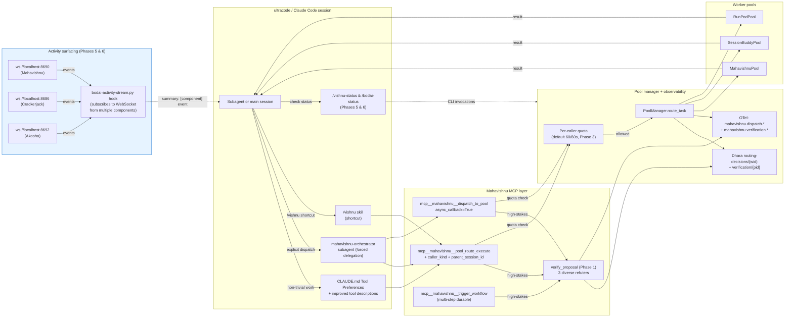

# Architecture Diagram — Ultracode → Mahavishnu → Workers

**Purpose:** Visual reference for the data flow described in §5.2 of `docs/plans/2026-07-11-ultracode-integration-wiring.md`. Render with any Mermaid-compatible viewer (GitHub markdown, mermaid-cli, mermaid.live).

**When to update:** When a new phase is added or a significant data flow changes, regenerate this diagram and update the inlined version in the plan.

______________________________________________________________________



## How to render

- **GitHub markdown**: The fenced ```` ```mermaid ```` block renders automatically on GitHub.
- **VS Code**: Install the "Markdown Preview Mermaid Support" extension.
- **mermaid-cli**: `npx -p @mermaid-js/mermaid-cli mmdc -i architecture-diagram.md -o architecture-diagram.svg`.
- **mermaid.live**: Paste the fenced block content into the editor at https://mermaid.live.

## When this diagram is out of date

Update this file (and the inlined version in the plan) when:

- A new MCP tool entry point is added (changes the MCP layer)
- A new worker pool type is added (changes the worker pools subgraph)
- A new observability surface is added (changes the management layer)
- A new subagent or skill is added for delegation (changes the ultracode layer)
- A new Bodai component is added with its own WebSocket broadcasts (changes the surfacing subgraph)

## Reading notes

- **Top row (ultracode)**: Where requests originate. Five paths: main session via preferences, subagent (forced delegation), skill (shortcut), status commands. The status commands (VSTAT) are dashed because they query rather than dispatch.
- **MCP layer**: Three primary entry points plus the verification gate (Phase 1). The gate runs on high-stakes paths only.
- **Management layer**: Pool manager + observability. Quota enforcement (Phase 3) is a guard rail; Dhara stores both routing decisions and verification records; OTel surfaces metrics for monitoring.
- **Worker pools**: Three pool types (Mahavishnu direct, Session-Buddy delegated, RunPod GPU) handle different deployment shapes.
- **Surfacing layer (Phases 5 & 6, highlighted)**: New subgraph added by Phase 5/6. The hook subscribes to WebSocket broadcasts from multiple components and surfaces one-line summaries back into the conversation. Dotted arrows indicate observation, not flow.

## Cross-references

- Plan: `docs/plans/2026-07-11-ultracode-integration-wiring.md` (§5.2 inlines this diagram)
- ADR-014: caller-side authorization (caller_pool_allowlist) — feeds into Phase 3's caller_kind pattern
- ADR M-NEW-5: cross-repo extractions are PROPOSE_APPROVE — Phase 1 verification runs *before* the human approval gate, doesn't replace it
