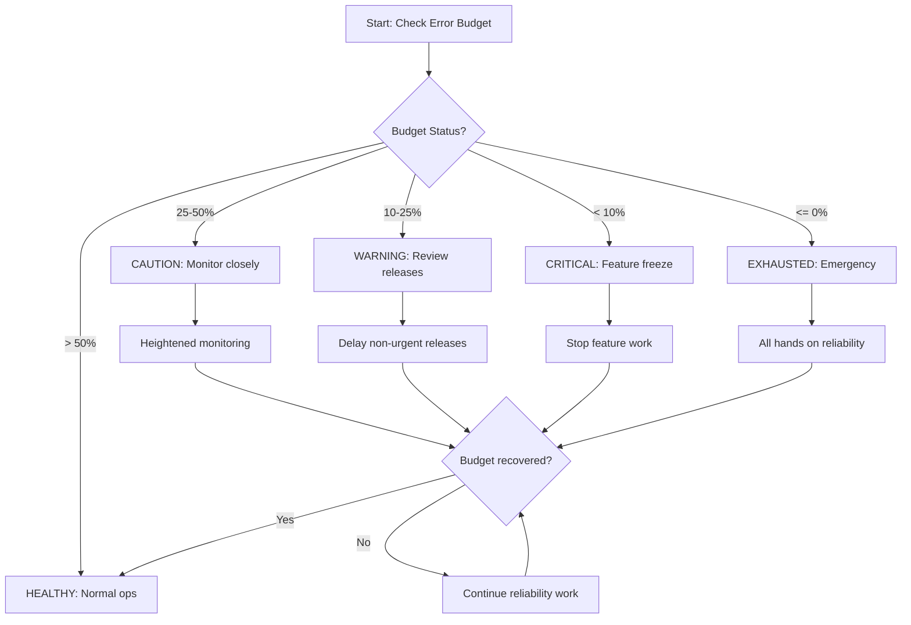

# Error Budget Enforcement Policy

**Service**: Mahavishnu Task Orchestration System (MTOS)
**Version**: 1.0
**Last Updated**: 2026-02-18
**Owner**: SRE Team

---

## Overview

This document defines the error budget enforcement policy for MTOS. Error budgets quantify the acceptable amount of unreliability and enable risk-aware decision making.

**Key Principle**: When error budget is exhausted, reliability work takes absolute priority over new features.

---

## Error Budget Allocation

### Monthly Budget (30-day rolling window)

| SLO | Target | Monthly Budget | Calculation |
|-----|--------|----------------|-------------|
| **Availability** | 99.9% | 43.2 minutes downtime | 30d × 24h × 60m × 0.1% |
| **Latency (P99)** | 500ms | 1% of requests can exceed | 0.01 × total_requests |
| **Error Rate** | 0.1% | 0.1% of operations can fail | 0.001 × total_operations |

### Error Budget Sources

```python
# Calculate remaining error budget
def calculate_error_budget():
    # Availability budget
    total_minutes = 30 * 24 * 60  # 43,200 minutes
    allowable_downtime = total_minutes * 0.001  # 43.2 minutes
    actual_downtime = get_downtime_minutes(last_30_days)
    availability_budget_remaining = allowable_downtime - actual_downtime

    # Error rate budget
    total_requests = get_request_count(last_30_days)
    allowable_errors = total_requests * 0.001
    actual_errors = get_error_count(last_30_days)
    error_budget_remaining = allowable_errors - actual_errors

    return {
        "availability_remaining_minutes": availability_budget_remaining,
        "availability_remaining_percent": (availability_budget_remaining / allowable_downtime) * 100,
        "error_budget_remaining_count": error_budget_remaining,
        "error_budget_remaining_percent": (error_budget_remaining / allowable_errors) * 100,
    }
```

---

## Enforcement Thresholds

### Budget Status Levels

| Status | Budget Remaining | Color | Action |
|--------|-----------------|-------|--------|
| **HEALTHY** | > 50% | 🟢 Green | Normal operations, feature work allowed |
| **CAUTION** | 25-50% | 🟡 Yellow | Heightened monitoring, review upcoming releases |
| **WARNING** | 10-25% | 🟠 Orange | Feature freeze consideration, reliability focus |
| **CRITICAL** | < 10% | 🔴 Red | **Feature freeze**, all hands on reliability |
| **EXHAUSTED** | ≤ 0% | ⛔ Black | **Emergency mode**, incident response active |

### Automated Alerts

```yaml
# Prometheus alerting rules
groups:
  - name: error_budget
    rules:
      - alert: ErrorBudgetWarning
        expr: |
          (
            (0.001 - (sum(rate(task_operations_total{status="error"}[30d])) / sum(rate(task_operations_total[30d]))))
            / 0.001
          ) < 0.25
        for: 5m
        labels:
          severity: warning
        annotations:
          summary: "Error budget below 25%"
          description: "Only {{ $value | humanizePercentage }} of error budget remaining"

      - alert: ErrorBudgetCritical
        expr: |
          (
            (0.001 - (sum(rate(task_operations_total{status="error"}[30d])) / sum(rate(task_operations_total[30d]))))
            / 0.001
          ) < 0.10
        for: 5m
        labels:
          severity: critical
        annotations:
          summary: "Error budget below 10% - FEATURE FREEZE"
          description: "Only {{ $value | humanizePercentage }} of error budget remaining"

      - alert: ErrorBudgetExhausted
        expr: |
          (
            (0.001 - (sum(rate(task_operations_total{status="error"}[30d])) / sum(rate(task_operations_total[30d]))))
            / 0.001
          ) <= 0
        for: 1m
        labels:
          severity: page
        annotations:
          summary: "Error budget EXHAUSTED - EMERGENCY MODE"
          description: "Error budget exhausted, all feature work must stop"
```

---

## Feature Freeze Policy

### Trigger Conditions

Feature freeze is **mandatory** when ANY of the following conditions are met:

1. **Availability budget < 10%** (4.3 minutes remaining)
2. **Error rate budget < 10%** remaining
3. **P0 incident active** and consuming budget
4. **Two consecutive P1 incidents** in 7 days

### Feature Freeze Actions

```markdown
## Feature Freeze Checklist

### Immediate (within 1 hour)
- [ ] Announce freeze in #engineering Slack channel
- [ ] Cancel all non-essential deployments
- [ ] Page on-call engineer if not already engaged
- [ ] Update status page if user-facing impact

### Short-term (within 24 hours)
- [ ] Audit all pending PRs for risk
- [ ] Prioritize reliability work over features
- [ ] Schedule reliability incident review
- [ ] Update release calendar

### Resolution (before lifting freeze)
- [ ] Root cause identified and fixed
- [ ] Error budget recovered to > 20%
- [ ] Postmortem completed
- [ ] SRE team sign-off
```

### Lifting Feature Freeze

Feature freeze can only be lifted when:

1. **Budget recovered to > 20%** (8.6 minutes buffer)
2. **No active P0/P1 incidents**
3. **SRE team approval**
4. **Postmortem completed** for triggering incident

---

## Budget Recovery Mechanisms

### Automatic Recovery

Error budgets automatically recover over time as old incidents age out of the 30-day window:

```python
# Daily budget recovery calculation
daily_budget_allowance = 43.2 / 30  # ~1.44 minutes/day
# If no incidents occur, budget recovers at ~3.3% per day
```

### Accelerated Recovery

For severe incidents, consider:

1. **Rolling window adjustment**: Temporarily use 14-day window to accelerate recovery
2. **SLO target adjustment**: If incident revealed unrealistic target, adjust SLO
3. **Risk acceptance**: Leadership can accept higher risk for specific period

---

## Burn Rate Alerts

### Burn Rate Thresholds

| Burn Rate | Time to Exhaust | Alert Level | Action |
|-----------|-----------------|-------------|--------|
| < 2x | > 15 days | None | Normal |
| 2-10x | 3-15 days | Warning | Increased monitoring |
| 10-50x | 8-40 hours | Critical | Page on-call |
| > 50x | < 8 hours | Emergency | Immediate response |

### Burn Rate Calculation

```promql
# Current burn rate (relative to monthly budget)
(
  sum(rate(task_operations_total{status="error"}[1h]))
  / sum(rate(task_operations_total[1h]))
)
/
0.001  # SLO target

# Example: If error rate is 5% (50x SLO target)
# Burn rate = 0.05 / 0.001 = 50x
# Time to exhaust = 43.2 minutes / 50 = ~52 seconds at current rate
```

---

## Enforcement Workflow



---

## Metrics and Reporting

### Daily Error Budget Report

```bash
# Generate daily error budget report
mahavishnu sre error-budget report --daily

# Output:
# Error Budget Report - 2026-02-18
# =================================
# Availability Budget: 38.2 min remaining (88.4%)
# Error Rate Budget: 98.7% remaining
# Current Burn Rate: 1.2x (normal)
# Status: HEALTHY 🟢
# Days until budget exhausted at current rate: 26.5 days
```

### Weekly SLO Review

```markdown
## Weekly SLO Review Agenda

1. Error budget status review
2. Incident summary (if any)
3. Burn rate analysis
4. Upcoming release risk assessment
5. Reliability improvements progress
```

---

## Appendix: Error Budget Dashboard

The error budget dashboard is available at:
- **URL**: https://grafana.example.com/d/error-budget
- **Refresh**: Every 30 seconds
- **Panels**:
  - Current budget status (gauge)
  - 30-day budget trend (graph)
  - Burn rate over time (graph)
  - Incident impact (table)

---

## Change Log

| Date | Version | Changes | Author |
|------|---------|---------|--------|
| 2026-02-18 | 1.0 | Initial error budget enforcement policy | SRE Team |
